# DDN Exascaler 监控系统手册


## DDN EXAScalerx性能监控系统简介

LustrePerfMon 是一款监控系统，通过采集DDN Exascaler的系统状态信息以达到对其进行性能监控及分析的目的。LustrePerfMon基于多种开源软件的监控系统，DDN同时还开发了一些外部插件以作功能扩展。

LustrePerfMon的主要组件之一是 **collectd**。**collectd**是一个运行在监控对象上的守护进程，完成了系统性能的相关统计信息定期收集，并将这些数据以多种不同的机制进行存储。LustrePerfMon是基于开源的**collectd**而研发，同时也包含了许多其他插件，如Filedata、Ganglia、Nagios、Stress、Zabbix等等。

### 名词解释

- **LustrePerfMon**：DDN Exascaler性能监控系统的缩写。 
- **DDN SFA**：DDN Storage Fusion Architecture的缩写。DDN Storage Fusion Architecture为平衡的高性能存储提供基础。通过使用并行存储处理技术，SFA提供了强大的IOPS和吞吐率。
- **DDN Exascaler**: DDN Exascaler是由DDN研发的基于Lustre的存储解决方案，它旨在解决极端数据密集型环境中最严苛的存储及数据管理问题。 
- **部署服务器**: LustrePerfMon监控系统的安装进程将在此服务器上被触发。


- **监控服务器**: LustrePerfMon监控系统的数据库(*Influxdb*) 及网络服务 (*Grafana*) 将在此服务器上运行。
- **代理节点**：  LustrePerfMon监控系统将从代理节点上收集各类指标数据，例如CPU, 内存、Lustre、SFA 存储等相关信息。守护进程collectd 将在每个客户端后台运行。 
- **DDN IME**: DDN 的无限内存引擎(*Infinite Memory Engine*) 是一款基于闪存的高速缓存系统，它简化了应用程序I/O路径，消除了系统瓶颈。
- **Lustre**: Lustre文件系统是一种开源的并行文件系统，它满足了许多高性能计算环境的海量数据存储需求。
- **OST**：Lustre的对象存储目标（Object Storage Target）是用来存储文件数据对象的存储目标。 
- **OSS**：Lustre的对象存储服务器（Object Storage Server）是用来管理对象存储目标的服务器。 
- **MDT**：Lustre的元数据目标（Metadata Target）是用来存储文件元数据的存储目标。  
- **MDS**：Lustre的元数据服务器（Metadata Server）是用来为文件系统提供元数据服务，管理一个或多个元数据目标的服务器  

### DDN Collectd 插件

为支持更多不同功能，DDN添加了一些附加的Collectd插件。

- **Filedata 插件:** Filedata插件能够通过读取及解析一组文件进行数据收集。用户需要在一个xml格式文件中对读取哪些文件、如何解析这些文件等进行定义。Filedata插件最常见的用途是通过正在运行的Lustre系统的 /proc 接口收集指标。
- **Ganglia 插件:**  Ganglia插件将collectd进程收集的指标信息发送给Ganglia服务器。
- **IME 插件:** IME插件通过DDN IME收集性能信息。IME插件和Filedata插件共享相似的定义文件格式和配置格式。
- **SSH 插件:** SSH插件能够通过使用SSH连接在远程主机上运行命令来收集来自DDN SFA存储的各项指标。与IME插件一样，它的定义文件格式和配置格式和Filedata插件类似。
- **Stress 插件:** Stress插件可以从collectd向服务器推送大量指标数据，来对监控系统性能进行高强度基准测试。
-  **Stress2插件**：**Stress** 插件改进版，可供灵活配置数据格式，仿真各种插件从客户端向服务器推送大量数据。 
- **Zabbix 插件:** Zabbix插件将指标数据从collectd发送至Zabbix系统。

## 安装要求

### 部署服务器

- **操作系统版本**: CenOS7/RHEL7
- **硬盘空闲空间**: > 500 MB。所有安装日志将被保存于部署服务器的 */var/log/esmon_install* 目录下，这需要占用一定空间。
- **网络**:  部署服务器须能对监控服务器和被监控客户端发起无密码提示的SSH连接。
- **LustrePerfMon ISO镜像** :  部署服务器上需有可用的LustrePerfMon ISO 镜像。 
- **时钟和时区：**节点的时钟和时区需要和其他节点一致。如果时钟或时区不一致，可能会导致数据收集或显示异常。 

### 监控服务器

- **操作系统版本**: CenOS7/RHEL7
- **硬盘空闲空间**: \> 5GB。监控服务器运行有Influxdb，如果Influxdb需容纳更多数据，则须预留更大空间。 
- **网络**:  监控服务器须运行SSHD。部署服务器必须可以通过无密码提示的SSH与监控服务器连接。 
- **时钟和时区：**节点的时钟和时区需要和其他节点一致。 

### 监控代理节点

- **操作系统版本:** CentOS7/RHEL7 or CentOS6/RHEL6
- **硬盘空闲空间**: > 200MB。必要的RPMs将被保存于 /var/log/esmon_install 目录下，这将占用一定空间。
- **网络**:  监控代理节点必须运行SSHD。部署服务器必须可以通过无密码提示的SSH与监控代理节点连接。 
- **EXASCALER版本：**EXAScaler 2.x、EXAScaler 3.x或EXAScaler 4.x。
- **时钟和时区：**节点的时钟和时区需要和其他节点一致。

### 对SFA的要求

-  **固件发行版：**3.x或11.x 

## 安装过程

### 1. 准备部署服务器

1. 将 LustrePerfMon ISO 镜像文件拷贝至部署服务器上，如 /ISOs/esmon.iso.

2. 在部署服务器上挂载 LustrePerfMon ISO 镜像： 

   ```shell
   # mount -o loop /ISOs/esmon.iso /media
   ```

3. 在部署服务器上，如果存在旧的LustrePerfMon配置文件，备份之： 

   ```shell
   # cp /etc/esmon_install.conf /etc/esmon_install.conf_backup
   ```

4. 在部署服务器上，如果已安装旧的LustrePerfMon RPM包，卸载之： 
   ```shell
   # rpm –e esmon
   ```

5. 在部署节点上安装 LustrePerfMon RPM： 

      ```shell
      # rpm -ivh /media/RPMS/rhel7/esmon*.rpm
      ```

### 2.准备监控服务器

如果监控服务器的防火墙打开，那么需要将防火墙的3000、4242、8086、8088、25826等端口打开，否则LustrePerfMon的安装或者使用会出现问题。其中3000端口为Grafana的服务端口，4242、8086、8088、25826等端口为Influxdb、Grafana、Collectd之间进行数据传输和管理的端口。 

### 3. 更新配置文件

在安装LustrePerfMon的RPM之后，更新配置文件/etc/esmon_install.conf。该文件包含了安装所需的所有必要信息。定义如下参数： 

- 在**agents**部分，定义了需要安装和配置LustrePerfMon代理的所有主机的信息：

  * **enable_disk** — 定义了是否启用磁盘指标收集功能，默认值为**false**。
  * **host_id** — 该主机的唯一标识。两个不同的主机不能拥有相同的**host_id**。
* **ime** — 定义了是否启用 **DDN IME**中指标收集功能，默认值为**false**。
  * **infiniband** — 定义了是否启用**Infiniband**中指标收集功能，默认值为**false**。
* **lustre_mds** — 定义了是否启用 **Lustre MDS**上的数据收集功能，默认值为**true**。
  * **lustre_oss** — 定义了是否启用 **Lustre OSS**上的数据收集功能，默认值为**true**。

    - **sfas** — 这个列表包含了该代理上一个或多个SFA的相关信息。
    
       + **controller0_hos** — 定义了该SFA控制器0的主机名或IP。
     - **controller1_host** — 定义了该SFA控制器1的主机名或IP。
       - **name** — 定义了该SFA的唯一名字。该名字用作该SFA的“fqdn”标签值。两个SFA不应拥有相同的名字。
  
- **agents_reinstall** — 定义了是否重装这些代理节点，默认值**true**。

- **collect_interval** — 定义了收集数据点的时间间隔（秒），默认值**60**。

- **continuous_query_interval** — 定义了连续查询（Continuous Query）的时间间隔。LustrePerfMon使用Influxdb的连续查询来聚合数据。要得到连续查询的间隔时间秒数，请将该参数值乘以**collect_interval**的数值。如果本参数值为1，那么连续查询的间隔时间秒数即为**collect_interval**秒。为了降低采样频率，减少性能压力，该值通常设置为大于1的数值，默认值为**4**。

- **iso_path** — LustrePerfMon ISO镜像的保存路径，默认值为**/root/esmon.iso**。

- **lustre_default_version** — 定义了默认的Lustre版本。如果在代理节点上安装的Lustre RPM包未匹配已支持版本，则使用默认Lustre版本。目前支持的参数值有：es2，es3，es4和error。如果配置的值为error, 当代理节点使用了一个不支持的Lustre版本时，会出现报错。默认值为es3。

- **lustre_exp_ost** —­­­ 定义了是否启用从代理节点的Lustre OST上收集exp_ost_stats_[read|write]指标功能。如果Lustre文件系统有太多客户端，为避免性能问题，该选项应关闭。默认值为**false**。

- **lustre_exp_mdt** —­­­ 定义了是否启用从代理节点的Lustre MDT上收集exp_md_stats_*指标功能。如果Lustre文件系统有太多客户端，为避免性能问题，该选项应关闭。默认值为**false**。

- 在**server**部分，定义了监控服务器的信息：

  - **drop_database** — 定义了是否丢弃Influxdb中已有的LustrePerfMon数据库，默认值为**false**。

  --------------

  **重要:**   只有当不需要保留Influxdb中数据和元数据时才可	以启用**drop_database**。

  -----

  - **erase_influxdb** — 定义了是否完全清除所有Influxdb	中的数据和元数据，默认值为**False**。当Influxdb完全毁坏  	时，打开该选项可以清除数据库恢复Influxdb的运行。

  ----

  **重要:**  只有当不需要保留Influxdb中数据和	元数据时才可以启用**erase_influxdb**。在打开该选项之前，	请仔细检查influxdb_path设置正确。

  -----

  - **host_id** — LustrePerfMon服务器主机的唯一标识。

  - **influxdb_path** — 定义了LustrePerfMon服务器主机上的Influxdb目录路径，默认值为**/esmon/influxdb**。

  ----

  **重要**: 请勿在该目录下放置其他文件或目录，因为在**erase_influxdb**打开的情况下，该目录下的所有子目录和文件将被清除。

  -------

  - **reinstall** — 定义了是否重新安装LustrePerfMon服务器，默认值为**true**。

    

- 在**ssh_hosts**部分，详细定义了用如何从部署服务器上用SSH连接登录监控服务器、监控代理节点的相关信息：

  - **host_id** — 该主机的唯一标识。两个不同的主机不能拥有相同的**host_id**。

  - **hostname** — 进行SSH连接时的主机名或IP。“ssh”命令中会使用该主机名或IP来登入主机。如果该主机用作LustrePerfMon服务器，那么该主机名或IP将作为服务节点配置到代理节点上的write_tsdb插件里。

  - **ssh_identity_file** — 进行SSH连接时的使用的SSH密钥文件。如果默认的SSH密钥文件可用，该参数可设置为**None**。默认值为**None**。

  - **local_host** —定义了该主机是否为本地节点。本地节点将不需要SSH连接。默认值为**false**。
  -------
  
  注意:    对同一个主机，**host_id**和**hostname**可能不		同，因为可以用多种方式连接至同一个主机。
  
  
  

下面是/etc/esmon_install.conf的一个例子

```yaml
例子:

agents:
  - enable_disk: false
    host_id: Agent1
    ime: false
    infiniband: false
    lustre_mds: true
    lustre_oss: true
    sfas:
      - controller0_host: 10.0.0.1
        controller1_host: 10.0.0.2
        name: SFA1
      - controller0_host: 10.0.0.3
        controller1_host: 10.0.0.4
        name: SFA2
  - host_id: Agent2
    sfas: []
agents_reinstall: true
collect_interval: 60
continuous_query_interval: 4
iso_path: /root/esmon.iso
lustre_default_version: es3
lustre_exp_mdt: false
lustre_exp_ost: false
server:
  drop_database: false
  erase_influxdb: false
  host_id: Server
  influxdb_path: /esmon/influxdb
  reinstall: true
ssh_hosts:
  - host_id: Agent1
    hostname: Agent1
    local_host: false
    ssh_identity_file: None
  - host_id: Agent2
    hostname: Agent2
  - host_id: Server
    hostname: Server
```

### 4. **在集群上运行安装程序**

在部署服务器上的 */etc/esmon_install.conf*更新完成后，运行以下命令在集群上启动安装程序： 

```shell
# esmon_install
```

所有可用于调试的相关日志将被保存在*/var/log/esmon_install*目录下。

esmon_install命令除了可以用来在新系统上安装LustrePerfMon外，还可以用来更新已有系统。为此，在安装完成LustrePerfMon之后，应备份*/etc/esmon_install.conf*文件。 

----

**重要**: 在升级已有LustrePerfMon系统时，**erase_influxdb**和**drop_database**应当关闭，除非Influxdb 中的数据和元数据不需要保留。  

----

当安装或升级时，**esmon_install**将会清除并安装所有默认的LustrePerfMon的Grafana仪表盘。除了默认的LustrePerfMon的Grafana仪表盘外，**esmon_install**不会改变任何其他的已有Grafana仪表盘。

--------

**重要**:  在升级已有LustrePerfMon系统之前，应通过Grafana网页界面备份所有经定制的LustrePerfMon默认仪表盘，将此复制为其他的名字，否则这些定制修改将会被升级过程所覆盖。 

-----

### 5. 访问监控网络页面

Grafana 服务将自动在监控服务器启动 。默认HTTP 端口为 3000。通过访问该端口可跳转至登录页面（[图1](#图1-grafana登陆界面 )），默认用户名密码皆为 “admin”。
###### 图1: Grafana登陆界面


------

**重要**:  访问监控页面的节点的时钟和时区应与服务节点保持一致，否则数据的显示将有可能不正常。 

------

## 仪表盘

在主仪表盘上（[图 2](#图2主仪表盘 )），可通过选择不同的模块页面浏览由 ESMON 收集的不同数据指标。

###### 图2：主仪表盘 


### 集群状态仪表盘 

集群状态仪表盘（[图 3](#图3集群状态仪表盘 )）显示了集群中服务器的状态信息概要。

其中，面板的背景颜色与服务器的运行状态相关 :

- 绿色：服务器正常运行。
- 黄色：警告信息，说明发生一个或多个下列情况 ：
  - 空闲 CPU 不足 20%
  - 负载数量高于 5
  - 空闲内存不足 1000 MiB
  - 根目录下空闲空间不足10 GiB 

- 红色：严重警告信息，说明发生一个或多个下列情况 :
  - 空闲 CPU 不足 5%
  - 负载数量高于 10
  - 根目录下空闲空间不足 1 GiB
  - 空闲内存不足100 MiB

###### 图3：集群状态仪表盘 


### Lustre 仪表盘 

Lustre 仪表盘（[图 4](#图4lustre仪表盘 )）显示了 Lustre 文件系统统计数据。

###### 	图4：Lustre仪表盘

 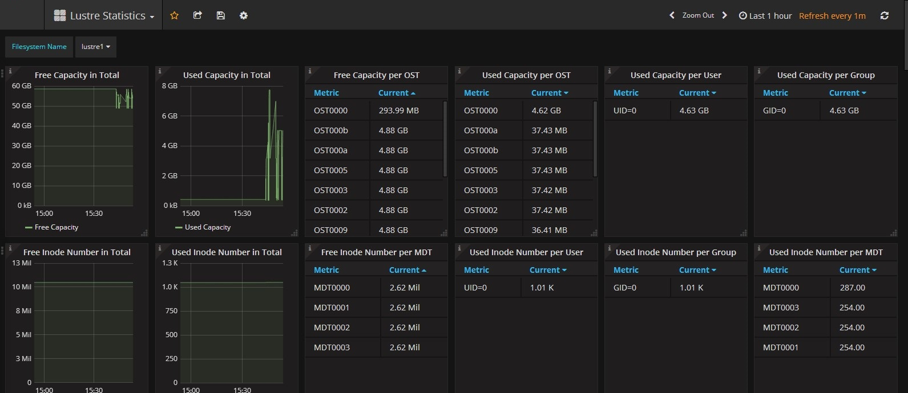

以下是一些主要指标的面板视图：

- **系统总剩余容量**面板([图5](#图5-lustre系统总剩余容量面板 )) 显示了Lustre文件系统剩余容量随时间的变化。从大约18:40开始运行测试用例“dd if=/dev/zero of=/mnt/lustre/file bs=1M”，图中显示出剩余容量正在以大约20MB/s的速度不断消耗。

  ###### 图5: Lustre系统总剩余容量面板 

   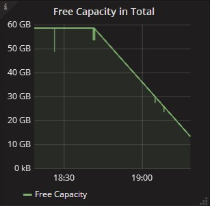


- **系统已使用总容量**面板([图6](#图6-lustre文件系统已使用总容量面板)) 显示了Lustre文件系统已使用总容量随时间的变化。该图的测试用例为“dd if=/dev/zero of=/mnt/lustre/file bs=1M”，从图可以看出已使用容量从18:40开始以大约20MB/s的速度递增。 

  ###### 图6: Lustre文件系统已使用总容量面板

   


- **每个OST剩余容量**面板([图7](#图7-lustre文件系统每个ost剩余容量面板)) 显示了Lustre文件系统每个OST剩余容量大小。如图所示，OST0002剩余容量为946.47MB， OST0007剩余容量为3.59GB，其他OST剩余容量都为4.09GB。点击**Current**，可以根据当前容量进行从小到大（或从大到小）排序。 

  ###### 图7: Lustre文件系统每个OST剩余容量面板

   

- 每个OST已使用容量面板([图8](#图8-每个ost已使用容量面板
  )) 显示了Lustre文件系统每个OST已使用的容量大小。如图所示，OST0002已使用容量为3.97GB， OST0007已使用容量为1.27GB，其余OST已使用容量都为820.8MB。点击Current，可以根据当前已使用容量进行从小到大（或从大到小）排序。

  ###### 图8: 每个OST已使用容量面板

   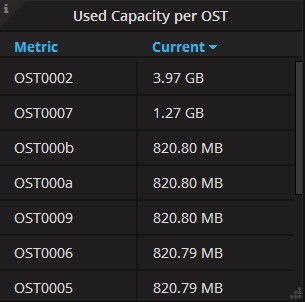

- 用户已使用容量面板([图9](#图9-用户已使用容量面板))显示了Lustre文件系统每个用户已使用的容量大小。如图所示，UID为0的用户当前使用的容量为13.65GB；UID为1000的用户当前使用的容量为2.10GB；UID为1001的用户当前使用的容量为954.37MB。

  ###### 图9: 用户已使用容量面板

   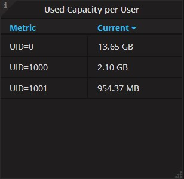

- 用户组已使用容量面板([图10](#图10-用户组已使用容量面板)) 显示了Lustre文件系统每个用户组已使用的容量大小。如图所示，GID为0的用户组当前使用的容量为13.65GB；GID为1000的用户组当前使用的容量为2.10GB；GID为1001的用户组当前使用的容量为954.37MB。

  ###### 图10: 用户组已使用容量面板

   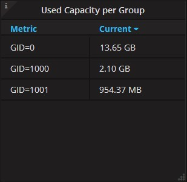

- 总的剩余索引节点数目面板([图11](#图11-总的剩余索引节点数目面板)) 显示了Lustre文件系统总的剩余索引节点数目随时间的变化。该图所使用的测试用例为“mdtest–C –n 900000 –d /mnt/lustre/mdtest/”，从图可以看出从大约14:35开始运行测试用例后，剩余的索引节点数目以大约1100Ops的速度减少。

  ###### 图11: 总的剩余索引节点数目面板

   

- 总的已使用索引节点数目面板([图12](#图12-总的已使用索引节点数目面板)) 显示了Lustre文件系统总的已使用索引节点数目随时间的变化。该图所使用的测试用例为“mdtest–C –n 900000 –d /mnt/lustre/mdtest/”，从图可以看出从大约14:35开始运行测试用例后，已使用的索引节点数目以大约1100Ops的速度增加。

  ###### 图12: 总的已使用索引节点数目面板

   

- 每个MDT剩余索引节点数目面板([图13](#图13-每个mdt剩余索引节点数目面板)) 显示了Lustre文件系统每个MDT剩余索引节点数目。如图所示，MDT0000剩余索引节点的数目为1.72Mil；系统其他各个MDT空闲的索引节点数目为2.62 Mil。点击Current，可以根据当前索引节点数目进行从小到大（或从大到小）排序。

  ###### 图13: 每个MDT剩余索引节点数目面板

   
  
- 每个用户已使用索引节点数目面板([图14](#图14-每个用户已使用索引节点数目面板)) 显示了Lustre文件系统每个用户已使用索引节点数目。如图所示，UID为1000的用户已使用的索引节点数目为897.49K； UID为1001的用户已使用的索引节点数目为1.08K；UID为0的用户已使用的索引节点数目为1.01K。点击Current，可以根据当前索引节点数目进行从小到大（或从大到小）排序。

  ###### 图14: 每个用户已使用索引节点数目面板

   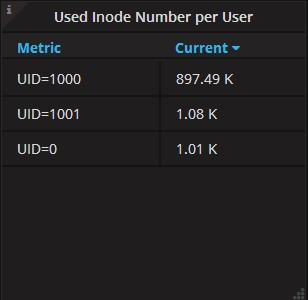
  
- 每个用户组已使用的索引节点数目面板([图15](#图15-每个用户组已使用索引节点数目面板)) 显示了Lustre文件系统每个用户组已使用的索引节点数目。如图所示，GID为1000的用户组已使用的索引节点数目为897.49K； GID为1001的用户组已使用的索引节点数目为1.08K；GID为0的用户组已使用的索引节点数目为1.01K。点击Current，可以根据当前索引节点数目进行从小到大（或从大到小）排序。

  ###### 图15: 每个用户组已使用索引节点数目面板

   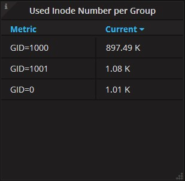
  
- 每个MDT已使用的索引节点数目面板([图16](#图16-每个mdt已使用索引节点数目面板)) 显示了Lustre文件系统每个MDT已使用的索引节点数目。如图所示，MDT0000使用索引节点数目为898.85K，MDT0001为254。

  ###### 图16: 每个MDT已使用索引节点数目面板

   
  
- 总的I/O吞吐量面板([图17](#图17-lustre文件系统总的io吞吐量面板)) 显示了Lustre文件系统总的I/O吞吐量随时间的变化。

  ###### 图17: Lustre文件系统总的I/O吞吐量面板

   
  
- 每个OST的I/O吞吐量面板([图18](#图18-每个ost的io吞吐量面板)) 显示了Lustre文件系统每个OST的I/O吞吐量信息，包括平均值、最大值和当前值。

  ###### 图18: 每个OST的I/O吞吐量面板

   
  
- 每个OST的写吞吐量面板([图19](#图19-每个ost写吞吐量面板)) 显示了Lustre文件系统每个OST的写吞吐量信息，包括平均值、最大值和当前值。

  ###### 图19: 每个OST写吞吐量面板

   
  
- 每个OST的读吞吐量面板([图20](#图20-每个ost读吞吐量面板)) 显示了Lustre文件系统每个OST的读吞吐量信息，包括平均值、最大值和当前值。

  ###### 图20: 每个OST读吞吐量面板

   
  
- 总的元数据操作速率面板([图21](#图21-总的元数据操作速率面板)) 显示了Lustre文件系统总的元数据操作速率随时间的变化，其单位为Ops，即 Operation Per Second。

  ###### 图21: 总的元数据操作速率面板

   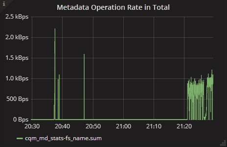
  
- 每个MDT的元数据操作速率面板([图22](#图22-每个mdt的元数据操作速率面板)) 显示了Lustre文件系统每个MDT的元数据操作速率信息，其单位为Ops， Operation Per Second。其信息包括平均值、最大值和当前值。

  ###### 图22: 每个MDT的元数据操作速率面板

   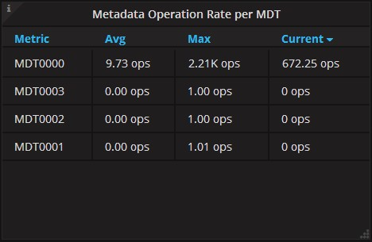
  
- 每个客户端的元数据操作速率面板([图23](#图23-每个客户端的元数据操作速率面板)) 显示了Lustre文件系统每个客户端（client）的元数据操作速率信息，其单位为Ops，即 Operation Per Second。其信息包括平均值、最大值和当前值。

  ###### 图23: 每个客户端的元数据操作速率面板

   
  
- 每种类型的元数据操作速率面板([图24](#图24-每种类型元数据操作速率面板)) 显示了Lustre文件系统每种类型的元数据操作速率信息，其单位为Ops即Operation Per Second。其信息包括平均值、最大值和当前值。当前测试用例为删除一个目录下的所有文件的元数据操作速率统计。

  ###### 图24: 每种类型元数据操作速率面板

   
  
- 不同块大小的写RPC速率面板([图25](#图25-不同块大小的写rpc速率面板)) 显示了Lustre文件系统不同块大小的写RPC速率随时间的变化。Lustre文件系统统计了不同bulk RPC大小信息，从4K到16M，下图显示了不同bulk 大小的写RPC的速率信息。图中所示的测试用例为：在两个客户端分别运行“dd if=/dev/zero of=/mnt/lustre/test1 bs=1M oflag=direct”和“dd if=/dev/zero of=/mnt/lustre/test2 bs=64k oflag=direct”测试，收集到的信息。

  ###### 图25: 不同块大小的写RPC速率面板

   
  
- 写bulk RPC大小分布面板([图26](#图26-写bulk-rpc大小分布面板)) 显示了Lustre文件系统不同bulk大小的写RPC数目的比例信息。如图所示，大小为256页的写bulk RPC数目占总的写RPC数目的百分比为100%。

  ###### 图26: 写bulk RPC大小分布面板

   
  
- 不同大小的读bulk RPC速率面板([图27](#图27-不同大小的读bulk-rpc速率面板)) 显示了Lustre文件系统不同bulk大小的读RPC速率随时间的变化。Lustre文件系统统计了不同bulk RPC大小信息，从4K到16M（Lustre中最大RPC bulk I/O大小为16MB）。下图显示了不同bulk 大小的读RPC的速率信息。图中所示的测试用例为：在两个客户端分别运行“dd if=/mnt/lustre/test1 of=/dev/zero bs=1M iflag=direct”和“dd if=/mnt/lustre/test2 of=/dev/zero bs=64k iflag=direct”测试，收集到的信息。

  ###### 图27: 不同大小的读bulk RPC速率面板

   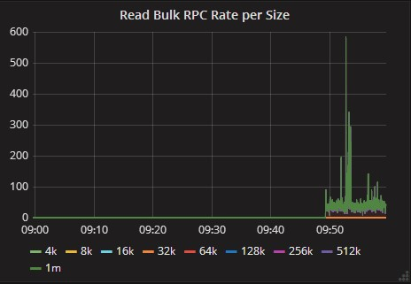
  
- 读bulk RPC大小分布面板([图28](#图28-读bulk-rpc大小分布面板)) 显示了Lustre文件系统不同bulk大小的读RPC数目比例信息。如图所示，该图正在进行的测试用例为“dd if=/mnt/lustre/file of=/dev/zero bs=1M”，大小为256页的读bulk RPC数目占总的RPC数目的百分比为100%。

  ###### 图28: 读bulk RPC大小分布面板

   
  
- 在Lustre 一次读写I/O中，如果写或者读的下一个页面与上一个读写页面的结尾（也就是下一个偏移量）不连续的话，那么就认为这个页面是不连续页面。在一次I/O RPC中可能有多个不连续页面。不连续的页面越少，底层的磁盘系统就能获取更好的性能。写I/O不连续页面分布面板([图29](#图29-写io不连续页面分布面板)) 显示了Lustre文件系统写I/O不连续页面数目比例信息。如图所示，不连续页面为“0_pages”数目占的百分比为100%，说明所有的页面都是连续的。

  ###### 图29: 写I/O不连续页面分布面板

   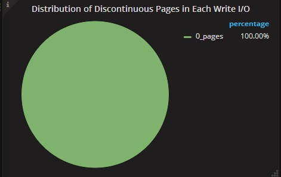
  
- 读I/O不连续页面分布面板([图30](#图30-读io不连续页面分布面板)) 显示了Lustre文件系统读I/O不连续页面数目比例信息。如图所示，不连续页面为“0_pages”数目占的百分比为100%，说明几乎所有的读页面都是连续的。

  ###### 图30: 读I/O不连续页面分布面板

   
  
- 写I/O不连续块分布面板([图31](#图31-写io不连续块分布面板)) 显示了Lustre文件系统写I/O不连续块的数目比例信息。在Lustre 一次读写I/O中，不连续块的含义与不连续页的含义类似。一个块中含有的页面数量由底层文件系统（Ldiskfs）决定。I/O中存在不连续块，则意味着这里一定存在不连续页；但反之不一定成立。如图所示，写I/O不连续块为“0_blocks”数目占的块I/O百分比为100%，说明几乎所有的写I/O都都是连续的。

  ###### 图31: 写I/O不连续块分布面板

  ######    

- 读I/O不连续块分布面板([图32](#图32-读io不连续块分布面板)) 显示了Lustre文件系统读I/O不连续块的数目比例信息。如图所示，不连续块为“0_blocks”数目占的块I/O百分比为100%，说明几乎所有的读I/O都没有被分裂，都是连续的。

  ###### 图32: 读I/O不连续块分布面板

   
- 在将读写I/O中提交到磁盘上过程中，由于各种原因（例如单次I/O页面过大），Lustre OSD发起的单个I/O可能被分裂为多个的磁盘I/O。写I/O碎片分布面板([图33](#图33-每个写io碎片分布面板)) 显示了Lustre文件系统每个写I/O分裂成多个磁盘 I/O的数目比例信息。如图所示，碎片为1表示I/O没有被分裂，“1_fragments”数目占的块I/O百分比为100%，说明几乎所有的写I/O都没有被分裂，都是整块连续的；“2_fragments”表示Lustre写I/O被分裂为两个磁盘块I/O，其占用的百分比为0%。

  ###### 图33: 每个写I/O碎片分布面板

  
- 读I/O碎片分布面板([图34](#图34-读io碎片分布面板)) 显示了Lustre文件系统每个读I/O分裂成碎片化磁盘 I/O的数目比例信息。如图所示，碎片为1表示I/O没有被分裂，“1_fragments”数目占的块I/O百分比为100%，说明几乎所有的读I/O都没有被分裂碎片化，都是连续的；“2_fragments”表示Lustre读I/O被分裂为两个磁盘块I/O，其占用的百分比为0%。

  ###### 图34: 读I/O碎片分布面板

  
- 已提交等待结束的磁盘写I/O分布面板([图35](#图35-已提交等待结束的磁盘写io分布面板)) 显示了当前OSD已提交等待结束的磁盘写I/O比例信息。如图所示，”1_ios”表示当前正在运行的磁盘I/O为1个，其所占比例为100%。

  ###### 图35: 已提交等待结束的磁盘写I/O分布面板

   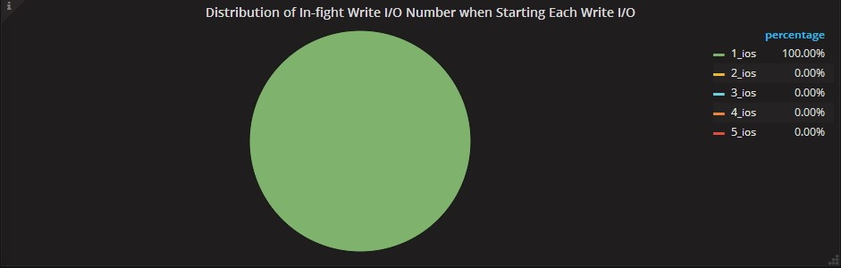
- 已提交等待结束的磁盘读I/O分布面板([图36](#图36-已提交等待结束的磁盘读io分布面板)) 显示了当前OSD已提交等待结束的（正在运行过程中）磁盘读I/O比例信息。如图所示，“1_ios”表示当前正在运行的磁盘I/O为1个，其所占比例为12.41%；“3_ios”表示当前挂起的磁盘I/O数目为3，其占的百分比为12.55%；“4_ios”表示当前挂起的磁盘I/O数目为4，其占的百分位49.80%。

  ###### 图36: 已提交等待结束的磁盘读I/O分布面板

   
- 写I/O时间分布面板([图37](#图37-写io时间分布面板)) 显示了当前OSD写I/O时间分布比例信息。如图所示，“1_milliseconds”表示写I/O时间小于1毫秒的I/O次数所占I/O次数的百分比，其所占比例为92.31%，“2_milliseconds”表示写I/O时间在1毫秒和2毫秒之间的I/O次数所占百分比，其值为：7.69%。

  ###### 图37: 写I/O时间分布面板

   
- 读I/O时间分布面板([图38](#图38-读io时间分布面板)) 显示了OSD读I/O时间分布比例信息。如图所示，“1_milliseconds”表示读I/O时间小于1毫秒的I/O次数所占I/O次数的百分比，其所占比例为14.11%；“4K_milliseconds”表示读I/O时间在2K毫秒和4K毫秒之间的I/O次数所占百分比，其值为42.62%。

  ###### 图38: 读I/O时间分布面板

   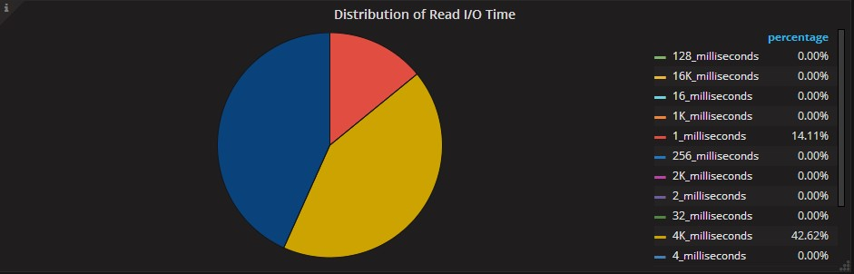
- 磁盘写I/O大小分布面板([图39](#图39-磁盘写io大小分布面板)) 显示了OSD写I/O大小分布比例信息。如图所示，“1M_Bytes”表示磁盘写I/O大小为512K字节到1M字节之间的I/O次数的所占百分比，其值为100%。“512K _ Bytes”表示磁盘写I/O大小为256K字节到512K字节之间的I/O次数的所占百分比。

  ###### 图39: 磁盘写I/O大小分布面板

   
- 磁盘读I/O大小分布面板([图40](#图40-磁盘读io大小分布面板)) 显示了OSD读I/O大小分布比例信息。如图所示，“1M_Bytes”表示磁盘读I/O大小为512K字节到1M字节之间的I/O次数的所占百分比，其值为94.16%；“512K_Bytes”表示磁盘读I/O大小在256K字节到512K字节之间的I/O次数所占百分比，其值为5.84%。

  ###### 图40: 磁盘读I/O大小分布面板

- 每个客户端写吞吐量面板（[图41](#图41-每个客户端写吞吐量面板)）显示了每个客户端写吞吐量信息，包括平均值，最大值和当前值。图中表示IP地址为“10.0.0.195”的客户端的平均I/O吞吐量为14.71MBps，最大值为55.73MBps，当前吞吐量为42.62MBps。

  ###### 图41: 每个客户端写吞吐量面板

  
- 每个客户端读吞吐量面板（[图42](#图42-每个客户端读吞吐量面板)）显示了每个客户端读吞吐量信息，包括平均值，最大值和当前值。图中表示IP地址为“10.0.0.194”的客户端的平均读吞吐量为32.01MBps，最大值为55.71MBps，当前吞吐量为23.50MBps。

  ###### 图42: 每个客户端读吞吐量面板

  

- 每个作业I/O吞吐量面板（[图43](#图43-每个作业io吞吐量面板)）显示了每个作业I/O吞吐量信息，包括平均值，最大值和当前值。图中JOBID为“dd.0”的作业的平均I/O吞吐量为7.68MBps，最大值为65.16MBps，当前吞吐量为29.37MBps。

  ###### 图43: 每个作业I/O吞吐量面板

   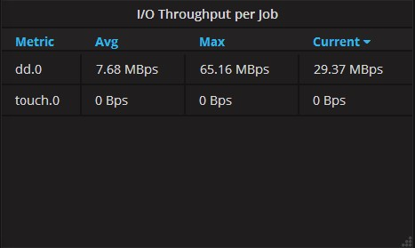

- 每个作业写吞吐量面板（[图44](#图44-每个作业写吞吐量面板)）显示了每个作业写吞吐量信息，包括平均值，最大值和当前值。图中JOBID为“dd.0”的作业的平均写吞吐量为7.68MBps，最大值为65.16MBps，当前吞吐量为29.37MBps。

  ###### 图44: 每个作业写吞吐量面板

   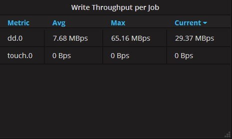

- 每个作业读吞吐量面板（[图45](#图45-每个作业读吞吐量面板)）显示了每个作业读吞吐量信息，包括平均值，最大值和当前值。图中JOBID为“dd.0”的作业的平均读吞吐量为2.56MBps，最大值为59.79MBps，当前吞吐量为12.75MBps。

  ###### 图45: 每个作业读吞吐量面板

   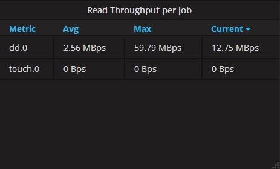
  每个作业元数据性能面板（[图46](#图46-每个作业元数据性能面板)）显示了每个作业元数据性能信息，包括平均值，最大值和当前值，其单位为Ops （Operations per Second）。图中JOBID为“rm.0”的作业的平均元数据性能为94.42ops，最大值为1.19K ops，当前性能为7.00 ops。

  ###### 图46: 每个作业元数据性能面板
   

### Lustre MDS仪表盘

Lustre MDS仪表盘（[图47](#图47-lustre-mds仪表盘)）显示了 Lustre 文件系统MDS服务器的统计数据。 

###### 图47: Lustre MDS仪表盘


以下是一些主要指标的面板视图：

- **活跃请求数目**面板（[图 48](#图48活跃请求数目面板)）显示分别显示了MDS服务器最大活跃请求数目和最小活跃请求数目随时间的变化。活跃的请求数是指那些正在被MDS处理的请求数目，但不包括那些在队列里面等待被处理的请求。如果活跃的请求的数目小于PTLRPC线程数目减去2（一个用于流入请求处理，另一个用于高优先级请求处理），则通常表示线程数目是足够的。下面左边的图显示了在上一个收集时间间隔间隔中的最大值；而右边的图则显示了收集时间间隔中的最小值。

  ###### 图48：活跃请求数目面板

	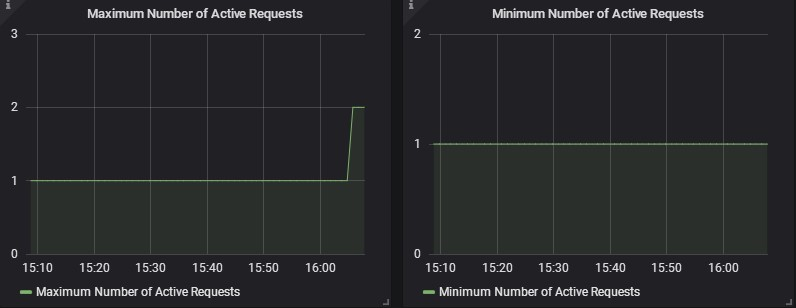

- 流入请求数目面板（[图 49](#图49流入请求数目面板)）显示分别显示了MDS服务器最大流入请求数目和最小流入请求数目随时间的变化。流入请求是指那些正在等待被MDS处理的请求。当开始处理请求，则该请求不再是流入请求，请求将会被放在处理队列中。下面左边的图显示了在上一个收集时间间隔中的流入请求的最大值；而右边的图则显示了收集时间间隔中的流入请求的最小值。

  ###### 图49：流入请求数目面板

	

- 请求等待时间面板（[图50](#图50请求等待时间面板)）显示分别显示了MDS服务器最大请求等待时间和最小请求等待时间随时间的变化。一个请求的等待时间是它到达时刻和开始被处理时刻的时间间隔。下面左边的图显示了在上一个收集时间间隔中的最大的请求等待时间；而右边的图则显示了上一个收集时间间隔中的最小的请求等待时间。

  ###### 图50：请求等待时间面板

	

- 自适应超时值面板（[图51](#图51自适应超时值面板)）分别显示了MDS服务器最大自适应超时值和最小自适应超时值随时间的变化。当一个客户端发送请求时，它会给请求的回复一个超时截止时间。由于Lustre的自适应超时机制，服务的超时值是一个运行时服务器和客户端协商的自适应的值。下面左边的图显示了在上一个收集时间间隔中的MDS服务的最大超时值；而右边的图则显示了收集时间间隔中的最小值超时值。

  ###### 图51：自适应超时值面板

	

- 可用请求缓冲区数目面板（[图52](#图52可用请求缓冲区数目面板)）分别显示了MDS服务器最大可用请求缓冲区数目和最小可用请求缓冲区数目随时间的变化。当一个请求到达时，它会使用一个请求缓冲区。当可用的请求缓冲区数目处于一个低阈值时，就需要更多的缓冲区来避免成为性能的瓶颈。下面左边的图显示了在上一个收集时间间隔中的最大值；而右边的图则显示了收集时间间隔中的最小值。

  ###### 图52：可用请求缓冲区数目面板

	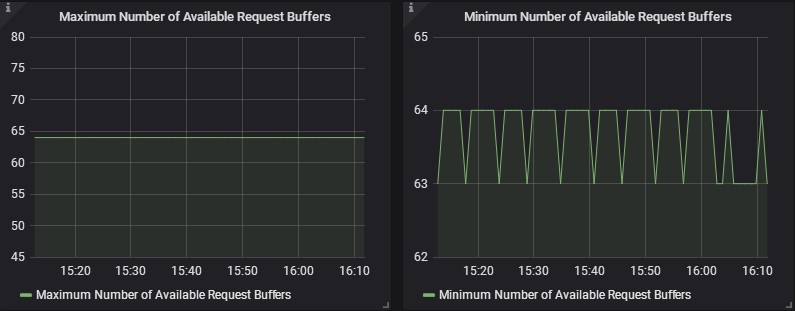

- LDLM ibits Enqueue请求处理时间面板（[图 53](#图53ldlm-ibits-enqueue请求处理时间面板)）分别显示了MDS服务器最大LDLM ibits Enqueue请求处理时间和最小LDLM ibits Enqueue请求处理时间随时间的变化。请求的处理时间是指它开始被处理的时刻和处理完成时刻之间的时间间隔。下面左边的图显示了在上一个收集时间间隔中的LDLM ibits Enqueue请求处理时间的最大值；而右边的图则显示了收集时间间隔中的LDLM ibits Enqueue请求处理时间的最小值。

  ###### 图53：LDLM ibits Enqueue请求处理时间面板

	

- Getattr请求处理时间面板（[图54](#图54getattr请求处理时间面板)）分别显示了MDS服务器最大Getattr请求处理时间和最小Getattr请求处理时间随时间的变化。请求的处理时间是指它开始被处理的时刻和处理完成时刻之间的时间间隔。下面左边的图显示了在上一个收集时间间隔中的Getattr请求处理时间的最大值；而右边的图则显示了收集时间间隔中的Getattr请求处理时间的最小值。

  ###### 图54：Getattr请求处理时间面板
  
  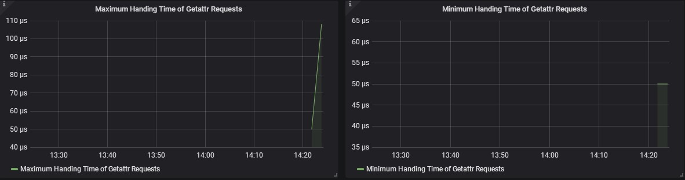
  
- Connect请求处理时间面板（[图55](#图55connect请求处理时间面板)）分别显示了MDS服务器最大Connect请求处理时间和最小Connect请求处理时间随时间的变化。请求的处理时间是指它开始被处理的时刻和处理完成时刻之间的时间间隔。下面左边的图显示了在上一个收集时间间隔中的Connect请求处理时间的最大值；而右边的图则显示了收集时间间隔中的Connect请求处理时间的最小值。

  ###### 图55：Connect请求处理时间面板

  

- Get-root请求处理时间面板（[图56](#图56get-root请求处理时间面板)）分别显示了MDS服务器最大Get-root请求处理时间和最小Get-root请求处理时间随时间的变化。请求的处理时间是指它开始被处理的时刻和处理完成时刻之间的时间间隔。下面左边的图显示了在上一个收集时间间隔中的Get-root请求处理时间的最大值；而右边的图则显示了收集时间间隔中的Get-root请求处理时间的最小值。

  ###### 图56：Get-root请求处理时间面板

  

- Statfs请求处理时间面板（[图57](#图57statfs请求处理时间面板)）分别显示了MDS服务器最大statfs请求处理时间和最小statfs请求处理时间随时间的变化。请求的处理时间是指它开始被处理的时刻和处理完成时刻之间的时间间隔。下面左边的图显示了在上一个收集时间间隔中的statfs请求处理时间的最大值；而右边的图则显示了收集时间间隔中的statfs请求处理时间的最小值。

  ###### 图57：Statfs请求处理时间面板

  

- Getxattr请求处理时间面板（[图58](#图58getxattr请求处理时间面板-1)）分别显示了MDS服务器最大Getxattr请求处理时间和最小Getxattr请求处理时间随时间的变化。请求的处理时间是指它开始被处理的时刻和处理完成时刻之间的时间间隔。下面左边的图显示了在上一个收集时间间隔中的Getxattr请求处理时间的最大值；而右边的图则显示了收集时间间隔中的Getxattr请求处理时间的最小值。

  ###### 图58：Getxattr请求处理时间面板

  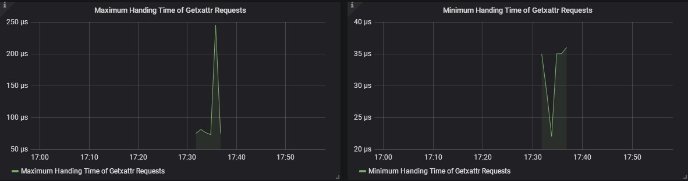

- Ping请求处理时间面板（[图59](#图59ping请求处理时间面板)）分别显示了MDS服务器最大ping请求处理时间和最小ping请求处理时间随时间的变化。请求的处理时间是指它开始被处理的时刻和处理完成时刻之间的时间间隔。下面左边的图显示了在上一个收集时间间隔中的ping请求处理时间的最大值；而右边的图则显示了收集时间间隔中的ping请求处理时间的最小值。

  ###### 图59：Ping请求处理时间面板

  

  **活跃的Readpage请求数目**面板（[图60](#图60活跃的readpage请求数目面板)）分别显示了MDS服务器最大活跃的Readpage请求数目和最小活跃的Readpage请求数目随时间的变化。活跃的请求数是指那些正在被MDS处理的请求数目，但不包括那些在队列里面等待被处理的请求。如果活跃的请求的数目小于PTLRPC线程数目减去2（一个用于流入请求处理，另一个用于高优先级请求处理），则通常表示线程数目是足够的。下面左边的图显示了在上一个收集时间间隔中的最大值；而右边的图则显示了收集时间间隔中的最小值。

  ###### 图60：活跃的Readpage请求数目面板

  

- 流入的Readpage请求数目面板（[图61](#图61流入的readpage请求数目面板)）分别显示了MDS服务器最大流入的Readpage请求数目和最小流入的Readpage请求数目随时间的变化。流入请求是指那些正在等待被MDS处理的请求。当开始处理请求，则该请求不再是流入请求，请求将会被放在处理队列中。下面左边的图显示了在上一个收集时间间隔中的流入请求的最大值；而右边的图则显示了收集时间间隔中的最小值。

  ###### 图61：流入的Readpage请求数目面板

  

- Readpage请求等待时间面板（[图62](#图62readpage请求等待时间面板)）分别显示了MDS服务器最大Readpage请求等待时间和最小Readpage请求等待时间随时间的变化。一个请求的等待时间是它到达时刻和开始被处理时刻的时间间隔。下面左边的图显示了在上一个收集时间间隔中的最大的请求等待时间；而右边的图则显示了上一个收集时间间隔中的最小的请求等待时间。

  ###### 图62：Readpage请求等待时间面板

  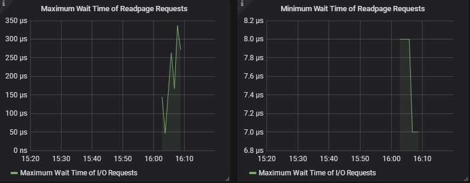

- Readpage服务的自适应超时值面板（[图63](#图63readpage自适应超时值面板)）分别显示了MDS服务器最大Readpage服务的自适应超时值和最小Readpage服务的自适应超时值随时间的变化。当一个客户端发送请求时，它会给请求的回复一个超时截止时间。由于Lustre的自适应超时机制，服务的超时值是一个运行时服务器和客户端协商的自适应的值。下面左边的图显示了在上一个收集时间间隔中的MDS Readpage服务的最大超时值；而右边的图则显示了收集时间间隔中的最小值超时值。

  ###### 图63：Readpage自适应超时值面板

  

- 可用Readpage请求缓冲区数目面板（[图64](#图64可用readpage请求缓冲区数目面板)）分别显示了MDS服务器最大可用Readpage请求缓冲区数目和最小可用Readpage请求缓冲区数目随时间的变化。当一个请求到达时，它会使用一个请求缓冲区。当可用的请求缓冲区数目处于一个低阈值时，就需要更多的缓冲区来避免成为性能的瓶颈。下面左边的图显示了在上一个收集时间间隔中的最大值；而右边的图则显示了收集时间间隔中的最小值。

  ###### 图64：可用Readpage请求缓冲区数目面板

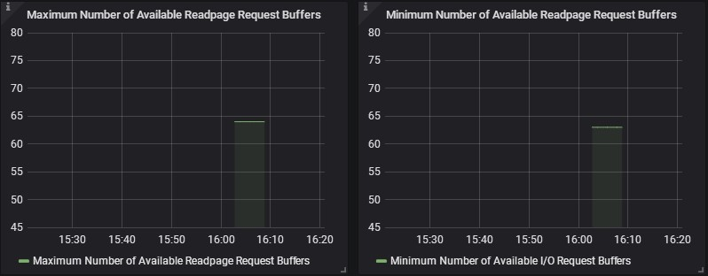

- Close请求处理时间面板（[图 65](#图65close请求处理时间面板)）分别显示了MDS服务器最大Close请求处理时间和最小Close请求处理时间随时间的变化。请求的处理时间是指它开始被处理的时刻和处理完成时刻之间的时间间隔。下面左边的图显示了在上一个收集时间间隔中的Close请求处理时间的最大值；而右边的图则显示了收集时间间隔中的Close请求处理时间的最小值。

  ###### 图65：Close请求处理时间面板

  

- Readpage请求处理时间面板（[图 66](#图66readpage请求处理时间面板)）分别显示了MDS服务器最大Readpage请求处理时间和最小Readpage请求处理时间随时间的变化。请求的处理时间是指它开始被处理的时刻和处理完成时刻之间的时间间隔。下面左边的图显示了在上一个收集时间间隔中的Readpage请求处理时间的最大值；而右边的图则显示了收集时间间隔中的Readpage请求处理时间的最小值。

  ###### 图66：Readpage请求处理时间面板

  

- **活跃的LDLM Canceld请求数目**面板（[图 67](#图67活跃的ldlm-canceld请求数目面板)）分别显示了MDS服务器最大活跃的LDLM Canceld请求数目和最小活跃的LDLM Canceld请求数目随时间的变化。活跃的请求数是指那些正在被MDS处理的请求数目，但不包括那些在队列里面等待被处理的请求。如果活跃的请求的数目小于PTLRPC线程数目减去2（一个用于流入请求处理，另一个用于高优先级请求处理），则通常表示线程数目是足够的。下面左边的图显示了在上一个收集时间间隔中的最大值；而右边的图则显示了收集时间间隔中的最小值。

  ###### 图67：活跃的LDLM Canceld请求数目面板

  

- 流入的LDLM Canceld请求数目面板（[图 68](#图68流入的ldlm-canceld请求数目面板)）分别显示了MDS服务器最大流入的LDLM Canceld请求数目和最小流入的LDLM Canceld请求数目随时间的变化。流入请求是指那些正在等待被MDS处理的请求。当开始处理请求，则该请求不再是流入请求，请求将会被放在处理队列中。下面左边的图显示了在上一个收集时间间隔中的流入请求的最大值；而右边的图则显示了收集时间间隔中的最小值。

  ###### 图68：流入的LDLM Canceld请求数目面板

  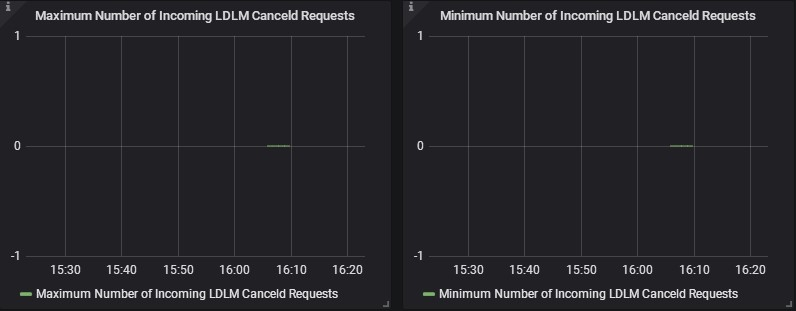

- LDLM Canceld请求等待时间面板（[图 69](#图69ldlm-canceld请求等待时间面板)）分别显示了MDS服务器最大LDLM Canceld请求等待时间和最小LDLM Canceld请求等待时间随时间的变化。一个请求的等待时间是它到达时刻和开始被处理时刻的时间间隔。下面左边的图显示了在上一个收集时间间隔中的最大的请求等待时间；而右边的图则显示了上一个收集时间间隔中的最小的请求等待时间。

  ###### 图69：LDLM Canceld请求等待时间面板

  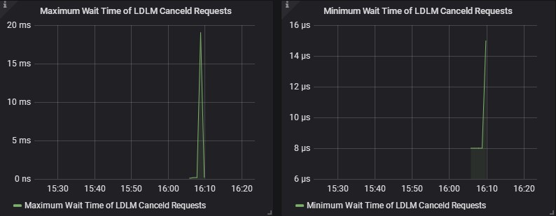

- LDLM Canceld服务的自适应超时值面板（[图 70](#图70ldlm-canceld服务的自适应超时值面板)）分别显示了MDS服务器最大LDLM Canceld服务的自适应超时值和最小LDLM Canceld服务的自适应超时值随时间的变化。当一个客户端发送请求时，它会给请求的回复一个超时截止时间。由于Lustre的自适应超时机制，服务的超时值是一个运行时服务器和客户端协商的自适应的值。下面左边的图显示了在上一个收集时间间隔中的最大的LDLM Canceld服务的自适应超时值；而右边的图则显示了上一个收集时间间隔中的最小的LDLM Canceld服务的自适应超时值。

  ###### 图70：LDLM Canceld服务的自适应超时值面板
  
  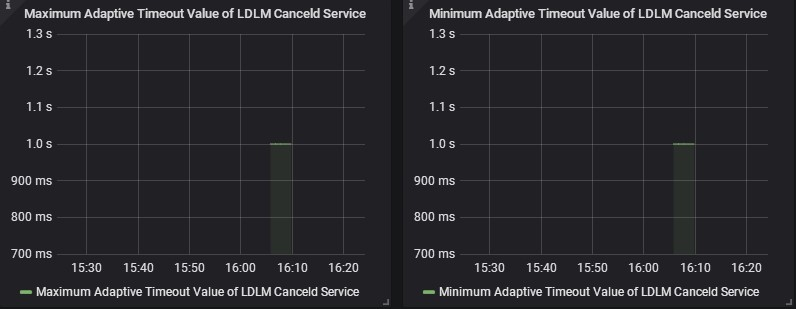
  
- 可用LDLM Canceld请求缓冲区数目面板（[图 71](#图71可用ldlm-canceld请求缓冲区数目面板)）分别显示了MDS服务器最大可用LDLM Canceld请求缓冲区数目和最小可用LDLM Canceld请求缓冲区数目随时间的变化。当一个请求到达时，它会使用一个请求缓冲区。当可用的请求缓冲区数目处于一个低阈值时，就需要更多的缓冲区来避免成为性能的瓶颈。下面左边的图显示了在上一个收集时间间隔中的最大值；而右边的图则显示了收集时间间隔中的最小值。

  ###### 图71：可用LDLM Canceld请求缓冲区数目面板

  

- 活跃的LDLM Callback请求数目面板（[图 72](#图72活跃的ldlm-callback请求数目面板)）分别显示了MDS服务器最大活跃的LDLM Callback请求数目和最小活跃的LDLM Callback请求数目随时间的变化。活跃的请求数是指那些正在被MDS处理的请求数目，但不包括那些在队列里面等待被处理的请求。如果活跃的请求的数目小于PTLRPC线程数目减去2（一个用于流入请求处理，另一个用于高优先级请求处理），则通常表示线程数目是足够的。下面左边的图显示了在上一个收集时间间隔中的最大值；而右边的图则显示了收集时间间隔中的最小值。

  ###### 图72：活跃的LDLM Callback请求数目面板

  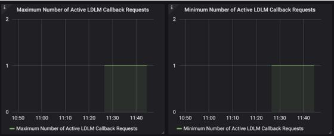

- 流入的LDLM Callback请求数目面板（[图 73](#图73流入的ldlm-callback请求数目面板)）分别显示了MDS服务器最大流入的LDLM Callback请求数目和最小流入的LDLM Callback请求数目随时间的变化。流入请求是指那些正在等待被MDS处理的请求。当开始处理请求，则该请求不再是流入请求，请求将会被放在处理队列中。下面左边的图显示了在上一个收集时间间隔中的流入请求的最大值；而右边的图则显示了收集时间间隔中的最小值。

  ###### 图73：流入的LDLM Callback请求数目面板

  

- LDLM Callback请求等待时间面板（[图74](#图74ldlm-callback请求等待时间面板)）分别显示了MDS服务器最大LDLM Callback请求等待时间和最小LDLM Callback请求等待时间随时间的变化。一个请求的等待时间是它到达时刻和开始被处理时刻的时间间隔。下面左边的图显示了在上一个收集时间间隔中的最大的请求等待时间；而右边的图则显示了上一个收集时间间隔中的最小的请求等待时间。

  ###### 图74：LDLM Callback请求等待时间面板

  

- LDLM Callback服务的自适应超时值面板（[图75](#图75ldlm-callback自适应超时值面板)）分别显示了MDS服务器最大LDLM Callback服务的自适应超时值和最小LDLM Callback服务的自适应超时值随时间的变化。当一个客户端发送请求时，它会给请求的回复一个超时截止时间。由于Lustre的自适应超时机制，服务的超时值是一个运行时服务器和客户端协商的自适应的值。下面左边的图显示了在上一个收集时间间隔中的MDS LDLM Callback服务的最大超时值；而右边的图则显示了收集时间间隔中的最小值超时值。

  ###### 图75：LDLM Callback自适应超时值面板

  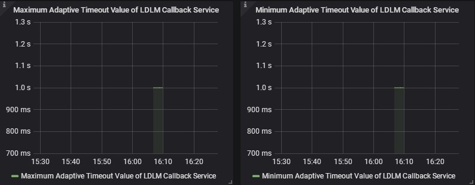

- 可用LDLM Callback请求缓冲区数目面板（[图76](#图76可用ldlm-callback请求缓冲区数目面板))分别显示了MDS服务器最大可用LDLM Callback请求缓冲区数目和最小可用LDLM Callback请求缓冲区数目随时间的变化。当一个请求到达时，它会使用一个请求缓冲区。当可用的请求缓冲区数目处于一个低阈值时，就需要更多的缓冲区来避免成为性能的瓶颈。下面左边的图显示了在上一个收集时间间隔中的最大值；而右边的图则显示了收集时间间隔中的最小值。

  ###### 图76：可用LDLM Callback请求缓冲区数目面板

  


### Lustre OSS 仪表盘

Lustre OSS仪表盘（[图77](#图77-lustre-oss仪表盘)）显示了 Lustre 文件系统OSS服务器的统计数据。

###### 图77: Lustre OSS仪表盘
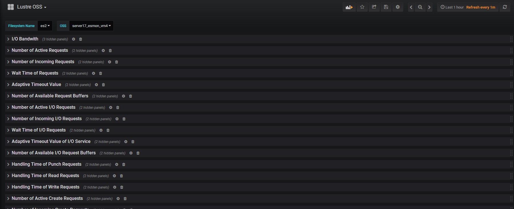

以下是一些**主要指标**的面板视图：

I/O带宽面板（[图78](#图78io带宽面板)）显示分别显示了OSS服务器总的I/O吐吞量，写吞吐量和读吞吐量。
###### 图78：I/O带宽面板


**活跃请求数目**面板（[图79](#图79-活跃请求数目面板)）显示了OSS最大活跃请求数目和最小活跃请求数目随时间的变化。活跃的请求数是指那些正在被OSS处理的请求数目，但不包括那些在队列里面等待被处理的请求。如果活跃的请求的数目小于PTLRPC线程数目减去2（一个用于流入请求处理，另一个用于高优先级请求处理），则通常表示线程数目是足够的。下面左边的图显示了在上一个收集时间间隔中的最大值；而右边的图则显示了收集时间间隔中的最小值。

###### 图79: 活跃请求数目面板
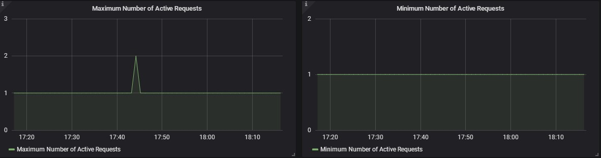

流入请求数目面板（[图80](#图80-流入请求数目面板)）显示了OSS最大流入请求数目和最小流入请求数目随时间的变化。流入请求是指那些正在等待被OSS处理的请求。当开始处理请求，则该请求不再是流入请求，请求将会被放在处理队列中。下面左边的图显示了在上一个收集时间间隔中的流入请求的最大值；而右边的图则显示了收集时间间隔中的最小值。

###### 图80: 流入请求数目面板
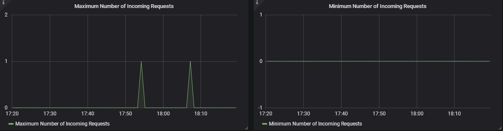

请求等待时间面板（[图81](#图81-请求等待时间面板)）显示了OSS最大请求等待时间和最小请求等待时间随时间的变化。一个请求的等待时间是它到达时刻和开始被处理时刻的时间间隔。下面左边的图显示了在上一个收集时间间隔中的最大的请求等待时间；而右边的图则显示了上一个收集时间间隔中的最小的请求等待时间。

###### 图81: 请求等待时间面板
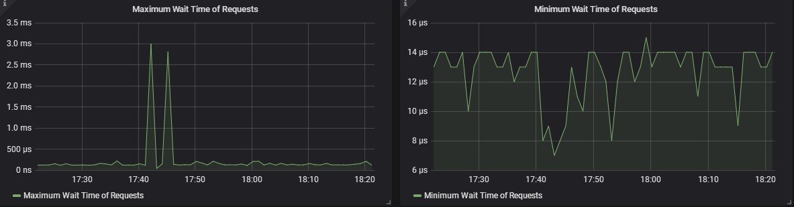

自适应超时值面板（[图82](#图82-自适应超时值面板)）显示了OSS最大自适应超时值和最小自适应超时值随时间的变化。当一个客户端发送请求时，它会给请求的回复一个超时截止时间。由于Lustre的自适应超时机制，服务的超时值是一个运行时服务器和客户端协商的自适应的值。下面左边的图显示了在上一个收集时间间隔中的OSS服务的最大超时值；而右边的图则显示了收集时间间隔中的最小超时值。

###### 图82: 自适应超时值面板
   

可用请求缓冲区数目面板（[图83](#图83-可用请求缓冲区数目面板)）显示了OSS最大可用请求缓冲区数目和最小可用请求缓冲区数目随时间的变化。当一个请求到达时，它会使用一个请求缓冲区。当可用的请求缓冲区数目处于一个低阈值时，就需要更多的缓冲区来避免成为性能的瓶颈。下面左边的图显示了在上一个收集时间间隔中的最大值；而右边的图则显示了收集时间间隔中的最小值。

###### 图83: 可用请求缓冲区数目面板


**活跃的I/O请求数目**面板（[图84](#图84-活跃的io请求数目面板)）显示了OSS最大活跃的I/O请求数目和最小活跃的I/O请求数目随时间的变化。活跃的请求数是指那些正在被OSS处理的请求数目，但不包括那些在队列里面等待被处理的请求。如果活跃的请求的数目小于PTLRPC线程数目减去2（一个用于流入请求处理，另一个用于高优先级请求处理），则通常表示线程数目是足够的。下面左边的图显示了在上一个收集时间间隔中的最大值；而右边的图则显示了收集时间间隔中的最小值。

###### 图84: 活跃的I/O请求数目面板
 

流入I/O请求数目面板（[图85](#图85-流入的io请求数目面板)）显示了OSS最大流入的I/O请求数目和最小流入的I/O请求数目随时间的变化。流入请求是指那些正在等待被OSS处理的请求。当开始处理请求，则该请求不再是流入请求，请求将会被放在处理队列中。下面左边的图显示了在上一个收集时间间隔中的流入I/O请求的最大值；而右边的图则显示了收集时间间隔中的流入I/O请求数目的最小值。

###### 图85: 流入的I/O请求数目面板


I/O请求等待时间面板（[图86](#图86-io请求等待时间面板)）显示了OSS最大I/O请求等待时间和最小I/O请求等待时间随时间的变化。一个请求的等待时间是它到达时刻和开始被处理时刻的时间间隔。下面左边的图显示了在上一个收集时间间隔中的最大的I/O请求等待时间；而右边的图则显示了上一个收集时间间隔中的最小的I/O请求等待时间。

###### 图86: I/O请求等待时间面板
   

I/O服务的自适应超时值面板（[图87](#图87-io服务的自适应超时值面板)）显示了OSS最大I/O服务的自适应超时值和I/O服务的自适应超时值随时间的变化。当一个客户端发送请求时，它会给请求的回复一个超时截止时间。由于Lustre的自适应超时机制，服务的超时值是一个运行时服务器和客户端协商的自适应的值。下面左边的图显示了在上一个收集时间间隔中的OSS I/O服务的最大超时值；而右边的图则显示了收集时间间隔中的OSS I/O服务的最小超时值。

###### 图87: I/O服务的自适应超时值面板


可用I/O请求缓冲区数目面板（[图88](#图88-可用io请求缓冲区数目面板)）显示了OSS最大I/O请求等待时间和最小I/O请求等待时间随时间的变化。当一个请求到达时，它会使用一个请求缓冲区。当可用的请求缓冲区数目处于一个低阈值时，就需要更多的缓冲区来避免成为性能的瓶颈。下面左边的图显示了在上一个收集时间间隔中的最大值；而右边的图则显示了收集时间间隔中的最小值。

###### 图88: 可用I/O请求缓冲区数目面板
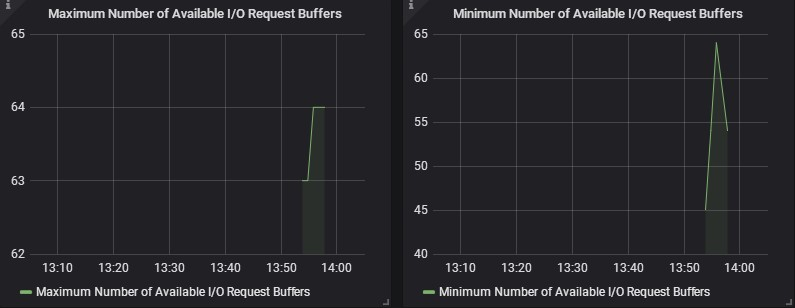

Punch请求处理时间面板（[图89](#图89-punch请求处理时间面板)）显示了OSS最大Punch请求处理时间和最小Punch请求处理时间随时间的变化。请求的处理时间是指它开始被处理的时刻和处理完成时刻之间的时间间隔。下面左边的图显示了在上一个收集时间间隔中的Punch请求处理时间的最大值；而右边的图则显示了收集时间间隔中的Punch请求处理时间的最小值。

###### 图89: Punch请求处理时间面板


读请求处理时间面板（[图90](#图90-读请求处理时间面板)）显示了OSS最大读请求处理时间和最小读请求处理时间随时间的变化。请求的处理时间是指它开始被处理的时刻和处理完成时刻之间的时间间隔。下面左边的图显示了在上一个收集时间间隔中的读请求处理时间的最大值；而右边的图则显示了收集时间间隔中的读请求处理时间的最小值。

###### 图90: 读请求处理时间面板
   

写请求处理时间面板（[图91](#图91-写请求处理时间面板)）显示了OSS最大写请求处理时间和最小写请求处理时间随时间的变化。请求的处理时间是指它开始被处理的时刻和处理完成时刻之间的时间间隔。下面左边的图显示了在上一个收集时间间隔中的写请求处理时间的最大值；而右边的图则显示了收集时间间隔中的写请求处理时间的最小值。

###### 图91: 写请求处理时间面板
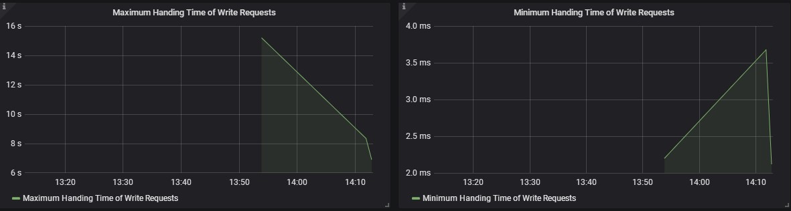

**活跃的创建请求数目**面板（[图92](#图92-活跃的创建请求数目面板)）显示了OSS最大活跃的创建请求数目和最小活跃的创建请求数目随时间的变化。活跃的请求数是指那些正在被OSS处理的请求数目，但不包括那些在队列里面等待被处理的请求。如果活跃的请求的数目小于PTLRPC线程数目减去2（一个用于流入请求处理，另一个用于高优先级请求处理），则通常表示线程数目是足够的。下面左边的图显示了在上一个收集时间间隔中的最大值；而右边的图则显示了收集时间间隔中的最小值。

###### 图92: 活跃的创建请求数目面板
   

流入的创建请求数目面板（[图93](#图93-流入的创建请求数目面板)）显示了OSS最大流入的创建请求数目和流入的创建请求数目随时间的变化。流入请求是指那些正在等待被OSS处理的请求。当开始处理请求，则该请求不再是流入请求，请求将会被放在处理队列中。下面左边的图显示了在上一个收集时间间隔中的流入创建请求的最大值；而右边的图则显示了收集时间间隔中的最小值。

###### 图93: 流入的创建请求数目面板
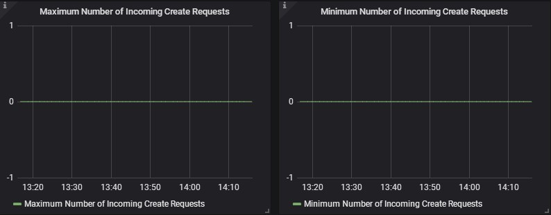   

创建请求等待时间面板（[图94](#图94-创建请求等待时间面板)）显示了OSS最大创建请求等待时间和最小创建请求等待时间随时间的变化。一个请求的等待时间是它到达时刻和开始被处理时刻的时间间隔。下面左边的图显示了在上一个收集时间间隔中的最大的创建请求等待时间；而右边的图则显示了上一个收集时间间隔中的最小的创建请求等待时间。

###### 图94: 创建请求等待时间面板


创建服务的自适应超时值面板（[图95](#图93-流入的创建请求数目面板)）显示了OSS最大创建服务的自适应超时值和最小创建服务的自适应超时值随时间的变化。当一个客户端发送请求时，它会给请求的回复一个超时截止时间。由于Lustre的自适应超时机制，服务的超时值是一个运行时服务器和客户端协商的自适应的值。下面左边的图显示了在上一个收集时间间隔中的OSS创建服务的最大超时值；而右边的图则显示了收集时间间隔中的最小值超时值。

###### 图95: 创建服务的自适应超时值面板


可用创建请求缓冲区数目面板（[图96](#图96-可用创建请求缓冲区数目面板)）显示了OSS最大可用创建请求缓冲区数目和可用创建请求缓冲区数目随时间的变化。当一个请求到达时，它会使用一个请求缓冲区。当可用的请求缓冲区数目处于一个低阈值时，就需要更多的缓冲区来避免成为性能的瓶颈。下面左边的图显示了在上一个收集时间间隔中的最大值；而右边的图则显示了收集时间间隔中的最小值。

###### 图96: 可用创建请求缓冲区数目面板


**活跃的LDLM Canceld请求数目**面板（[图97](#图97-活跃的ldlm-canceld请求数目面板)）显示了OSS最大活跃的LDLM Canceld请求数目和最小活跃的LDLM Canceld请求数目随时间的变化。活跃的请求数是指那些正在被OSS处理的请求数目，但不包括那些在队列里面等待被处理的请求。如果活跃的请求的数目小于PTLRPC线程数目减去2（一个用于流入请求处理，另一个用于高优先级请求处理），则通常表示线程数目是足够的。下面左边的图显示了在上一个收集时间间隔中的最大值；而右边的图则显示了收集时间间隔中的最小值。

###### 图97: 活跃的LDLM Canceld请求数目面板


流入的LDLM Canceld请求数目面板（[图98](#图98-流入的ldlm-canceld请求数目面板)）显示了OSS最大流入的LDLM Canceld请求数目和最小流入的LDLM Canceld请求数目随时间的变化。流入请求是指那些正在等待被OSS处理的请求。当开始处理请求，则该请求不再是流入请求，请求将会被放在处理队列中。下面左边的图显示了在上一个收集时间间隔中的流入请求的最大值；而右边的图则显示了收集时间间隔中的最小值。

###### 图98: 流入的LDLM Canceld请求数目面板
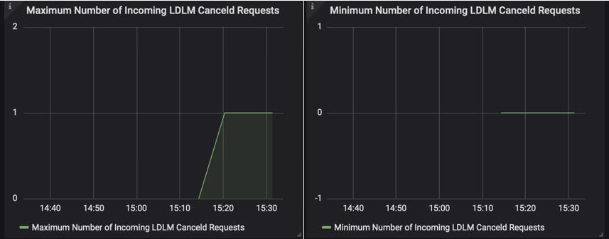

LDLM Canceld请求等待时间面板（[图99](#图99-ldlm-canceld请求等待时间面板)）显示了OSS最大LDLM Canceld请求等待时间和最小LDLM Canceld请求等待时间随时间的变化。一个请求的等待时间是它到达时刻和开始被处理时刻的时间间隔。下面左边的图显示了在上一个收集时间间隔中的最大的LDLM Canceld请求等待时间；而右边的图则显示了上一个收集时间间隔中的最小的LDLM Canceld请求等待时间。

###### 图99: LDLM Canceld请求等待时间面板
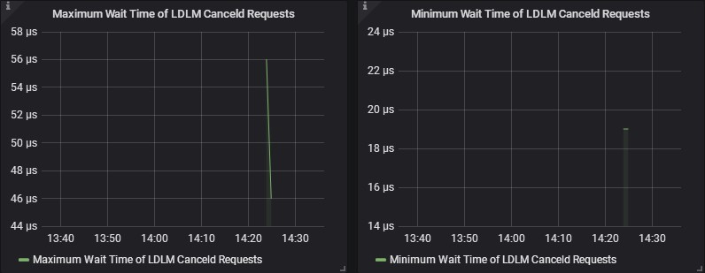

LDLM Canceld服务自适应超时值面板（[图100](#图100-ldlm-canceld服务自适应超时值面板)）显示了OSS最大LDLM Canceld服务自适应超时值和最小LDLM Canceld服务自适应超时值随时间的变化。当一个客户端发送请求时，它会给请求的回复一个超时截止时间。由于Lustre的自适应超时机制，服务的超时值是一个运行时服务器和客户端协商的自适应的值。下面左边的图显示了在上一个收集时间间隔中的OSS LDLM Canceld服务的最大超时值；而右边的图则显示了收集时间间隔中的最小值超时值。

###### 图100: LDLM Canceld服务自适应超时值面板
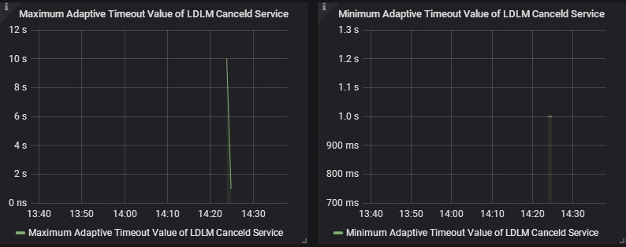

可用的LDLM Canceld请求缓冲区数目面板（[图101](#图101-可用的ldlm-canceld请求缓冲区数目面板)）显示了OSS最大可用的LDLM Canceld请求缓冲区数目和最小可用的LDLM Canceld请求缓冲区数目随时间的变化。当一个请求到达时，它会使用一个请求缓冲区。当可用的请求缓冲区数目处于一个低阈值时，就需要更多的缓冲区来避免成为性能的瓶颈。下面左边的图显示了在上一个收集时间间隔中的最大值；而右边的图则显示了收集时间间隔中的最小值。

###### 图101: 可用的LDLM Canceld请求缓冲区数目面板


**活跃的LDLM Callback请求数目**面板（[图102](#图102-活跃的ldlm-callback请求数目面板)）显示了OSS最大活跃的LDLM Callback请求数目和最小活跃的LDLM Callback请求数目随时间的变化。活跃的请求数是指那些正在被OSS处理的请求数目，但不包括那些在队列里面等待被处理的请求。如果活跃的请求的数目小于PTLRPC线程数目减去2（一个用于流入请求处理，另一个用于高优先级请求处理），则通常表示线程数目是足够的。下面左边的图显示了在上一个收集时间间隔中的最大值；而右边的图则显示了收集时间间隔中的最小值。

###### 图102: 活跃的LDLM Callback请求数目面板


流入的LDLM Callback请求数目面板（[图103](#图103-流入的ldlm-callback请求数目面板)）显示了OSS最大流入的LDLM Callback请求数目和最小流入的LDLM Callback请求数目随时间的变化。流入请求是指那些正在等待被OSS处理的请求。当开始处理请求，则该请求不再是流入请求，请求将会被放在处理队列中。下面左边的图显示了在上一个收集时间间隔中的流入请求的最大值；而右边的图则显示了收集时间间隔中的最小值。
###### 图103: 流入的LDLM Callback请求数目面板


LDLM Callback请求等待时间面板（[图104](#图104-ldlm-callback请求等待时间面板)）显示了OSS最大LDLM Callback请求等待时间和最小LDLM Callback请求等待时间随时间的变化。一个请求的等待时间是它到达时刻和开始被处理时刻的时间间隔。下面左边的图显示了在上一个收集时间间隔中的最大的请求等待时间；而右边的图则显示了上一个收集时间间隔中的最小的请求等待时间。
###### 图104: LDLM Callback请求等待时间面板


LDLM Callback服务自适应超时值面板（[图105](#图105-ldlm-callback服务自适应超时值面板)）显示了OSS最大LDLM Callback服务自适应超时值和最小LDLM Callback服务自适应超时值随时间的变化。当一个客户端发送请求时，它会给请求的回复一个超时截止时间。由于Lustre的自适应超时机制，服务的超时值是一个运行时服务器和客户端协商的自适应的值。下面左边的图显示了在上一个收集时间间隔中的OSS LDLM Callback服务的最大超时值；而右边的图则显示了收集时间间隔中的最小值超时值。
###### 图105: LDLM Callback服务自适应超时值面板


可用的LDLM Callback请求缓冲区数目面板（[图106](#图106-可用的ldlm-callback请求缓冲区数目面板)）显示了OSS最大可用的LDLM Callback请求缓冲区数目和最小可用的LDLM Callback请求缓冲区数目随时间的变化。当一个请求到达时，它会使用一个请求缓冲区。当可用的请求缓冲区数目处于一个低阈值时，就需要更多的缓冲区来避免成为性能的瓶颈。下面左边的图显示了在上一个收集时间间隔中的最大值；而右边的图则显示了收集时间间隔中的最小值。
###### 图106: 可用的LDLM Callback请求缓冲区数目面板
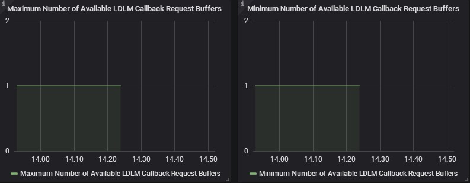

### 服务器仪表盘

服务器仪表盘（[图107](#图107服务器仪表盘)）页面显示了服务器的统计信息。

###### 图107：服务器仪表盘


以下是在服务器仪表盘中可以找到的面板：

- **CPU 使用率**面板（[图 108](#图108cpu-使用率面板)）显示了CPU在不同状态下的使用率，即CPU在执行用户代码、执行系统代码、等待数据读写操作、空闲时所占用的时间。

  ###### 图108：CPU 使用率面板

   

- **内存使用率**面板（[图109](#图109内存使用率面板)）显示了内存的使用情况，这些值来自于操作系统，包括：Used, Buffered, Cached, Free, Slab_recl, Slab_unrecl。

  ###### 图109：内存使用率面板
  
   
  
- 磁盘写速率面板（[图110](#图110磁盘写速率面板)）显示出服务器磁盘写入速率随时间的变化。

  ###### 图110：磁盘写速率面板

   


- **磁盘读速率**面板（[图111](#图111磁盘读速率面板)）显示出服务器磁盘写入速率随时间的变化。

  ###### 图111：磁盘读速率面板

   


- **根目录磁盘使用率**面板（[图112](#图112根目录磁盘使用率)）显示了根目录的空闲空间、使用空间、预留空间。

  ###### 图112：根目录磁盘使用率

   

- **负载**面板（[图113](#图113负载面板)）显示了服务器负载情况，即服务器运行队列中可运行的任务数量。相关信息由操作系统提供，分为三类：

    - **Shortterm（短期）**—  一分钟内的平均负载。
    - **Midterm（中期）**—  五分钟内的平均负载。
    - **Longterm（长期）**— 十五分钟内的平均负载。

   ###### 图113：负载面板
	​	

- 启动时间面板（[图114](#图114启动时间面板)）显示出服务器已经启动了多长时间。提供诸如平均运行时间或在一段时间内达到的最大正常运行时间等信息。

  ###### 图114：启动时间面板

   

- **用户数**面板（[图115](#图115用户数面板)）显示出登陆系统的用户数量。

  ###### 图115：用户数面板

   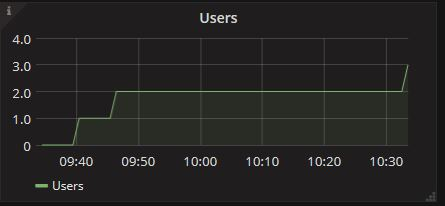


- **温度**面板（[图116](#图116温度面板)）显示出从各温度传感器中收集的温度信息。

  ###### 图116：温度面板

  


### SFA 物理磁盘仪表盘

**SFA物理磁盘仪**表盘（[图117](#图117-sfa物理磁盘仪表盘)）显示了SFA物理磁盘的相关信息。

###### 图117: SFA物理磁盘仪表盘

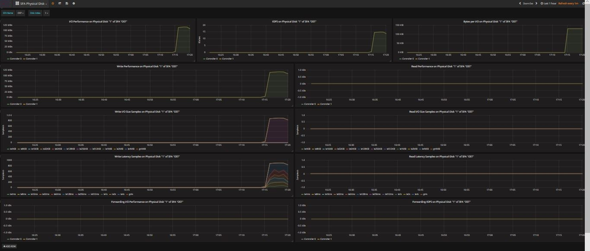


下面是可以在**SFA物理磁盘**表盘中可以找到的面板：

- **I/O** **吞吐率**面板（[图118](#图118io-吞吐率面板)）显示出该物理磁盘的I/O吞吐率。

  ###### 图118：I/O 吞吐率面板
   

- **IOPS**面板（[图119](#图119iops面板)）显示出该物理磁盘每秒I/O操作数目。

  ###### 图119：IOPS面板
  
   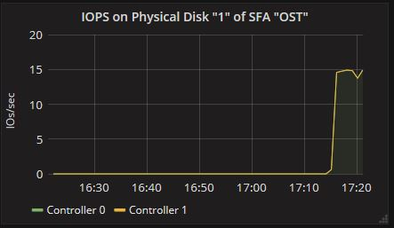
  
- **I/O大小**面板([图120](#图120io-大小面板)) 显示出各控制器中该物理硬盘的每次I/O的平均大小。

  ###### 图120：I/O 大小面板

   

- **写数据吞吐率**面板（[图121](#图121写数据吞吐率面板)）显示出各控制器中，该物理硬盘的写入吞吐率。

  ###### 图121：写数据吞吐率面板
  
   

- **写数据的I/O大小样品采样数目**面板（[图122](#图122写数据的io大小样品采样数目面板)）显示出该物理磁盘上每种I/O大小的采样数目。

  ###### 图122：写数据的I/O大小样品采样数目面板
  
   
  
- **数据写入延迟样品采样数目**面板（[图123](#图123数据写入延迟样品采样数目面板)）显示出显示出该物理磁盘上，每种I/O延迟的采样数目。

  ###### 图123：数据写入延迟样品采样数目面板

  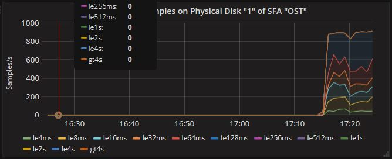        


### SFA 虚拟磁盘仪表盘

**SFA虚拟磁盘**表盘（[图124](#图124sfa虚拟磁盘表盘)）显示出SFA虚拟磁盘表盘的信息。

###### 图124：SFA虚拟磁盘表盘

下面是可以在**SFA虚拟磁盘**表盘中找到的面板：

- I/O吞吐率面板（[图125](#图125io吞吐率面板)）显示出该虚拟磁盘上的I/O吞吐率。

  ###### 图125：I/O吞吐率面板

  

- IOPS面板（[图126](#图126iops面板)）显示出在不同的控制器上，该虚拟磁盘上的IOPS。

  ###### 图126：IOPS面板

  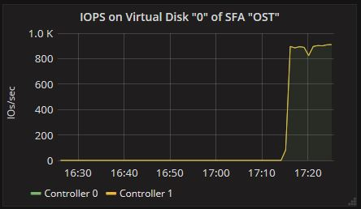

- I/O大小面板（[图127](#图127bytes-per-io-on-virtual-disk-panel)）显示出各控制器上，该虚拟磁盘每次I/O的平均大小。

  ###### 图127：Bytes per I/O on Virtual Disk Panel

   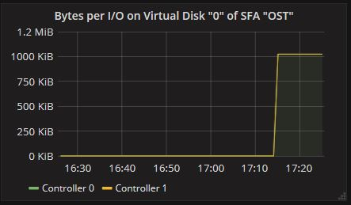

- 数据写入速率面板（[图128](#图128write-performance-on-vrtual-disk-panel)）显示出每个控制器上，该虚拟磁盘的数据写入速率。

  ###### 图128：Write Performance on Virtual Disk Panel
  
    
  
- 数据写入的I/O大小样品采集数目面板（[图129](#图129数据写入的io大小样品采集数目面板)）显示出该SFA虚拟磁盘上，数据写入的I/O大小的分布。

  ###### 图129：数据写入的I/O大小样品采集数目面板

   

- 数据写入的延迟样品采集数目面板（[图130](#图130数据写入的延迟样品采集数目面板)）显示出该SFA虚拟磁盘上，数据写入延迟的分布。

  ###### 图130：数据写入的延迟样品采集数目面板
  
   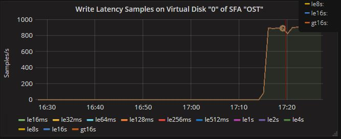

## 压力测试

为了验证监控在高负载的集群环境下是否运行良好，我们设计了**collectd-stress2** 插件来进行压力测试。它是**Stress** 插件的升级版，它可以通过几个**collectd**客户端来模拟几百个服务器收集的数以万计的监控数据。

### 在代理节点安装插件

由于**stress2**插件会产生大量的模拟的监控数据，污染数据库，所以该插件默认不会在所有的客户端安装。当使用**esmon_install** 部署完监控系统之后，用户可以选择某个客户端作为压测客户端。可以在ISO目录下找到collectd-stress2*.rpm并通过以下命令进行安装：

```shell
# rpm --ivh collectd-stress2*.rpm
```

### 在代理节点更新配置文件

安装**stress2** RPM之后，更新配置文件/etc/collectd.conf, 添加下面的配置：

- **Thread**—定义了测试线程数目**。**

- **Metric**—定义了一个监控目标的所有属性,它可以指定多次，用来同时模拟不同的监控目标**，**它包含以下属性:
  - **Variable**—定义了监控目标变化的范围以及变化的速度，可以指定多次。
    - **Name**—定义了变量名。
    - **Number**—定义了变量变化的范围最大值.
    - **UpdateIterval**—定义了变量变更的间隔时间。

  - **Host**—定义了客户端的主机名，通常定义为"${key:hostname}"，由程序自动设置当前主机名，它和下面的**Plugin**，**PluginInstance**，**Type**，**TypeInstance**共同组成collectd 描述收集数据对象的区分符，详情请参见[Collectd 的描述符](https://collectd.org/wiki/index.php/Naming_schema)**。**
  - **Plugin**—定义了collectd 识别符中的plugin 成员。
  -  **PluginInstance**—定义了collectd 识别符中的plugininstance 成员。
  - **Type**—定义了collectd 识别符中的type 成员,详细可参见[数据类型](https://collectd.org/wiki/index.php/Derive)**。**
  - **TypeInstance**—定义了collectd 识别符中的type instance成员。
  - **TsdbName**—定义了提交到数据库格式中的名字。
  - **TsdbTags**—定义了提交到数据库格式的标签，方便后期分类查找。

**下面是一个**/etc/collectd.conf**的例子。**

```yaml
例子:
LoadPlugin stress2
<Plugin "stress2">
  Thread 32
  <Metric>
	<Variable>
	    Name "ost_index"
	    Number 10
	    UpdateIterval 0
	</Variable>
	<Variable>
	    Name "job_id"
	    Number 7000
	    UpdateIterval 10
	</Variable>
	  Host "${key:hostname}"
	  Plugin "stress-${variable:ost_index:OST%04x}"
	  PluginInstance "jobstat_${variable:job_id:job%d}"
	  Type "derive"
	  TypeInstance "sum_read_bytes"
	  TsdbName "ost_jobstats_samples"
	  TsdbTags "optype=sum_read_bytes fs_name=stress ost_index=${variable:ost_index:OST%04x} job_id=${variable:job_id:job%d}"
   </Metric>
  <Metric>
	<Variable>
	    Name "mdt_index"
	    Number 10
	    UpdateIterval 0
	</Variable>
	<Variable>
	    Name "md_stats"
	    Number 10
	    UpdateIterval 10
	</Variable>
	  Host "${key:hostname}"
	  Plugin "stress-${variable:mdt_index:MDT%04x}"
	  PluginInstance "md_stats"
	  Type "derive"
	  TypeInstance "open"
	  TsdbName "md_stats"
	  TsdbTags "optype=open fs_name=stress mdt_index=${variable:mdt_index:MDT%04x} mdt_stats_open=${variable:mdt_stats_open:%d}"
   </Metric>
</Plugin>

```

### 进行压力测试

在更改了配置文件之后，重启Collectd:

```shell
# service collectd restart
```

通过查看/var/log/messages日志，可以看到如下消息：

```yaml
server11 collectd[20830]: stress2: time: 1.79244 for 70100 commits with 32 threads, 39108.70099 commits/second
```

上面信息显示**stress2** 插件已经成功加载运行，并且产生了大量的监控数据。

下面将以上面的配置文件为例，分析在如下指定的硬件环境下，如何分析对应的监控瓶颈。

- **操作系统版本：**CentOS7。

- **内存****：**128GB。

- **处理器:** Intel(R) Xeon(R) CPU E5-2630 v3 @ 2.40GHz。

-  **硬盘：**Samsung SSD 850  2B6Q。

监控客户端和服务器端运行在同一台服务器上，Influxdb 数据存在SSD对应的Ext4文件系统上。

**前提条件：**

- **Collectd** **收集数据间隔****：**60秒。

-  **Grafana** **展示历史时间长度：**1小时。

- **Grafana** **自动刷新间隔：**60 秒。

-  **Collectd** **运行时间：大于1个小时。**

**结论：**

-  **Grafana** **页面一直处于刷新状态：**监控过载。

- **Grafana** **页面有空闲：**监控运行良好。

理论上Grafana 的刷新时间，等于数据库查询时间加上页面布局的加载时间。

我们可以通过查询数据库，来衡量数据库的查询性能，比如针对ESMON Grafana “Read Throughput per Job”查询，数据库端相应的查询语句：

```sql
influx -database esmon_database –execute \
"SELECT "value" FROM "ost_jobstats_samples" WHERE ("optype" = 'sum_read_bytes' AND "fs_name" = 'stress') AND time >= now() - 1h GROUP BY "job_id"" 

```

随着监控软件的运行，可以在数据库后端的host 上执行该条语句，验证数据库端查询的时间。

[图71](#图71可用ldlm-canceld请求缓冲区数目面板)所示，Influxdb 在一个小时以内，数据查询时间呈线性增长，因为查询获得的数据量会随着时间增长而增长。但是一个小时以后，查询时间稳定在二十多秒。

###### 图131：Influxdb Query Time 变化曲线图

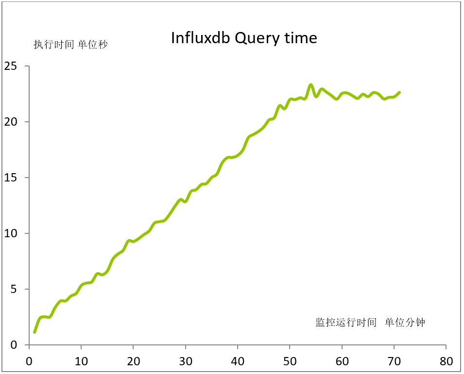

验证完了数据库端的负载，我们还需要验证Grafana界面的加载情况，如[图72](#图72活跃的ldlm-callback请求数目面板) 所示，通过Grafana登陆查看“**每个任务读吞吐量**”。

###### 图132：每个任务读吞吐压测面板

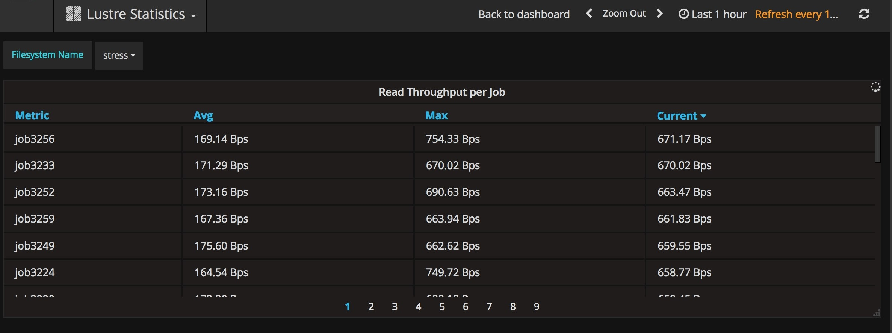

如果页面一直处于刷新状态，页面在60秒以内无法加载出来，则说明当前配置下监控处于过载状态，说明当前需要升级监控的硬件配置，或者增大收集时间间隔。否则则表明监控运行良好。通过不断调整*/etc/collectd.conf**中的***job_id**的Number，观察页面加载延迟，可以得到当前硬件配置下可支持的最大压力。测试表明，该设置条件下，监控可以支持10 个OST上并行运行的7000个作业。


## 故障排除

部署服务器收集了所有可用于调试的日志，并将其保存至的*/var/log/esmon_install/[installing_date]* 目录下。 一旦操作失败，相关错误信息将被输出至*/var/log/esmon_install/[installing_date]/error.log* 文件中。通常，第一条错误信息包含了导致该操作失败的原因。
