# DDN Exascaler Monitoring System Manual

## Introduction to DDN EXAScaler Performance Monitoring System

*LustrePerfMon* is a monitoring system that can collect system statistics of DDN EXAScaler for performance monitoring and analysis. It is based on multiple widely used open-source software. Some extra plugins have been developed by DDN for enhancement.

One of the main components of *LustrePerfMon* is **сollectd**. **collectd** is a daemon, which collects system performance statistics periodically and provides mechanisms to store the values in a variety of ways. *LustrePerfMon* is based on the open-source **collectd**, yet includes more plugins, such as Filedata, Ganglia, Nagios, Stress, Zabbix and so on.

### Terminology

- **LustrePerfMon**: Abbreviation for *DDN EXAScaler Performance Monitoring System*.
- **DDN SFA**: *DDN* *Storage Fusion Architecture* provides the foundation for balanced, high-performance storage. Using highly parallelized storage processing technology, SFA delivers both unprecedented IOPS and massive throughput.
- **DDN EXAScaler**: Software stack developed by DDN to overcome the toughest storage and data management challenges in extreme, data-intensive environments.
- **Installation Server**: The server on which the installation process is triggered.
- **Monitoring Server**: The server on which the database (*Influxdb*) and web server (*Grafana*) of the monitoring system will run.
- **Monitoring** **Agent(s)**: The hosts, from which the monitoring system will collect metrics from. The metrics includes information about CPU, memory, Lustre, SFA storage, and so on. A *collectd* daemon will run on each monitoring client.
- **DDN IME**: DDN’s *Infinite Memory Engine (IME)* is a flash-native, software-defined, storage cache that streamlines application IO, eliminating system bottlenecks.
- **Lustre**: The *Lustre* file system is an open-source, parallel file system  that supports many requirements of leadership class HPC simulation environments.
- **OST**: The *Object Storage Target(OST)* of *Lustre* is the storage target that store the file data objects.
- **OSS**: The *Object Storage Server(OSS)* of *Lustre* is the server that manage the *Object Storage Target*.
- **MDT**: The *Metadata Target(MDT)* of *Lustre* is the storage target that stores the file metadata.
- **MDS**: The *Metadata Servers(MDS)* of *Lustre* is the server that provides metadata services for a file system and manages one or multiple Metadata Target (MDT).

### Collectd plugins of DDN

Several additional plugins are added to **collectd** in LustrePerfMon to support various functions.

- **Filedata plugin**: The **Filedata** plugin is able to collect data by reading and parsing a set of files. An XML-formatted definition file is required for the **Filedata** plugin to understand which files to read and how to parse these files. The most common usage of the **Filedata** plugin is to collect metrics through /proc interfaces of a running Lustre system.

- **Ganglia plugin**: The **Ganglia** plugin can send metrics collected by a **collectd** client daemon to Ganglia server.

- **IME plugin**: The **IME** plugin can collect performance information from **DDN IME**. The **IME** plugin shares the similar definition file format and configuration format with the **Filedata** plugin.

- **SSH plugin**: The **SSH** plugin is able to collect metrics by running commands on remote hosts by using SSH connections. The **SSH** plugin is used to collect metrics from DDN SFA Storage. Like the **IME** plugin, the **SSH** plugin shares the similar definition file format and configuration format with the **Filedata** plugin.
-  **Stress plugin**: The **Stress** plugin can push a large amount of metrics to server from **collectd** client in order to benchmark the performance of the collecting system under high pressure.
- **Stress****2 plugin**: Enhanced version of **Stress** plugin. The format of pushed metrics can be flexibly configured to simulate different real metrics.
- **Zabbix plugin**: The Zabbix plugin is used to send metrics from **collectd** to **Zabbix** system.

## Installation Requirements

### Installation Server

- **OS distribution:** CentOS7/RHEL7
- **Free disk space:** > 500 MB. The Installation Server will save all installation logs to the /var/log/esmon_install directory, which requires some free disk space.
- **Network:** The Installation Server must be able to start SSH connections to the Monitoring Server and Monitoring Clients without a password prompt.
- **LustrePerfMon ISO image:** The LustrePerfMon ISO image must be available on the Installation Server.
- **Clock and Time Zone:** The clock and time zone should be synchronized with other nodes in the cluster.

### Monitoring Server

- **OS distribution:** CentOS7/RHEL7
- **Free disk space:** > 5 GB. Influxdb will be running on this server. More disk space is required to keep more data in Influxdb
- **Network:** SSHD should be running on the Monitoring Server. The Installation Server must be able to connect to the Monitoring Server without a password prompt.
- **Clock and Time Zone:** The clock and time zone should be synchronized with other nodes in the cluster.

### Monitoring Agent

- **OS distribution:** CentOS7/RHEL7 or CentOS6/RHEL6
- **Free disk space:** > 200 MB. The installation server will save necessary RPMs in directory /var/log/esmon_install, which requires some free disk space.
- **Network:** SSHD should be running on the Monitoring Agent. The Installation Server must be able to connect to the Monitoring Agent without a password prompt.
- **EXAScaler version:** EXAScaler 2.x, EXAScaler 3.x or EXAScaler4.x.
- **Clock and Time Zone:** The clock and time zone should be synchronized with other nodes in the cluster.

### SFA

- **Firmware release:** 3.x or 11.x


## Installation Process

### Preparing the Installation Server

1. Copy the LustrePerfMon ISO image file to the Installation Server, for example, to /ISOs/esmon.iso.

2. Mount the LustrePerfMon ISO image on the Installation Server:

   ```shell
   mount -o loop /ISOs/esmon.iso /media
   ```

3. On the Installation Server, back up old LustrePerfMon configuration file, if there is any:

   ```shell
   cp /etc/esmon_install.conf /etc/esmon_install.conf_backup
   ```

4. On the Installation Server, uninstall old LustrePerfMon RPM, if there is any:

   ```shell
   rpm -e esmon
   ```

5.  Install the LustrePerfMon RPM on the Installation Server:

   ```shell
   rpm -ivh /media/RPMS/rhel7/esmon*.rpm
   ```


### Monitoring Server

If firewall is started on the monitoring server, the ports 3000, 4242, 8086, 8088 and 25826 should be opened, otherwise the installation or running of LustrePerfMon might have problem. The 3000 port is for the webb interface of Grafana. The ports 4242, 8086, 8088, 25826 are for the data communication and management of Influxdb, Grafana and Collectd.


### Updating the configuration

After the LustrePerfMon RPM has been installed on the Installation Server, update the configuration file /etc/esmon_install.conf, which includes all the necessary information for installation. Define the following parameters:

- In the section **agents**, specify information about all of the hosts where LustrePerfMon agent packages should be installed and configured:
  - **enable_disk** —This option determines whether to collect disk metrics from this agent. Default value: **false**.
  - **host_id** — This option is the ID of the host. The ID of a host is a unique value to identify the host. Two hosts should not share the same **host_id**.
  -  **ime** —This option determines whether to enable IME metrics collection on this LustrePerfMon agent. Default value: **false**.
  - **infiniband** —This option determines whether to enable Infiniband metrics collection on this LustrePerfMon agent. Default value: **false**.
  - **lustre_mds** — Define whether to enable (**true**) or disable (**false**) metrics collection of Lustre MDS. Default value: **true**.
  - **lustre_oss** — Define whether to enable (**true**) or disable (**false**) metrics collection of Lustre OSS. Default value: **true**.
  -  **sfas** — This list includes the information of DDN SFAs on this LustrePerfMon agent.
    - **controller0_host** — This option is the hostname/IP of the controller 0 of this SFA. Default value: **controller0_host**.
    - **controller****1_host** — This option is the hostname/IP of the controller 1 of this SFA. Default value: **controller1_host**.
    - **Name** —This option is the unique name of this controller. This value will be used as the value of "fqdn" tag for metrics of this SFA. Thus, two SFAs shouldn't have the same **name**.
  
- **agents_reinstall** — Define whether to reinstall (**true**) LustrePerfMon clients or not (**False**). Default value: **true**.

- **collect_interval** — The interval (in seconds) to collect data points on LustrePerfMon clients. Default value: **60**.

- **continuous_query_interval** — The interval of continuous query. The value of **continuous_query_interval \* collect_interval** is the real interval in seconds between two adjacent data points of each continuous query. Usually, in order to down sample the data and reduce performance impact, this value should be larger than "1". Default value: **4**.

- **iso_path** — The path where the LustrePerfMon ISO image is saved. Default value: **/root/esmon.iso**.

- **lustre_default_version** — The default Lustre version to use, if the Lustre RPMs installed on the LustrePerfMon client is not the supported version. The current supported values of the parameter are **es2**, **es3**, **es4** and **error**. If the parameter **error** is configured, an error will be raised when an LustrePerfMon client is using an unsupported Lustre version.

- **lustre_exp_ost** — Define whether to enable (**true**) or disable (**false**) metrics collection of export information of Lustre OST. To avoid a flood of metrics, this parameter is usually disabled in Lustre file systems with a large number of clients. Default value: **false**.

- **lustre_exp_mdt** — Define whether to enable (**true**) or disable (**false**) metrics collection of export information of Lustre MDT. To avoid a flood of metrics, this parameter is usually disabled in Lustre file systems with a large number of clients. Default value: **false**.

- In the section **server**, specify information about all of the hosts where LustrePerfMon server packages should be installed and configured:

  - **drop_database** —If the parameter is set to **true**, the LustrePerfMon database in Influxdb will be dropped. If the parameter is set to **false**, the LustrePerfMon database in Influxdb will be kept as it is. Default value: **false**.

    ---------------------

    **Important:      drop_database** should only be enabled when the data in Influxdb is not needed anymore. 

    -----------
    
  - **erase_influxdb** — If the parameter is enabled (set to **true**), all the data and metadata of Influxdb will be completely erased. By enabling **erase_influxdb**, some corruption problems of Influxdb could be fixed. If the parameter is disabled (set to **False**), the data and metadata of Influxdb will not be completely erased.
  
    ----------------

    **Important:      erase_influxdb** should only be enabled when the data/metadata in Influxdb is not needed anymore. Please double check the influxdb_path option is properly configured before enabling this option.

    ----------------------

  - **host_id** — The unique ID of the host.

  - **influxdb_path** — This option is Influxdb directory path on LustrePerfMon server node. Default value: **/esmon/influxdb**.

    ------------
  
    **Important:**      Please do not put any other files/directries under this directory of LustrePerfMon server node, because, with "erase_influxdb" option enabled, all of the files/directries under that directory will be removed.
  
    ------------------------------
  
  - **reinstall** —This option determines whether to reinstall the LustrePerfMon server. Default value: **true**.

- In the section **ssh_hosts**, specify details necessary to log in to the Monitoring Server and to each Monitoring Agent using SSH connection:

  - **host_id** — The unique ID of the host. Two hosts *should not* share the same **host_id**.
  - **hostname** — The hostname/IP to use when connecting to the host using SSH. "ssh" command will use this hostname/IP to login into the host. If the host is the LustrePerfMon server, this hostname/IP will be used as the server host in the **write_tsdb** plugin of LustrePerfMon agent.
  -  **ssh_identity_file** — The SSH key file used for connecting to the host. If the default SSH identity file works, this option can be set to **None**. Default value: **None**.
  - **local_host** —This option determines whether this host is local host. Default value: **false**.

  --------------

  **Note:   host_id** and **hostname** can be different for a host, because there can be multiple ways to connect to the same host.

  -------------

  

Below is an example of /etc/esmon_install.conf:

```yaml
Example:

agents:
  - enable_disk: false
    host_id: Agent1
    ime: false
    infiniband: false
    lustre_mds: true
    lustre_oss: true
    sfas:
      - controller0_host: 10.0.0.1
        controller1_host: 10.0.0.2
        name: SFA1
      - controller0_host: 10.0.0.3
        controller1_host: 10.0.0.4
        name: SFA2
  - host_id: Agent2
    sfas: []
agents_reinstall: true
collect_interval: 60
continuous_query_interval: 4
iso_path: /root/esmon.iso
lustre_default_version: es3
lustre_exp_mdt: false
lustre_exp_ost: false
server:
  drop_database: false
  erase_influxdb: false
  host_id: Server
  influxdb_path: /esmon/influxdb
  reinstall: true
ssh_hosts:
  - host_id: Agent1
    hostname: Agent1
    local_host: false
    ssh_identity_file: None
  - host_id: Agent2
    hostname: Agent2
  - host_id: Server
    hostname: Server
```


### Running installation on the cluster

After the */etc/esmon_install.conf* file has been updated correctly on the Installation Server, run the following command to start the installation on the cluster:

```shell
esmon_install
```

All the logs that are useful for debugging are saved under /var/log/esmon_install directory of the Installation Server.

Apart from installing LustrePerfMon on a fresh system, the command **esmon_install** can also be used for upgrading an existing LustrePerfMon system. The configuration file */etc/esmon_install.conf* should be backed up after installation of LustrePerfMon in case of upgrading in the future.

----------

**Important:**      When upgrading an existing LustrePerfMon system, **erase_influxdb** and **drop_database** should be disabled, unless the data or metadata in Influxdb is not needed anymore.

---------

When installing or upgrading, **esmon_install** will cleanup and install the default LustrePerfMon dashboards of Grafana. Except for the default LustrePerfMon dashboards, **esmon_install** will not change any other existing dashboards of Grafana.

-------------

**Important:**      Before upgrading an existing LustrePerfMon system, all default LustrePerfMon dashboards customized via a Grafana web page should be saved under different names, otherwise the modifications will be overwritten.

------------


### Accessing the Monitoring Web Page

The Grafana service is started on the Monitoring Server automatically. The default HTTP port is 3000. A login web page will be shown through that port (see [Figure 1](#figure-1-grafana-login-web-page) below). The default user and password are both “admin”.

###### Figure 1: Grafana Login Web Page


------

**Important:**      The host that runs the web browser to access the monitoring web page should have the same time clock and time zone with the servers. Otherwise, the monitoring results might be shown incorrectly.

----------


## Dashboards

From the Home dashboard (see [Figure 2](#figure-2-home-dashboard)) different dashboards can be chosen to view different metrics collected by LustrePerfMon.

###### Figure 2: Home Dashboard

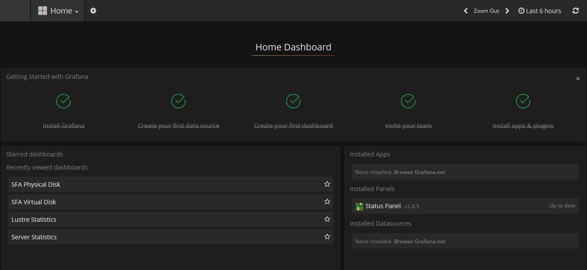

### Cluster Status Dashboard

The **Cluster Status** dashboard (see [Figure 3](#figure-3-cluster-status-dashboard) below) shows a summarized status of the servers in the cluster. The background color of panels show the servers’ working status:

- If the color of the panel is green, it means the server is under normal condition.

- If the color of the panel is yellow, it means the server is under warning status due to one or more of the following conditions:
  - Idle CPU is less than 20%

  - Load is higher than 5
  - Free memory is less than 1000 MiB
  - Free space of “/” is less than 10 GiB

- If the color of the panel is red, it means the server is under critical status due to one or more of the following conditions:

  - Idle CPU is less than 5% 
  - Load is higher than 10

  - Free space of “/” is less than 1 GiB

  - Free memory is less than 100 MiB

###### Figure 3: Cluster Status Dashboard

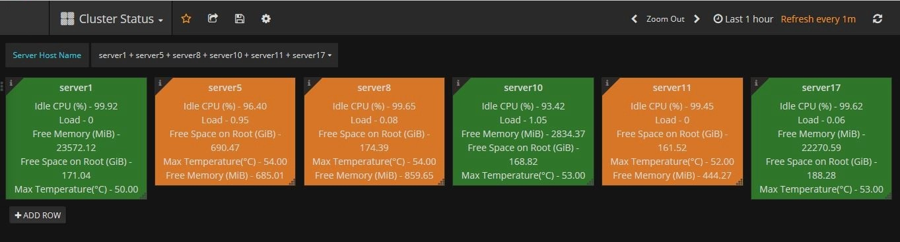

### Lustre Status Dashboard

The Lustre Statistics dashboard ([Figure 4](#figure-4-lustre-statistics-dashboard)) shows metrics of Lustre file systems.

###### Figure 4: Lustre Statistics Dashboard

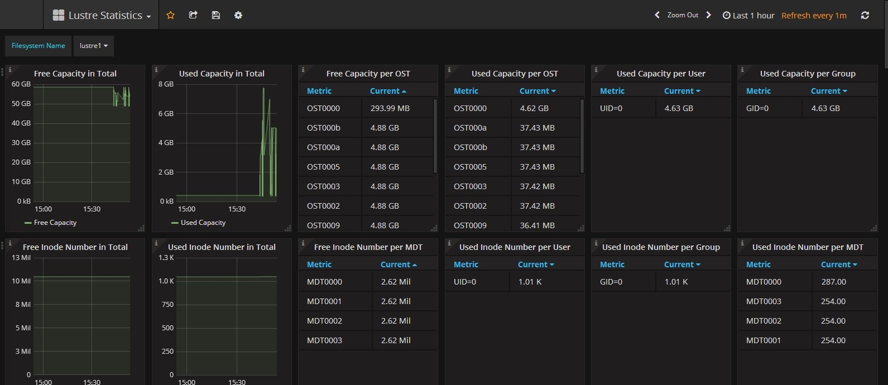

The following pictures are some of the panels in the **Lustre Statistics** dashboard.

- The **Free Capacity in Total** panel ([Figure 5](#figure-5-free-capacity-in-total-panel)) shows how much free capacity remains in the Lustre filesystem. The test case used in the figure is running “dd if=/dev/zero of=/mnt/lustre/file bs=1M” from about 18:40, and it shows that the free capacity is being consumed at a speed of about 20MB/s.

  ###### Figure 5: Free Capacity in Total Panel

   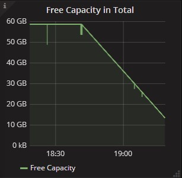

- The **Used Capacity in Total** panel ([Figure 6](#figure-6-used-capacity-in-total-panel)) shows how much capacity in total is used in the Lustre filesystem. The test case used in the figure is running “dd if=/dev/zero of=/mnt/lustre/file bs=1M” from about 18:40, and it can be seen from the figure that the used capacity has increased at the rate of about 20 MB/s.

  ###### Figure 6: Used Capacity in Total Panel

   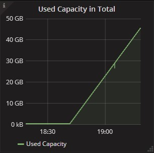

- The **Free Capacity per OST** panel ([Figure 7](#figure-7-free-capacity-per-ost-panel)) shows how much free capacity per OST remains in the Lustre filesystem. As shown in the figure, OST0002 free capacity is 946.47MB, OST0007 free capacity is 3.59GB, the free capacity of the remaining OSTs is 4.09GB each. To display the current free capacity per OST in the ascending or descending order, click on **Current**.

  ###### Figure 7: Free Capacity per OST Panel

  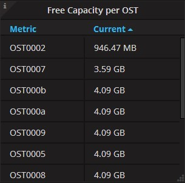         

- The **Used Capacity per OST** panel ([Figure 8](#figure-8-used-capacity-per-ost-panel)) shows how much capacity per OST is used in the Lustre filesystem. As shown in the figure, the used capacity of OST0002 is 3.97GB, the used capacity of OST0007 is 1.27GB, the used capacity of the remaining OSTs is 820.8MB. To display the current used capacity per OST  in the ascending or descending order, click on **Current**.

  ###### Figure 8: Used Capacity per OST Panel

​        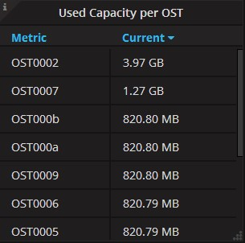

- The Used Capacity per User panel ([Figure 9](#figure-9-used-capacity-per-user-panel)) shows how much capacity per user is used in the  Lustre filesystem. As shown in the figure, the current used capacity of the user with UID=0 is 13.65GB, the current used capacity of the user with UID=1000 is 2.10GB, the current used capacity of the user with UID=1001 is 954.37MB.

   ###### Figure 9: Used Capacity per User Panel

   ###### 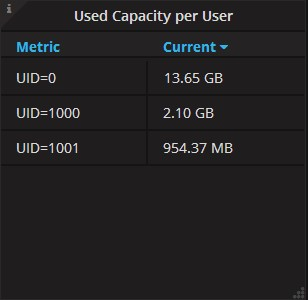

- The **Used Capacity per Group** panel ([Figure 10](#figure-10-used-capacity-per-group-panel)) shows how much capacity per group is used in the Lustre filesystem. As shown in the figure, the current used capacity of the group with GID=0 is 13.65GB, the current used capacity of the group with GID=1000 is 2.10GB, the current used capacity of the group with GID=1001 is 954.37MB.

  ###### Figure 10: Used Capacity per Group Panel

   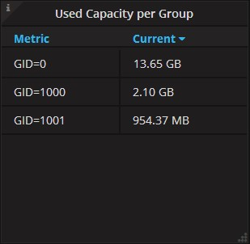

- The **Free Inode Number in Total** panel ([Figure 11](#figure-11-free-inode-number-in-total-panel)) shows the total number of free inodes in the Lustre filesystem over time. The test case used in the figure is running“mdtest–C –n 900000 –d /mnt/lustre/mdtest/” from about 14:35. From the figure it can be seen that from that time on, the free inode number is decreased and exhausted at a speed of about 1100 Ops (Operation per Second).

  ###### Figure 11: Free Inode Number in Total Panel

  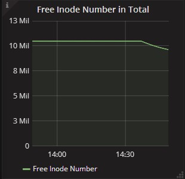   

- The **Used Inode Number in Total** panel ([Figure 12](#figure-12-used-inode-number-in-total-panel)) shows the total number of used inodes in the Lustre filesystem over time. The test case used in the figure is running “mdtest–C –n 900000 –d /mnt/lustre/mdtest/” from about 14:35, from the figure it can be seen that the used inode number is increased in a speed of about 1100 Ops (Operation per Second).

  ###### Figure 12: Used Inode Number in Total Panel
  
   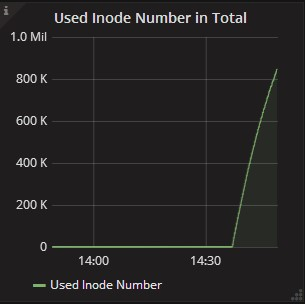
  
- The **Free Inode Number per MDT** panel (see [Figure 13](#figure-13-free-inode-number-per-mdt-panel)) shows the current number of free inodes per MDT in the Lustre filesystem. As shown in the figure, the number of free inodes of MDT0000 is 1.72Mil, the number of free inodes of all other MDTs is 2.62 Mil. By clicking on the “Current”, the current free inode number per MDT in the system can be sorted in the ascending of descending order. To display the current free inode number per MDT in the ascending or descending order, click on **Current**.

  ###### Figure 13: Free Inode Number per MDT Panel
   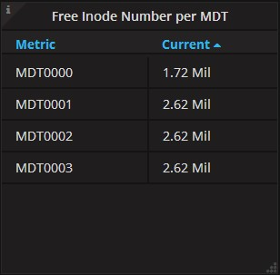

- The **Used Inode Number per User** panel ([Figure 14](#figure-14-used-inode-number-per-user-panel)) shows the number of used inodes per user in the Lustre filesystem. As shown in the figure, the number of used nodes pertaining to the user with UID=1000 is 897.49K, the number of used inodes of the user with UID=1001 is 1.08K, the number of used inodes of the user with UID=0 is 1.01K. To display the current number of used inodes per user in the ascending or descending order, click on **Current**.

  ###### Figure 14: Used Inode Number per User Panel
   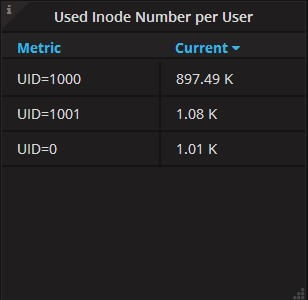

- The **Used Inode Number per Group** panel ([Figure 15](#figure-15-used-inode-number-per-group-panel)) shows the number of used inodes per group in the Lustre Filesystem. As shown in the figure, the number of used inodes of the group with GID=1000 is 897.49K, the number of used inodes of the group with GID=1001 is 1.08K, the number of used inodes of the group with GID=0 is 1.01K. To display the current number of used inodes per group in the ascending or descending order, click on **Current**.

  ###### Figure 15: Used Inode Number Per Group Panel
   ) shows the inode number per MDT used in the Lustre Filesystem. As shown in the figure, MDT0000 used inode number is 898.85K, MDT0001 is 254.

  ###### Figure 16: Used Inode Number per MDT Panel
   

- The **I/O Throughput in Total** panel ([Figure 17](#figure-17-io-throughput-in-total-panel)) shows the total I/O throughput in the Lustre filesystem over time.
  
###### Figure 17: I/O Throughput in Total Panel
   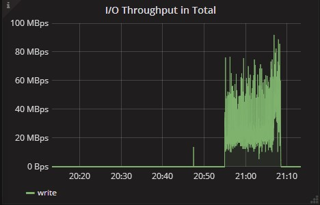
  
- The **I/O Throughput per OST** panel ([Figure 18](#figure-18-io-throughput-per-ost-panel)) shows the average, maximum, and current I/O throughput per OST in the Lustre filesystem.

  ###### Figure 18: I/O Throughput per OST Panel
   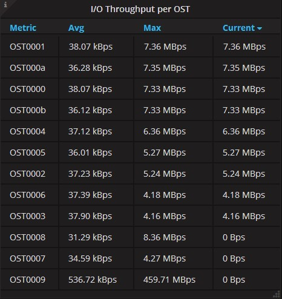

- The **Write Throughput per OST** panel ([Figure 19](#figure-19-write-throughput-per-ost-panel)) shows the average, maximum, and current write throughput per OST in the Lustre Filesystem.

  ###### Figure 19: Write Throughput per OST Panel
   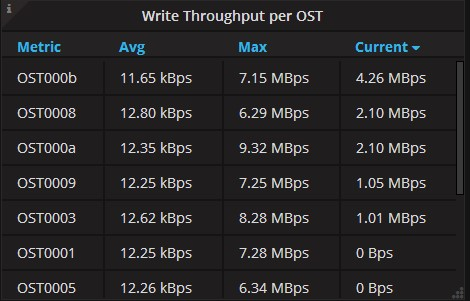

- The **Read Throughput per OST** panel ([Figure 20](#figure-20-read-throughput-per-ost-panel)) shows the average, maximum, and current read throughput per OST in the Lustre Filesystem.

  ###### Figure 20: Read Throughput per OST Panel
   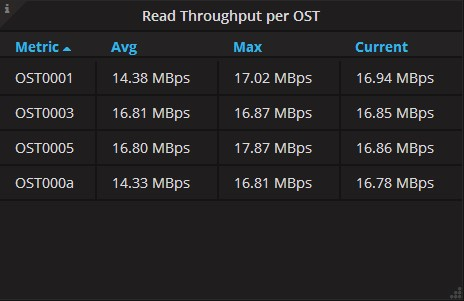

- The **Metadata Operation Rate in Total** panel ([Figure 21](#figure-21-metadata-operation-rate-in-total-panel)) shows the total metadata operation rate in the Lustre Filesystem over time. The unit is Ops, i.e. Operation Per Second.

  ###### Figure 21: Metadata Operation Rate in Total Panel
   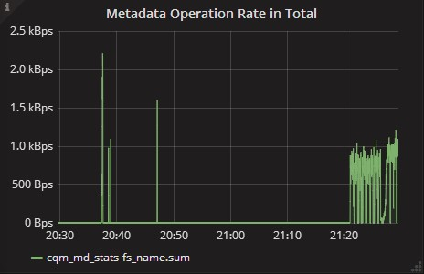

- The **Metadata Operation Rate per MDT** panel ([Figure 22](#figure-22-metadata-operation-rate-per-mdt-panel)) shows the metric information of the metadata operation rate per MDT in the Lustre filesystem. The unit is OPS (Operation Per Second). The information includes the average, maximum, and current values.

  ###### Figure 22: Metadata Operation Rate Per MDT Panel
   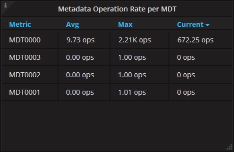

- The **Metadata Operation Rate per Client** panel ([Figure 23](#figure-23-metadata-operation-rate-per-client-panel)) shows the metric information of the metadata operation rate per client in the Lustre filesystem. The unit is OPS. The information includes the average, maximum, and current values.

     ###### Figure 23: Metadata Operation Rate per Client Panel   
     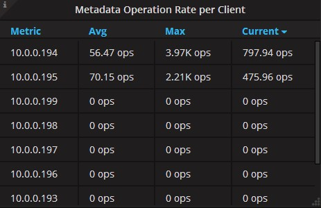

- The **Metadata Operation Rate per Type** panel ([Figure 24](#figure-24-metadata-operation-rate-per-type-panel)) shows the metric information of the metadata operation rate per type in the Lustre filesystem. The unit is OPS. The information includes the average, maximum, and current values. The current test case used is the operations that remove all files in a directory.

     ###### Figure 24: Metadata Operation Rate per Type Panel
     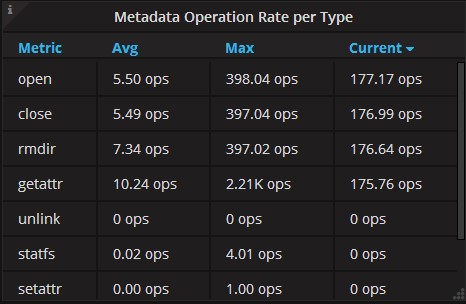

- The **Write Bulk RPC Rate per Size** panel ([Figure 25](#figure-25-write-bulk-rpc-rate-per-size)) shows the write bulk RPC rate with different size in the Lustre Filesystem over time. The size of Lustre Bulk RPC could be a value between 4KiB and 16MiB. The figure below shows the information of write RPC Rate with different bulk size. The test case that generated the collected information is that two clients run ”dd if=/dev/zero of=/mnt/lustre/test1 bs=1M oflag=direct”, “dd if=/dev/zero of=/mnt/lustre/test2 bs=64k oflag=direct”, respectively.

     ###### Figure 25: Write Bulk RPC Rate per Size
     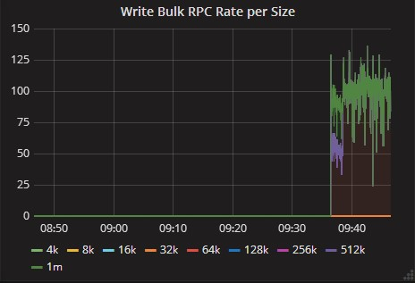

- The **Size Distribution of Write Bulk RPC** panel ([Figure 26](#figure-26-size-distribution-of-write-bulk-rpc-panel)) shows the ratio information of the write bulk RPC with different bulk size in the Lustre Filesystem. As shown in the figure, the percentage of total for the number of the write bulk RPC number with 256 pages is 100%.

     ###### Figure 26: Size Distribution of Write Bulk RPC Panel
     

- The **Read Bulk RPC Rate per Size** panel ([Figure 27](#figure-27-read-bulk-rpc-rate-per-size-panel)) shows the read bulk RPC rate per size in the Lustre filesystem over time. The size of Lustre Bulk RPC could be a value between 4KiB and 16MiB. The figure below shows the read RPC rate with different bulk I/O size. The used test case to generate the collected information is that  two clients run “dd if=/mnt/lustre/test1 of=/dev/zero bs=1M iflag=direct” and “dd if=/mnt/lustre/test2 of=/dev/zero bs=64k iflag=direct”, respectively.

     ###### Figure 27: Read Bulk RPC Rate per Size Panel
     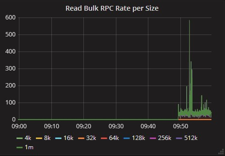

- The **Size Distribution of Read Bulk RPC** panel ([Figure 28](#figure-28-size-distribution-of-read-bulk-rpc-panel)) shows the ratio information of read bulk RPC with different bulk I/O size in the Lustre filesystem. As shown in the figure, the total percentage of the read bulk RPC number with 256 pages is 100% where the current used test case is running”dd if=/mnt/lustre/file of=/dev/zero bs=1M”.

     ###### Figure 28: Size Distribution of Read Bulk RPC Panel
     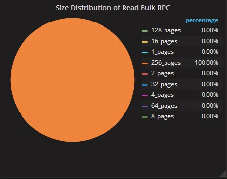

- In each Lustre I/O, if the next page to be written or read in the I/O is not with the next offset, that page is a discontinuous page. There could be multiple discontinuous pages in an I/O. I/Os with less discontinuous pages are more friendly to OSTs, and underlying disk system will obtain much better performance. The **Distribution of Discontinuous Pages in Each Write I/O** panel ([Figure 29](#figure-29-distribution-of-discontinuous-pages-in-each-write-io-panel)) shows the ratio information of the discontinuous pages in each write I/O in the Lustre filesystem. As shown in the figure, the total percentage of discontinuous pages “0_pages” is 100%, which means all pages are continuous.

  ###### Figure 29: Distribution of Discontinuous Pages in Each Write I/O Panel
  

- The **Distribution of Discontinuous Pages in Each Read I/O** panel ([Figure 30](#figure-30-distribution-of-discontinuous-pages-in-each-read-io-panel)) shows the ratio information of discontinuous pages in each read I/O in the Lustre filesystem. As shown in the figure, the percentage of discontinuous pages “0_pages” in each read I/O is 100%, which means all pages are continuous.

  ###### Figure 30: Distribution of Discontinuous Pages in Each Read I/O Panel
  

- The **Distribution of Discontinuous Blocks** panel ([Figure 31](#figure-31-distribution-of-discontinuous-blocks-in-each-write-io-panel)) shows the ratio information of the discontinuous blocks in each write I/O in the Lustre filesystem. In each Lustre read/write I/O, the meaning of discontinuous blocks is similar to discontinuous pages. How many pages a block contains is determined by the underlying filesystem (ldiskfs).If an I/O has discontinuous blocks, there must exist discontinuous pages, but the opposite is not necessarily true. As shown in the figure, the percentage of write discontinuous blocks “0_blocks” in each write I/O is 100%, which means nearly all write I/O are continuous. 

  ###### Figure 31: Distribution of Discontinuous Blocks in Each Write I/O Panel
  

- The **Distribution of Discontinuous Blocks in Each Read I/O** panel ([Figure 32](#figure-32-distribution-of-discontinuous-blocks-in-each-read-io-panel)) shows the ratio information of discontinuous blocks in each read I/O in the Lustre filesystem. As shown in the figure, the percentage of discontinuous blocks “0_blocks” in each read I/O is 100%, and it means that none of the read I/Os is discontinous.

  ###### Figure 32: Distribution of Discontinuous Blocks in Each Read I/O Panel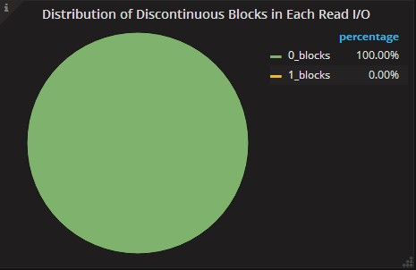

- For various reasons (e.g. too many pages to read or write per single I/O), read or write I/O sent by Lustre OSD to the underlying disk system may be split into multiple disk I/Os. The **Distribution of Fragments in Each Write I/O** panel ([Figure 33](#figure-33-distribution-of-fragments-in-each-write-io-panel)) shows the distribution of write I/Os by the number of disk I/Os each write I/O is split into. As shown in the figure, “1_fragments” denotes that I/O is not split. The percentage of “1_fragments” is 100%, which means that none of the write I/O is split and all of them are continuous. “2_fragments” denotes that Lustre write I/O is split into two disk block I/Os, and the percentage in the figure is 0%.

  ###### Figure 33: Distribution of Fragments in Each Write I/O Panel
  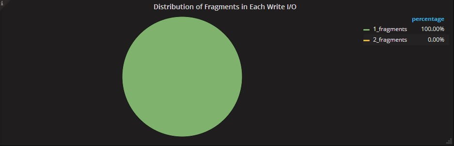

- The **Distribution of Fragments in Each Read I/O** panel ([Figure 34](#figure-34-distribution-of-fragments-in-each-read-io-panel)) shows the distribution of read I/Os by the number of disk I/Os each read I/O is split into. In the figure, the percentage of “1_fragments” is 100%, which means that none of the read I/Os is split and all of them are continuous. “2_fragments” denotes that Lustre read I/O is split into two disk block I/Os, and the percentage in the figure is 0%.

  ###### Figure 34: Distribution of Fragments in Each Read I/O Panel
  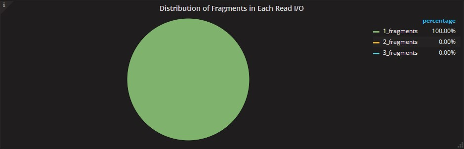

- The **Distribution of in-flight Write I/O Number when Starting Each Write I/O** panel ([Figure 35](#figure-35-distribution-of-in-flight-write-io-number-when-starting-each-write-io-panel)) shows the distribution of the number of write I/Os operations pending at the time of starting each write I/O in the Lustre filesystem. In the figure, ”1_ios” has percentage of 100%. That means, when the write I/O operations started on the OST, this I/O was the only one write I/O that is currently being submitted to disk.

  ###### Figure 35: Distribution of in-flight Write I/O Number when Starting Each Write I/O Panel
  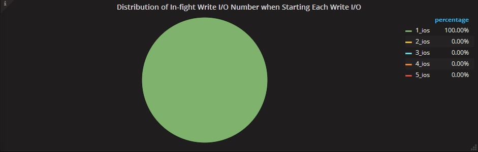

- The **Distribution of in-flight Read I/O Number when Starting Each Read I/O** panel ([Figure 36](#figure-36-distribution-of-in-flight-read-io-number-when-starting-each-read-io-panel)) shows the distribution of the number of read I/Os operations pending at the time of starting each read I/O in the Lustre filesystem. For example, “4_ios” has percentage of 49.80% in the figure. That means 49.80% of the read I/O operations started when there were four in-flight I/O operations on that OST.

  ###### Figure 36: Distribution of in-flight Read I/O Number when Starting Each Read I/O Panel
  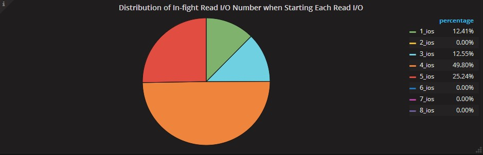

- The **Distribution of Write I/O Time** panel ([Figure 37](#figure-37-distribution-of-write-io-time-panel)) shows the current distribution of OSD write I/O time in the Lustre filesystem. “1_milliseconds” represents the percentage of I/O operations whose duration is less than 1 millisecond, “2_milliseconds” represents the percentage of I/O operations whose duration is between 1 millisecond and 2 milliseconds, and so on.

  ###### Figure 37: Distribution of Write I/O Time Panel
  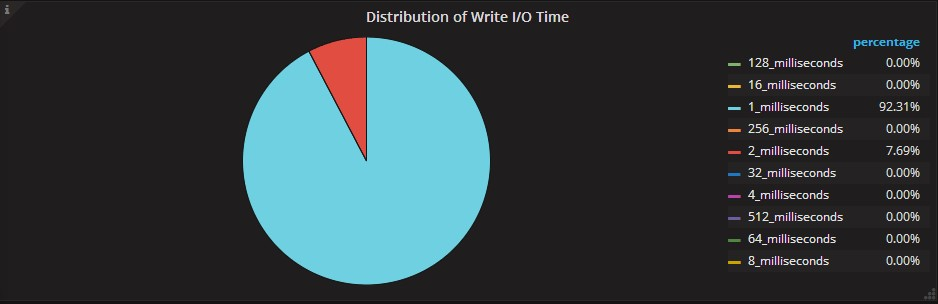

- The **Distribution of Read I/O Time** panel ([Figure 38](#figure-38-distribution-of-read-io-time-panel)) shows the current distribution of OSD write I/O size in the Lustre filesystem. In the figure, the percentage of “1_milliseconds” I/Os (I/Os whose duration is less than 1 millisecond) is 14.11%, “4K_milliseconds” I/Os (I/Os whose duration is between 2K milliseconds and 4K milliseconds) take up 42.62%.

  ###### Figure 38: Distribution of Read I/O Time Panel
  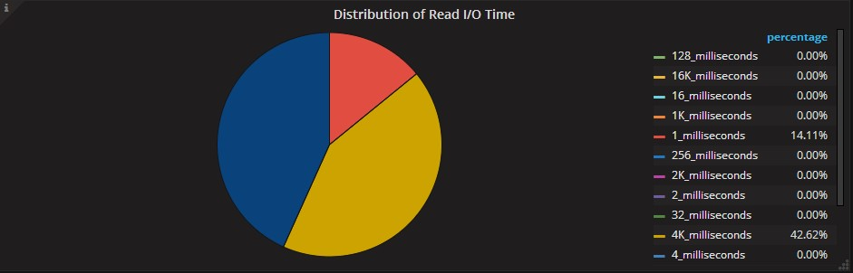

- The **Distribution of Write I/O size on Disk** panel ([Figure 39](#figure-39-distribution-of-write-io-size-on-disk-panel)) shows the current distribution of OSD write I/O size in the Lustre filesystem. In the panel, “1M_Bytes” represents disk I/Os that have sizes between 512K and 1M bytes, “512K_Bytes” represents I/Os with disk I/O size between 256K and 512K bytes, etc.

  ###### Figure 39: Distribution of Write I/O size on Disk Panel
  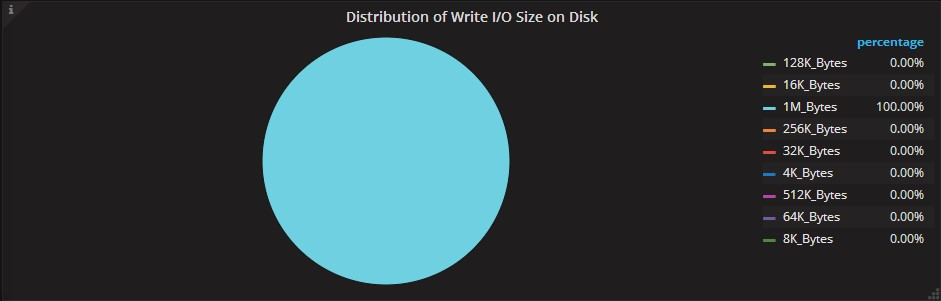

- The **Distribution of Read I/O Size on Disk** panel ([Figure 40](#figure-40-distribution-of-read-io-size-on-disk-panel)) shows the distribution of OSD read I/O size in the Lustre filesystem. In the panel, “1M_Bytes” represents I/Os with disk I/O size between 512K and 1M bytes, “512K_Bytes” represents I/Os with disk I/O size between 256K and 512K bytes, etc. In the figure, the percentage of “1M_Bytes” I/Os is 94.16% and the percentage of “512K_Bytes” I/Os is 5.84%.

  ###### Figure 40: Distribution of Read I/O Size on Disk Panel
  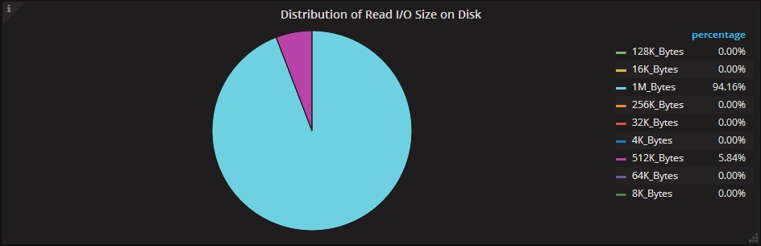

   

- The **Write Throughput per Client** panel ([Figure 41](#figure-41-write-throughput-per-client-panel)) shows the average, max, and current write throughput per client in the Lustre filesystem. As shown in the figure, the average/max/current values of the write throughput for the client with the IP address 10.0.0.195 are 14.71MBps/55.73MBps/42.62MBps, respectively.

  ###### Figure 41: Write Throughput per Client Panel
  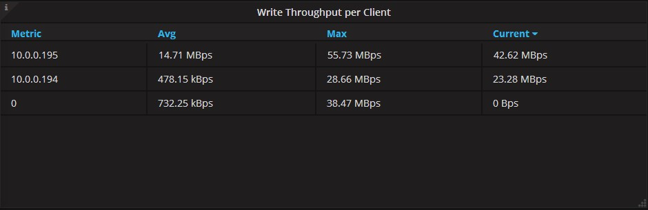

- The **Read Throughput per Client** panel ([Figure 42](#figure-42-read-throughput-per-client-panel)) shows the metric information of the read throughput per client in the Lustre filesystem. It includes average, max, and current values. As shown in the figure, the average, max, and current values of the read throughput for the client with the IP address 10.0.0.194 are 32.01MBps/55.71MBps/23.50MBps. 

  ###### Figure 42: Read Throughput per Client Panel
  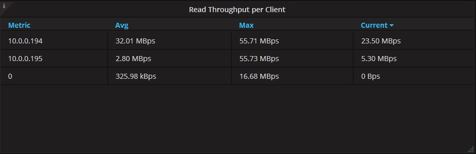

- The **I/O Throughput per Job** panel ([Figure 43](#figure-43-io-throughput-per-job-panel)) shows the metric information of the I/O throughput per job in the Lustre filesystem. It includes average, max, and current values. As shown in the figure, for the job with JOBID “dd.0”, the average I/O throughput is 7.68MBps, the max value is 65.16MBps, and the current I/O throughput is 29.37MBps.

     ###### Figure 43: I/O Throughput per Job Panel
     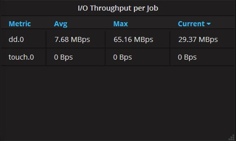

- The **Write Throughput per Job** panel ([Figure 44](#figure-44-write-throughput-per-job-panel)) shows the metric information of the write throughput per job in the Lustre filesystem. It includes average, max, and current values. As shown in the figure, for the job with JOBID “dd.0”, the average I/O throughput is 7.68MBps, the max value is 64.16MBps, and the current I/O throughput is 29.37MBps.

     ###### Figure 44: Write Throughput per Job Panel
     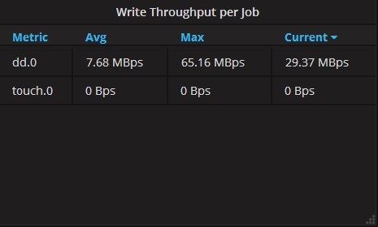

- The **Read Throughput per Job** panel ([Figure 45](#figure-45-read-throughput-per-job-panel)) shows the metric information of the read throughput per job in the Lustre filesystem. It includes average, max, and current values. As shown in the figure, for the job with JOBID “dd.0”, the average I/O throughput is 2.56MBps, the max value is 59.79MBps, and the current I/O throughput is 12.75MBps.

     ###### Figure 45: Read Throughput per Job Panel
     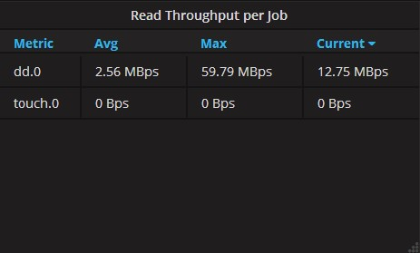

 - The **Metadata Performance per Job** panel ([Figure 46](#figure-46-metadata-performance-per-job-panel)) shows the metric information of the metadata performance per job in the Lustre filesystem. It includes average, max, and current values, and the unit is OPS (Operations per Second). As shown in the figure, for the job with JOBID “rm.0”, the average metadata performance is 94.42 ops, max value is 1.19K ops, and the current performance is 7.00 ops.

     ###### Figure 46: Metadata Performance per Job Panel

    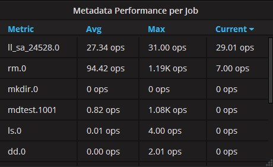


### Lustre MDS Statistics

The Lustre MDS Statistics dashboard ([Figure 47](#figure-47-lustre-mds-statistics-dashboard)) shows detailed information about a Lustre MDS server.

###### Figure 47: Lustre MDS Statistics Dashboard
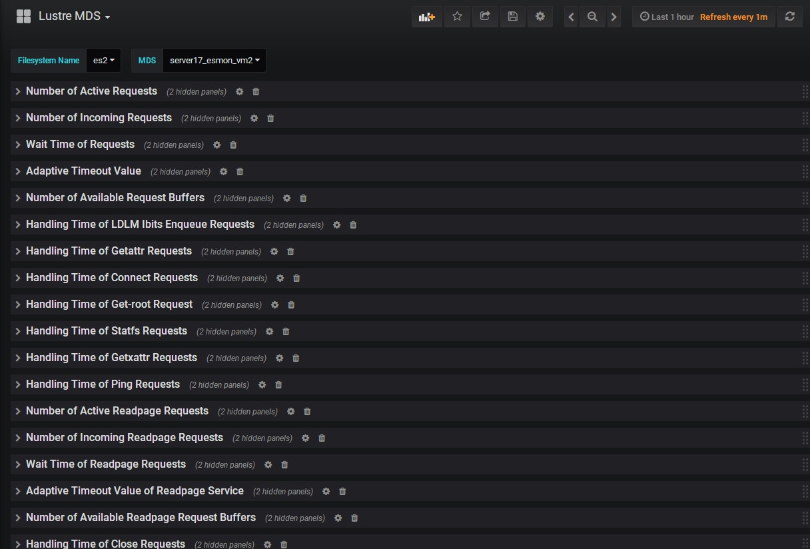


Below you will find description of some of the panels in the **Lustre MDS Statistics** dashboard:

- The **Number of Active Requests** Panel ([Figure 48](#figure-48number-of-active-requests-panel)) shows the maximum and minimum number of active requests varying on time on MDS. Active requests are the requests that is being actively handled by this MDS, not including the requests that are waiting in the queue. If the number of active requests is smaller than PTLRPC thread number minus two (one for incoming  request handling and the other for incoming high priority request handling), it generally means the thread number should be enough. The value shown in the left graph blew is the maximum number during the last collect interval. The value shown in the right graph blew is the minimum number during the last collect interval. 

  ###### Figure 48：Number of Active Requests Panel
  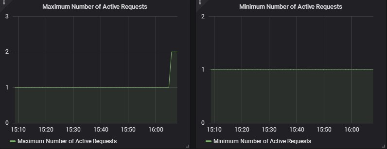

- The Number of Incoming Requests Panel ([Figure 49](#figure-49number-of-incoming-requests-panel)) shows the maximum and minimum number of incoming requests varying on time on MDS.  Incoming requests are the requests that waiting on preprocessing. A request is not incoming request any more when its proprocessing begins. And after preprocessing, the requests will be put into processing queue.  The value shown in the left graph blew is the maximum number of incoming requests during the last collect interval; The value shown in the right graph blew is the minimum number of incoming requests during the last collect interval. 

  ###### Figure 49：Number of Incoming Requests Panel
  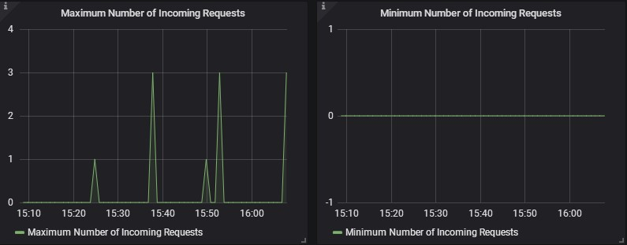   

- The Wait time of Requests Panel ([Figure 50](#figure-50wait-time-of-requests-panel)) shows the maximum and minimum wait time of requests varying on time on MDS. The wait time of a request is the time interval between its arrival time and the time when it starts to be handled. The value shown in the left graph blew is the maximum wait time of the requests during the last collect interval; The value shown in the right graph blew is the minimum wait time of the requests during the last collect interval. 

  ###### Figure 50：Wait time of Requests Panel
  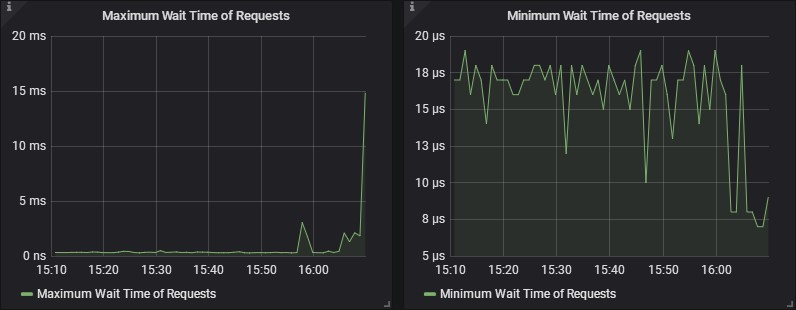

- The Adaptive Timeout Value Panel ([Figure 51](#figure-51adaptive-timeout-value-panel)) shows the maximum and minimum adaptive timeout value varying on time on MDS. When a client sends a request, it has a timeout deadline for the reply. The timeout value of a service is an adaptive value negotiated between server and client during run-time. The value shown in the left graph is the maximum timeout of the MDS service during the last collect interval; The value shown in the right graph is the minimum timeout of the MDS service during the last collect interval. 

  ###### Figure 51：Adaptive Timeout Value Panel
  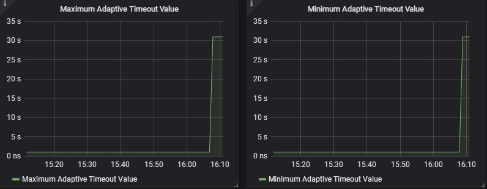
  
- The Number of Available Request buffers Panel ([Figure 52](#figure-52number-of-available-request-buffers-panel)) shows the maximum and minimum number of available request buffers varying on time on MDS. When a request arrives, one request buffer will be used. When number of available request buffers is under low water, more buffers are needed to avoid performance bottleneck. The value shown in the left graph blew is the maximum number during the last collect interval;  The value shown in the right graph blew is the minimum number during the last collect interval.

  ###### Figure 52：Number of Available Request buffers Panel
  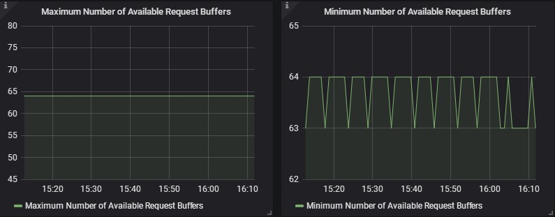
  
- The Handing time of LDLM Ibits Enqueue Requests Panel ([Figure 53](#figure-53handing-time-of-ldlm-ibits-enqueue-requests-panel)) shows the maximum and minimum Handling time of LDLM ibits enqueue request varying on time on MDS. The handling time of a request is the time interval between the time that it is started to be handled time and the time the handling finishes.  The value shown in the left graph blew is the minimum handling time of the LDLM ibits enqueue requests during the last collect interval; The value shown in the left graph blew is the minimum handling time of the LDLM ibits enqueue requests during the last collect interval.

  ###### Figure 53：Handing time of LDLM ibits Enqueue Requests Panel
  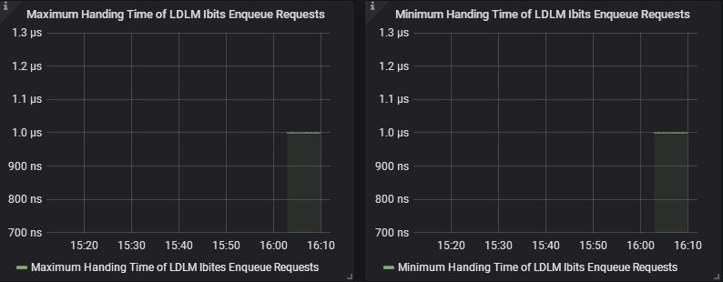
  
- The Handing time of Getattr Requests Panel ([Figure 54](#figure-54handing-time-of-getattr-requests-panel)) shows the maximum and minimum Handling time of Getattr requests varying on time on MDS. The handling time of a request is the time interval between the time that it is started to be handled time and the time the handling finishes.  The value shown in the left graph blew is the minimum handling time of the Getattr requests during the last collect interval; The value shown in the left graph blew is the minimum handling time of the Getattr requests during the last collect interval.

  ###### Figure 54：Handing Time of Getattr Requests Panel
  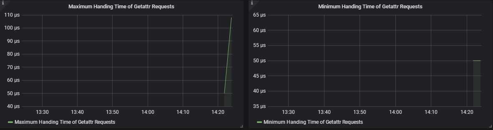
  
- The Handing time of Connect Requests Panel ([Figure 55](#figure-55handing-time-of-connect-requests-panel)) shows the maximum and minimum Handling time of Connect requests varying on time on MDS. The handling time of a request is the time interval between the time that it is started to be handled time and the time the handling finishes.  The value shown in the left graph blew is the minimum handling time of the Connect requests during the last collect interval; The value shown in the left graph blew is the minimum handling time of the Connect requests during the last collect interval.

  ###### Figure 55：Handing Time of Connect Requests Panel
  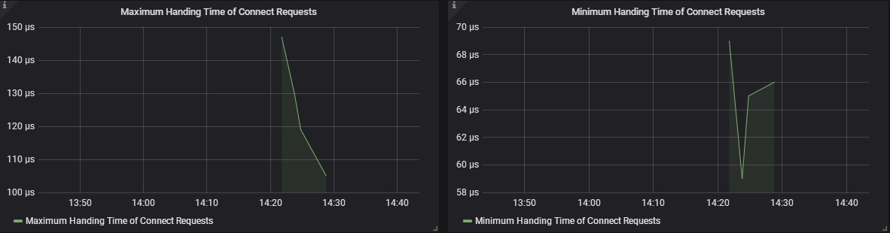
  
- The Handing time of Get-root Requests Panel ([Figure 56](#figure-56handing-time-of-get-root-requests-panel)) shows the maximum and minimum Handling time of Get-root requests varying on time on MDS. The handling time of a request is the time interval between the time that it is started to be handled time and the time the handling finishes.  The value shown in the left graph blew is the minimum handling time of the Get-root requests during the last collect interval; The value shown in the left graph blew is the minimum handling time of the Get-root requests during the last collect interval.

  ###### Figure 56：Handing Time of Get-root Requests Panel
  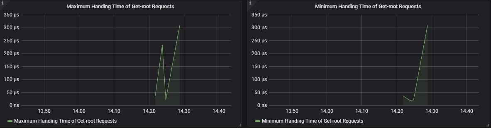
  
- The Handing time of Statfs Requests Panel ([Figure 57](#figure-57handing-time-of-statfs-requests-panel)) shows the maximum and minimum Handling time of Statfs requests varying on time on MDS. The handling time of a request is the time interval between the time that it is started to be handled time and the time the handling finishes.  The value shown in the left graph blew is the minimum handling time of the Statfs requests during the last collect interval; The value shown in the left graph blew is the minimum handling time of the Statfs requests during the last collect interval.

  ###### Figure 57：Handing Time of Statfs Requests Panel
  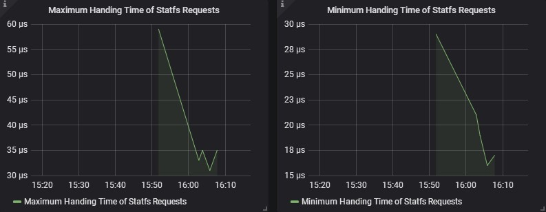
  
- The Handing time of Getxattr Requests Panel ([Figure 58](#figure-58handing-time-of-getxattr-requests-panel)) shows the maximum and minimum Handling time of Getxattr requests varying on time on MDS. The handling time of a request is the time interval between the time that it is started to be handled time and the time the handling finishes.  The value shown in the left graph blew is the minimum handling time of the Getxattr requests during the last collect interval; The value shown in the left graph blew is the minimum handling time of the Getxattr requests during the last collect interval.

  ###### Figure 58：Handing Time of Getxattr Requests Panel
  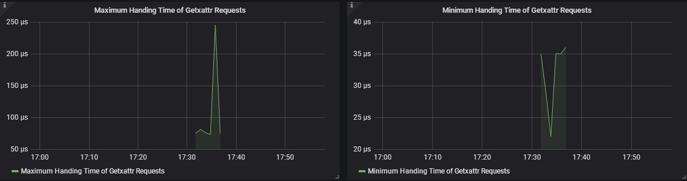
  
- The Handing time of Ping Requests Panel ([Figure 59](#figure-59handing-time-of-ping-requests-panel))shows the maximum and minimum Handling time of Ping requests varying on time on MDS. The handling time of a request is the time interval between the time that it is started to be handled time and the time the handling finishes.  The value shown in the left graph blew is the minimum handling time of the Ping requests during the last collect interval; The value shown in the left graph blew is the minimum handling time of the Ping requests during the last collect interval.

    ###### Figure 59：Handing Time of Ping Requests Panel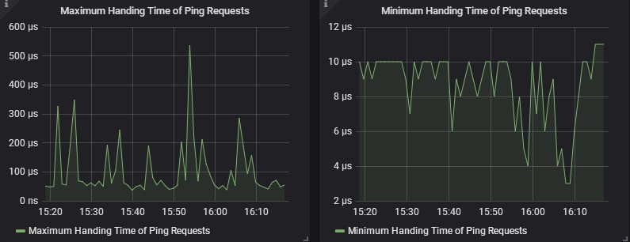

- The **Number of Active Readpage Requests** Panel ([Figure 48](#figure-60number-of-active-readpage-requests-panel)) shows the maximum and minimum number of active Readpage requests varying on time on MDS. Active requests are the requests that is being actively handled by this MDS, not including the requests that are waiting in the queue. If the number of active requests is smaller than PTLRPC thread number minus two (one for incoming  request handling and the other for incoming high priority request handling), it generally means the thread number should be enough. The value shown in the left graph blew is the maximum number during the last collect interval. The value shown in the right graph blew is the minimum number during the last collect interval. 

  ###### Figure 60：Number of Active Readpage Requests Panel
  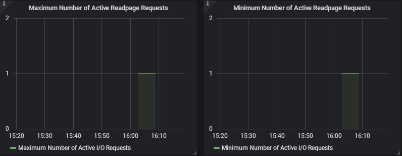
  
- The Number of Incoming Readpage Requests Panel ([Figure 61](#figure-61number-of-incoming-readpage-requests-panel)) shows the maximum and minimum number of incoming Readpage requests varying on time on MDS.  Incoming requests are the requests that waiting on preprocessing. A request is not incoming request any more when its proprocessing begins. And after preprocessing, the requests will be put into processing queue.  The value shown in the left graph blew is the maximum number of incoming Readpage requests during the last collect interval; The value shown in the right graph blew is the minimum number of incoming Readpage requests during the last collect interval. 

###### Figure 61：Number of Incoming Readpage Requests Panel
  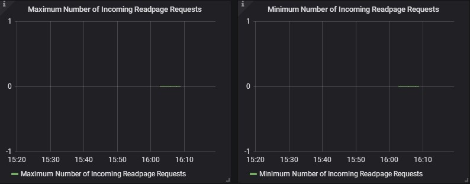
  
 
  
- The Wait time of Readpage Requests Panel ([Figure 62](#figure-62wait-time-of-readpage-requests-panel)) shows the maximum and minimum wait time of Readpage requests varying on time on MDS. The wait time of a request is the time interval between its arrival time and the time when it starts to be handled. The value shown in the left graph blew is the maximum wait time of the Readpage requests during the last collect interval; The value shown in the right graph blew is the minimum wait time of the Readpage requests during the last collect interval. 

  ###### Figure 62：Wait Time of Readpage Requests Panel
  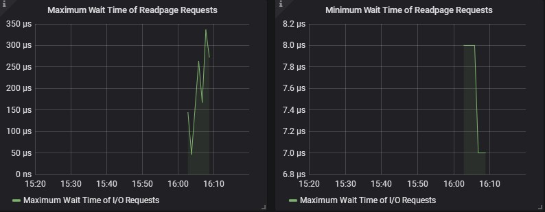
  
- The Adaptive Timeout Value of Readpage Service Panel ([Figure 63](#figure-63adaptive-timeout-value-of-readpage-service)) shows the maximum and minimum adaptive timeout value of Readpage Service varying on time on MDS. When a client sends a request, it has a timeout deadline for the reply. The timeout value of a service is an adaptive value negotiated between server and client during run-time. The value shown in the left graph is the maximum timeout of the Readpage service during the last collect interval; The value shown in the right graph is the minimum timeout of the Readpage service during the last collect interval. 

    ###### Figure 63：Adaptive Timeout Value of Readpage Service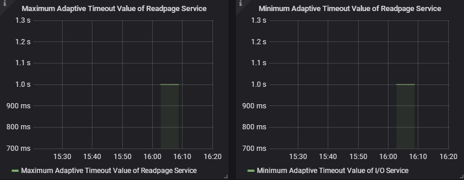

- The Number of Available Readpage Request buffers Panel ([Figure 64](#figure-64number-of-available-readpage-request-buffers-panel)) shows the maximum and minimum number of available Readpage request buffers varying on time on MDS. When a request arrives, one request buffer will be used. When number of available request buffers is under low water, more buffers are needed to avoid performance bottleneck. The value shown in the left graph blew is the maximum number during the last collect interval;  The value shown in the right graph blew is the minimum number during the last collect interval. 

  ###### Figure 64：Number of Available Readpage Request Buffers Panel
  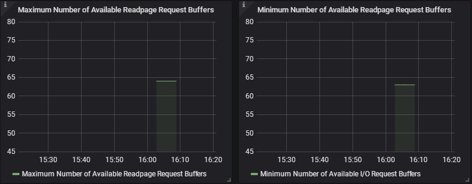
  
- The Handing time of Close Requests Panel ([Figure 65](#figure-65handing-time-of-close-requests-panel)) shows the maximum and minimum Handling time of Close requests varying on time on MDS. The handling time of a request is the time interval between the time that it is started to be handled time and the time the handling finishes.  The value shown in the left graph blew is the minimum handling time of the Close requests during the last collect interval; The value shown in the left graph blew is the minimum handling time of the Close requests during the last collect interval. 

  ###### Figure 65：Handing Time of Close Requests Panel
  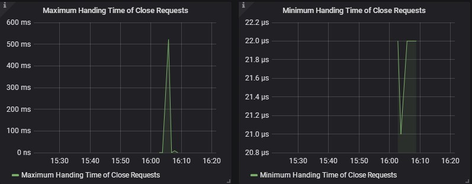
  
- The Handing time of Readpage Requests Panel ([Figure 66](#figure-66handing-time-of-readpage-requests-panel)) shows the maximum and minimum Handling time of Readpage requests varying on time on MDS. The handling time of a request is the time interval between the time that it is started to be handled time and the time the handling finishes.  The value shown in the left graph blew is the minimum handling time of the Readpage requests during the last collect interval; The value shown in the left graph blew is the minimum handling time of the Readpage requests during the last collect interval. 

  ###### Figure 66：Handing Time of Readpage Requests Panel
  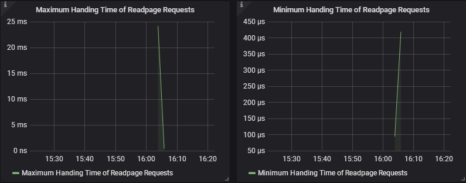
  
- The **Number of Active LDLM Canceld** **Requests** Panel ([Figure 67](#figure-67number-of-active-ldlm-canceld-requests-panel)) shows the maximum and minimum number of active LDLM Canceld requests varying on time on MDS. Active requests are the requests that is being actively handled by this MDS, not including the requests that are waiting in the queue. If the number of active requests is smaller than PTLRPC thread number minus two (one for incoming  request handling and the other for incoming high priority request handling), it generally means the thread number should be enough. The value shown in the left graph blew is the maximum number during the last collect interval. The value shown in the right graph blew is the minimum number during the last collect interval. 

  ###### Figure 67：Number of Active LDLM Canceld Requests Panel
  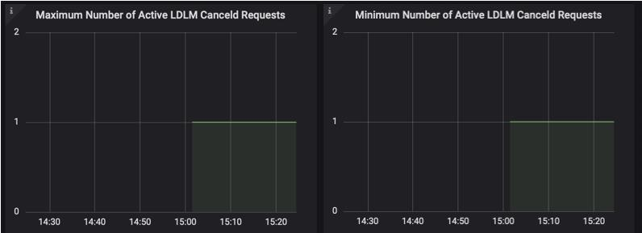
  
- The Number of Incoming LDLM Canceld Requests Panel ([Figure 68](#figure-68number-of-incoming-ldlm-canceld-requests-panel)) shows the maximum and minimum number of incoming LDLM Canceld requests varying on time on MDS.  Incoming requests are the requests that waiting on preprocessing. A request is not incoming request any more when its proprocessing begins. And after preprocessing, the requests will be put into processing queue.  The value shown in the left graph blew is the maximum number of incoming LDLM Canceld requests during the last collect interval; The value shown in the right graph blew is the minimum number of incoming LDLM Canceld requests during the last collect interval. 

  ###### Figure 68：Number of Incoming LDLM Canceld Requests Panel
  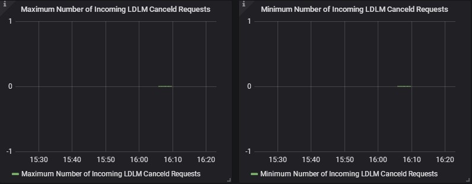
  
- The Wait time of LDLM Canceld Requests Panel ([Figure 69](#figure-69wait-time-of-ldlm-canceld-requests-panel)) shows the maximum and minimum wait time of LDLM Canceld requests varying on time on MDS. The wait time of a request is the time interval between its arrival time and the time when it starts to be handled. The value shown in the left graph blew is the maximum wait time of the LDLM Canceld requests during the last collect interval; The value shown in the right graph blew is the minimum wait time of the LDLM Canceld requests during the last collect interval. 

  ###### Figure 69：Wait Time of LDLM Canceld Requests Panel
  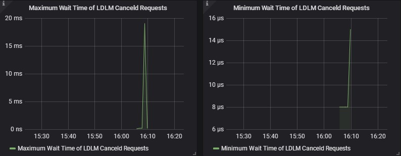
  
- The Adaptive Timeout Value of LDLM Canceld Service Panel ([Figure 70](#figure-70adaptive-timeout-value-of-ldlm-canceld-service)) shows the maximum and minimum adaptive timeout value of LDLM Canceld Service varying on time on MDS. When a client sends a request, it has a timeout deadline for the reply. The timeout value of a service is an adaptive value negotiated between server and client during run-time. The value shown in the left graph is the maximum timeout of the LDLM Canceld service during the last collect interval; The value shown in the right graph is the minimum timeout of the LDLM Canceld service during the last collect interval. 

  ###### Figure 70：Adaptive Timeout Value of LDLM Canceld Service
  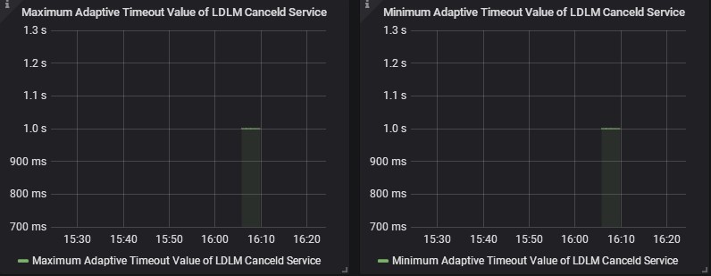
  
- The Number of Available LDLM Canceld Request buffers Panel ([Figure 71](#figure-71number-of-available-ldlm-canceld-request-buffers-panel)) shows the maximum and minimum number of available LDLM Canceld request buffers varying on time on MDS. When a request arrives, one request buffer will be used. When number of available request buffers is under low water, more buffers are needed to avoid performance bottleneck. The value shown in the left graph blew is the maximum number during the last collect interval;  The value shown in the right graph blew is the minimum number during the last collect interval. 

  ###### Figure 71：Number of Available LDLM Canceld Request Buffers Panel
  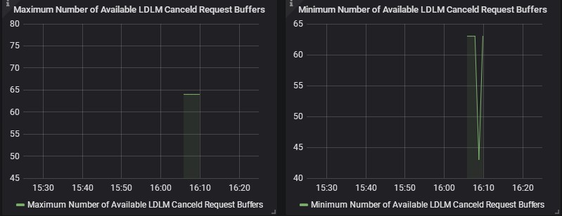

   

- The **Number of Active LDLM Callback** **Requests** Panel ([Figure 72](#figure-72number-of-active-ldlm-callback-requests-panel)) shows the maximum and minimum number of active LDLM Callback requests varying on time on MDS. Active requests are the requests that is being actively handled by this MDS, not including the requests that are waiting in the queue. If the number of active requests is smaller than PTLRPC thread number minus two (one for incoming  request handling and the other for incoming high priority request handling), it generally means the thread number should be enough. The value shown in the left graph blew is the maximum number during the last collect interval. The value shown in the right graph blew is the minimum number during the last collect interval. 

  ###### Figure 72：Number of Active LDLM Callback Requests Panel
  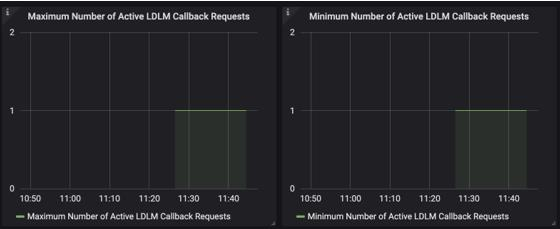
  
- The Number of Incoming LDLM Callback Requests Panel ([Figure 73](#figure-73number-of-incoming-ldlm-callback-requests-panel)) shows the maximum and minimum number of incoming LDLM Callback requests varying on time on MDS.  Incoming requests are the requests that waiting on preprocessing. A request is not incoming request any more when its proprocessing begins. And after preprocessing, the requests will be put into processing queue.  The value shown in the left graph blew is the maximum number of incoming LDLM Callback requests during the last collect interval; The value shown in the right graph blew is the minimum number of incoming LDLM Callback requests during the last collect interval. 

  ###### Figure 73：Number of Incoming LDLM Callback Requests Panel
  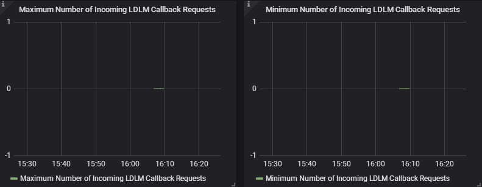
  
- The Wait time of LDLM Callback Requests Panel ([Figure 74](#figure-74wait-time-of-ldlm-callback-requests-panel)) shows the maximum and minimum wait time of LDLM Callback requests varying on time on MDS. The wait time of a request is the time interval between its arrival time and the time when it starts to be handled. The value shown in the left graph blew is the maximum wait time of the LDLM Callback requests during the last collect interval; The value shown in the right graph blew is the minimum wait time of the LDLM Callback requests during the last collect interval. 

###### Figure 74：Wait time of LDLM Callback Requests Panel
  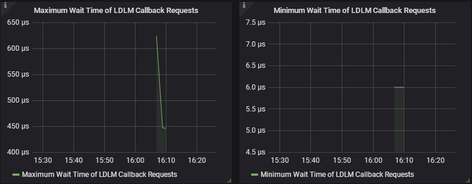
  
- The Adaptive Timeout Value of LDLM Callback Service Panel ([Figure 75](#figure-75adaptive-timeout-value-of-ldlm-callback-service-panel)) shows the maximum and minimum adaptive timeout value of LDLM Callback Service varying on time on MDS. When a client sends a request, it has a timeout deadline for the reply. The timeout value of a service is an adaptive value negotiated between server and client during run-time. The value shown in the left graph is the maximum timeout of the LDLM Callback service during the last collect interval; The value shown in the right graph is the minimum timeout of the LDLM Callback service during the last collect interval. 

  ###### Figure 75：Adaptive Timeout Value of LDLM Callback Service Panel
  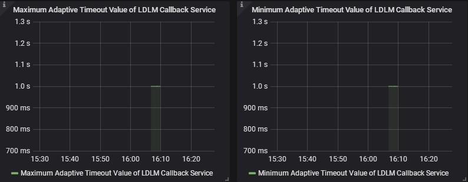

- The Number of Available LDLM Callback Request buffers Panel ([Figure 76](#figure-76number-of-available-ldlm-callback-request-buffers-panel)) shows the maximum and minimum number of available LDLM Callback request buffers varying on time on MDS. When a request arrives, one request buffer will be used. When number of available request buffers is under low water, more buffers are needed to avoid performance bottleneck. The value shown in the left graph blew is the maximum number during the last collect interval;  The value shown in the right graph blew is the minimum number during the last collect interval. 

  ###### Figure 76：Number of Available LDLM Callback Request Buffers Panel
  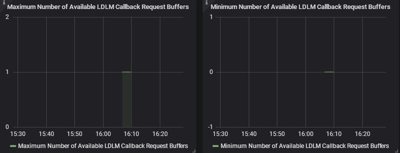

   

### Lustre OSS Statistics

The Lustre OSS dashboard ([Figure 77](#figure-77-lustre-oss-dashboard)) shows detailed information about a Lustre OSS server.

###### Figure 77: Lustre OSS Dashboard
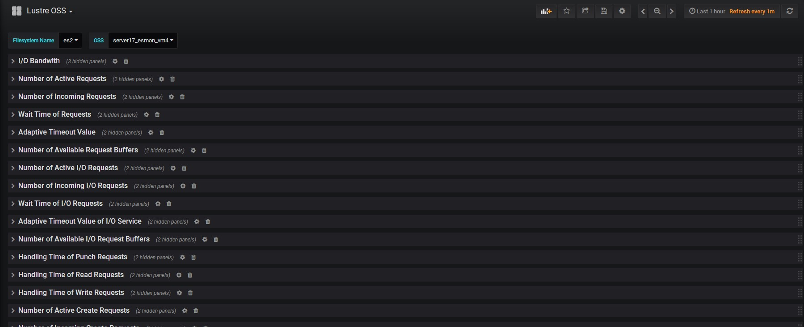

Below you will find description of some of the panels in the **Lustre OSS Statistics** dashboard:

- I/O Bandwidth Panel ([Figure 78](#figure-78io-bandwidth-panel)) shows the I/O throughput, write throughput and read throughput of an OSS server, respectively.

###### Figure 78：I/O Bandwidth Panel
  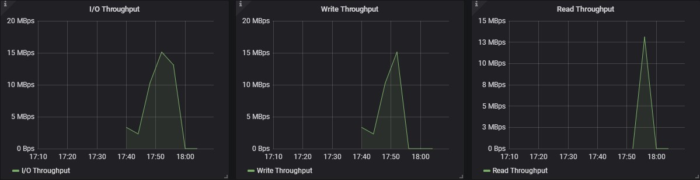
  
- The **Number of Active Requests** Panel ([Figure 79](#figure-79-number-of-active-requests-panel)) shows the maximum and minimum number of active requests varying on time on OSS. Active requests are the requests that is being actively handled by this OSS, not including the requests that are waiting in the queue. If the number of active requests is smaller than PTLRPC thread number minus two (one for incoming  request handling and the other for incoming high priority request handling), it generally means the thread number should be enough. The value shown in the left graph blew is the maximum number during the last collect interval. The value shown in the right graph blew is the minimum number during the last collect interval. 

  ###### Figure 79: Number of Active Requests Panel
  
  
- The Number of Incoming Requests Panel ([Figure 80](#figure-80-number-of-incoming-requests-panel)) shows the maximum and minimum number of incoming requests varying on time on OSS.  Incoming requests are the requests that waiting on preprocessing. A request is not incoming request any more when its proprocessing begins. And after preprocessing, the requests will be put into processing queue.  The value shown in the left graph blew is the maximum number of incoming requests during the last collect interval; The value shown in the right graph blew is the minimum number of incoming requests during the last collect interval. 

  ###### Figure 80: Number of Incoming Requests Panel
  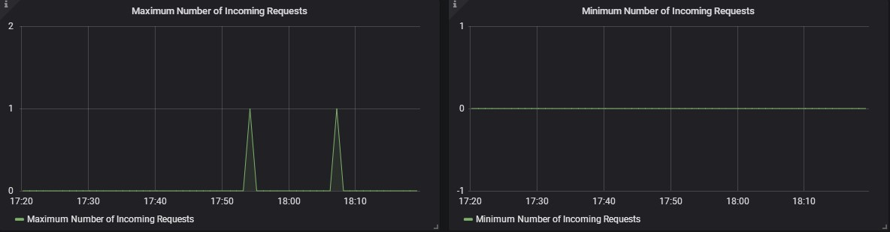
  
- The Wait time of Requests Panel ([Figure 81](#figure-81-wait-time-of-requests-panel)) shows the maximum and minimum wait time of requests varying on time on OSS. The wait time of a request is the time interval between its arrival time and the time when it starts to be handled. The value shown in the left graph blew is the maximum wait time of the requests during the last collect interval; The value shown in the right graph blew is the minimum wait time of the requests during the last collect interval. 

  ###### Figure 81: Wait time of Requests Panel
  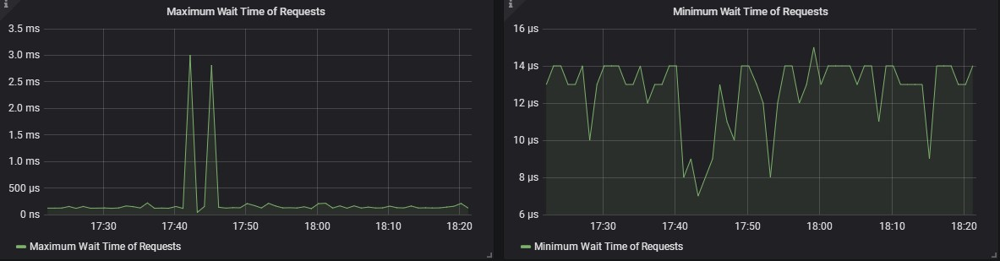
  
- The Adaptive Timeout Value Panel ([Figure 82](#figure-82-adaptive-timeout-value-panel)) shows the maximum and minimum adaptive timeout value varying on time on OSS. When a client sends a request, it has a timeout deadline for the reply. The timeout value of a service is an adaptive value negotiated between server and client during run-time. The value shown in the left graph is the maximum timeout of the MDS service during the last collect interval; The value shown in the right graph is the minimum timeout of the MDS service during the last collect interval. 

  ###### Figure 82: Adaptive Timeout Value Panel
  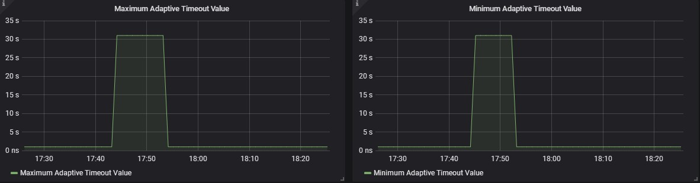      

- The Number of Available Request buffers Panel ([Figure 83](#figure-83-number-of-available-request-buffers-panel)) shows the maximum and minimum number of available request buffers varying on time on OSS. When a request arrives, one request buffer will be used. When number of available request buffers is under low water, more buffers are needed to avoid performance bottleneck. The value shown in the left graph blew is the maximum number during the last collect interval;  The value shown in the right graph blew is the minimum number during the last collect interval. 

  ###### Figure 83: Number of Available Request Buffers Panel
  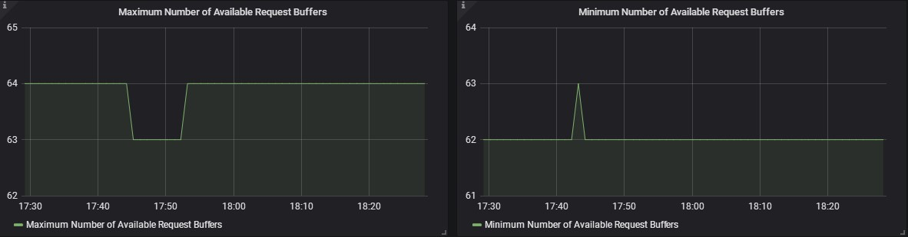
  
- The **Number of Active I/O Requests** Panel ([Figure 84](#figure-84-number-of-active-io-requests-panel)) shows the maximum and minimum number of active I/O requests varying on time on OSS. Active requests are the requests that is being actively handled by this OSS, not including the requests that are waiting in the queue. If the number of active requests is smaller than PTLRPC thread number minus two (one for incoming  request handling and the other for incoming high priority request handling), it generally means the thread number should be enough. The value shown in the left graph blew is the maximum number during the last collect interval. The value shown in the right graph blew is the minimum number during the last collect interval. 

  ###### Figure 84: Number of Active I/O Requests Panel
  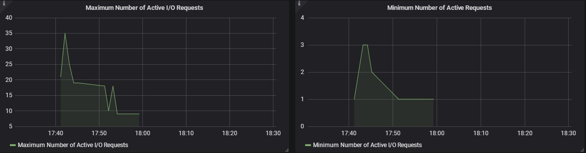 
  
- The Number of Incoming I/O Requests Panel ([Figure 85](#figure-85-number-of-incoming-io-requests-panel)) shows the maximum and minimum number of incoming I/O requests varying on time on OSS.  Incoming requests are the requests that waiting on preprocessing. A request is not incoming request any more when its proprocessing begins. And after preprocessing, the requests will be put into processing queue.  The value shown in the left graph blew is the maximum number of incoming I/O requests during the last collect interval; The value shown in the right graph blew is the minimum number of incoming I/O requests during the last collect interval. 

  ###### Figure 85: Number of Incoming I/O Requests Panel
  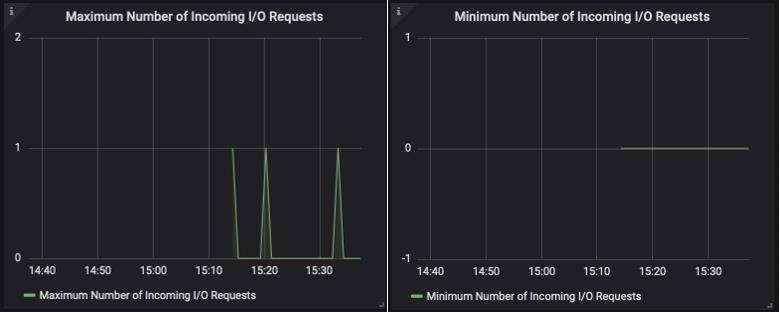
  
- The Wait time of I/O Requests Panel ([Figure 86](#figure-86-wait-time-of-io-requests-panel)) shows the maximum and minimum wait time of I/O requests varying on time on OSS. The wait time of a request is the time interval between its arrival time and the time when it starts to be handled. The value shown in the left graph blew is the maximum wait time of the I/O requests during the last collect interval; The value shown in the right graph blew is the minimum wait time of the I/O requests during the last collect interval.

  ###### Figure 86: Wait Time of I/O requests Panel
  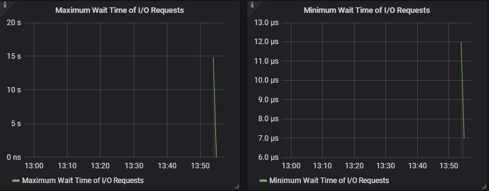 
  
- The Adaptive Timeout Value of I/O Service Panel ([Figure 87](#figure-87-adaptive-timeout-value-of-io-service-panel)) shows the maximum and minimum adaptive timeout value of I/O Service varying on time on OSS. When a client sends a request, it has a timeout deadline for the reply. The timeout value of a service is an adaptive value negotiated between server and client during run-time. The value shown in the left graph is the maximum timeout of the I/O service during the last collect interval; The value shown in the right graph is the minimum timeout of the I/O service during the last collect interval. 

  ###### Figure 87: Adaptive Timeout Value of I/O Service Panel
  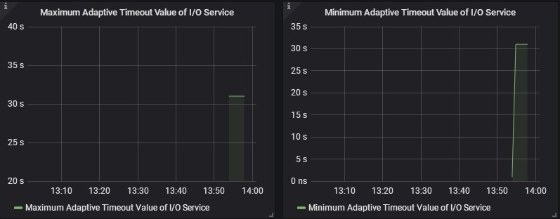
  
- The Number of Available I/O Request buffers Panel ([Figure 88](#figure-88-number-of-available-io-request-buffers)) shows the maximum and minimum number of available I/O request buffers varying on time on OSS. When a request arrives, one request buffer will be used. When number of available request buffers is under low water, more buffers are needed to avoid performance bottleneck. The value shown in the left graph blew is the maximum number during the last collect interval;  The value shown in the right graph blew is the minimum number during the last collect interval.

  ###### Figure 88: Number of Available I/O Request Buffers
  
  
- The Handing time of Punch Requests Panel ([Figure 89](#figure-89-handing-time-of-punch-requests-panel)) shows the maximum and minimum Handling time of Punch requests varying on time on OSS. The handling time of a request is the time interval between the time that it is started to be handled time and the time the handling finishes.  The value shown in the left graph blew is the minimum handling time of the Punch requests during the last collect interval; The value shown in the left graph blew is the minimum handling time of the Punch requests during the last collect interval. 

  ###### Figure 89: Handing Time of Punch Requests Panel
  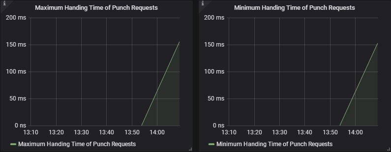
  
- The Handing time of Read Requests Panel ([Figure 90](#figure-90-handing-time-of-read-requests-panel)) shows the maximum and minimum Handling time of Read requests varying on time on OSS. The handling time of a request is the time interval between the time that it is started to be handled time and the time the handling finishes.  The value shown in the left graph blew is the minimum handling time of the Read requests during the last collect interval; The value shown in the left graph blew is the minimum handling time of the Read requests during the last collect interval. 

    ###### Figure 90: Handing Time of Read Requests Panel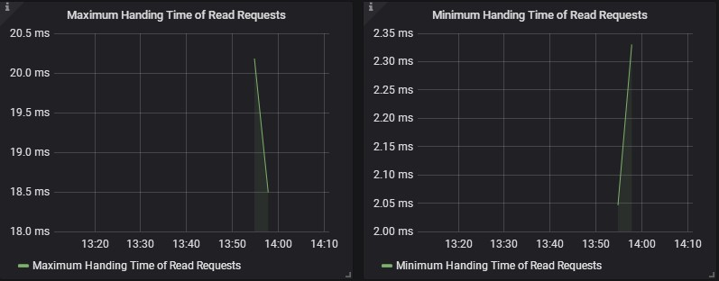   

- The Handing time of Write Requests Panel ([Figure 91](#figure-91--handing-time-of-write-requests-panel)) shows the maximum and minimum Handling time of Write requests varying on time on OSS. The handling time of a request is the time interval between the time that it is started to be handled time and the time the handling finishes.  The value shown in the left graph blew is the minimum handling time of the Write requests during the last collect interval; The value shown in the left graph blew is the minimum handling time of the Write requests during the last collect interval. 

  ###### Figure 91:  Handing Time of Write Requests Panel
  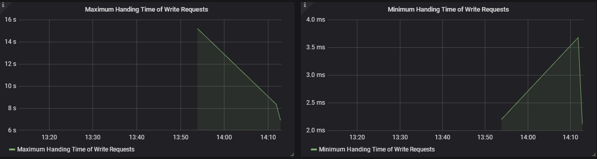
  
- The **Number of Active Create Requests** Panel ([Figure 92](#figure-92-number-of-active-create-requests-panel)) shows the maximum and minimum number of active create requests varying on time on OSS. Active requests are the requests that is being actively handled by this OSS, not including the requests that are waiting in the queue. If the number of active requests is smaller than PTLRPC thread number minus two (one for incoming  request handling and the other for incoming high priority request handling), it generally means the thread number should be enough. The value shown in the left graph blew is the maximum number during the last collect interval. The value shown in the right graph blew is the minimum number during the last collect interval. 

  ###### Figure 92: Number of Active Create Requests Panel
  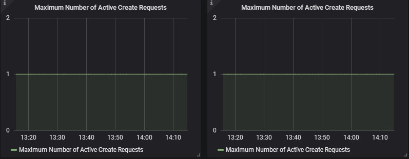   
  
- The Number of Incoming Create Requests Panel ([Figure 93](#figure-93--number-of-incoming-create-requests-panel)) shows the maximum and minimum number of incoming create requests varying on time on OSS.  Incoming requests are the requests that waiting on preprocessing. A request is not incoming request any more when its proprocessing begins. And after preprocessing, the requests will be put into processing queue.  The value shown in the left graph blew is the maximum number of incoming create requests during the last collect interval; The value shown in the right graph blew is the minimum number of incoming create requests during the last collect interval. 

  ###### Figure 93:  Number of Incoming Create Requests Panel
  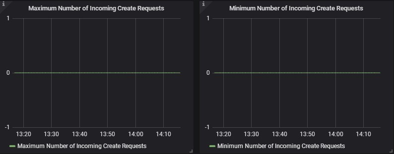   
  
- The Wait time of Create Requests Panel ([Figure 94](#figure-94-wait-time-of-create-requests-panel)) shows the maximum and minimum wait time of create requests varying on time on OSS. The wait time of a request is the time interval between its arrival time and the time when it starts to be handled. The value shown in the left graph blew is the maximum wait time of the create requests during the last collect interval; The value shown in the right graph blew is the minimum wait time of the create requests during the last collect interval. 

  ###### Figure 94: Wait Time of Create Requests Panel
  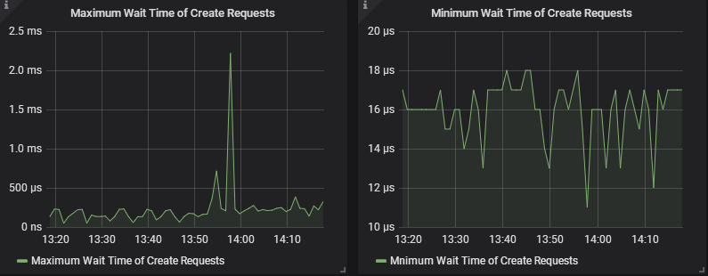
  
- The Adaptive Timeout Value of Create Service Panel ([Figure 95](#figure-95-adaptive-timeout-value-of-create-service-panel)) shows the maximum and minimum adaptive timeout value of the create Service varying on time on OSS. When a client sends a request, it has a timeout deadline for the reply. The timeout value of a service is an adaptive value negotiated between server and client during run-time. The value shown in the left graph is the maximum timeout of the create service during the last collect interval; The value shown in the right graph is the minimum timeout of the create service during the last collect interval. 

  ###### Figure 95: Adaptive Timeout Value of Create Service Panel
  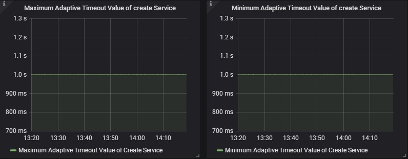
  
- The Number of Available Create Request buffers Panel ([Figure 96](#figure-96-number-of-available-create-request-buffers-panel)) shows the maximum and minimum number of available create request buffers varying on time on OSS. When a request arrives, one request buffer will be used. When number of available request buffers is under low water, more buffers are needed to avoid performance bottleneck. The value shown in the left graph blew is the maximum number during the last collect interval;  The value shown in the right graph blew is the minimum number during the last collect interval. 

  ###### Figure 96: Number of Available Create Request Buffers Panel
  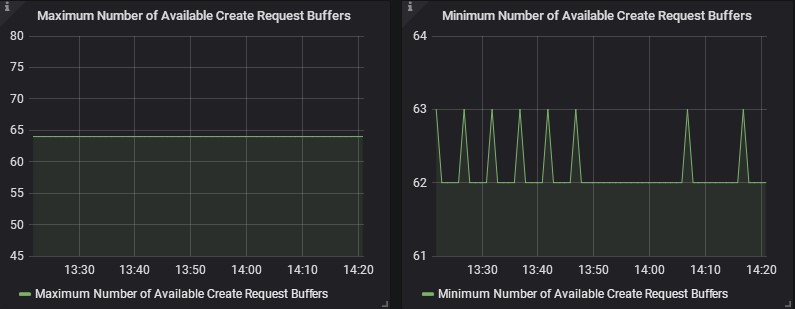
  
- The **Number of Active LDLM Canceld** **Requests** Panel ([Figure 97](#figure-97-number-of-active-ldlm-canceld-requests-panel)) shows the maximum and minimum number of active LDLM Canceld requests varying on time on OSS. Active requests are the requests that is being actively handled by this OSS, not including the requests that are waiting in the queue. If the number of active requests is smaller than PTLRPC thread number minus two (one for incoming  request handling and the other for incoming high priority request handling), it generally means the thread number should be enough. The value shown in the left graph blew is the maximum number during the last collect interval. The value shown in the right graph blew is the minimum number during the last collect interval. 

  ###### Figure 97: Number of Active LDLM Canceld Requests Panel
  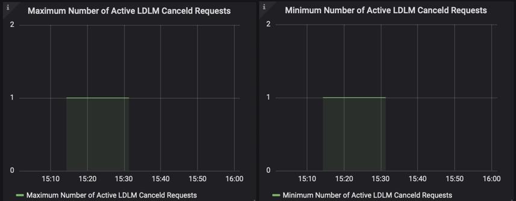
  
- The Number of Incoming LDLM Canceld Requests Panel ([Figure 98](#figure-98-number-of-incoming-ldlm-canceld-requests-panel)) shows the maximum and minimum number of incoming LDLM Canceld requests varying on time on OSS.  Incoming requests are the requests that waiting on preprocessing. A request is not incoming request any more when its proprocessing begins. And after preprocessing, the requests will be put into processing queue.  The value shown in the left graph blew is the maximum number of incoming LDLM Canceld requests during the last collect interval; The value shown in the right graph blew is the minimum number of incoming LDLM Canceld requests during the last collect interval. 

  ###### Figure 98: Number of Incoming LDLM Canceld Requests Panel
  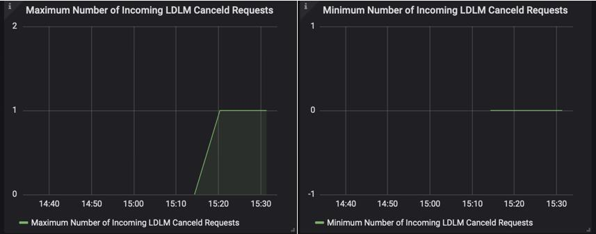
  
- The Wait time of LDLM Canceld Requests Panel ([Figure 99](#figure-99-wait-time-of-ldlm-canceld-requests-panel)) shows the maximum and minimum wait time of LDLM Canceld requests varying on time on MDS. The wait time of a request is the time interval between its arrival time and the time when it starts to be handled. The value shown in the left graph blew is the maximum wait time of the LDLM Canceld requests during the last collect interval; The value shown in the right graph blew is the minimum wait time of the LDLM Canceld requests during the last collect interval. 

  ###### Figure 99: Wait Time of LDLM Canceld Requests Panel
  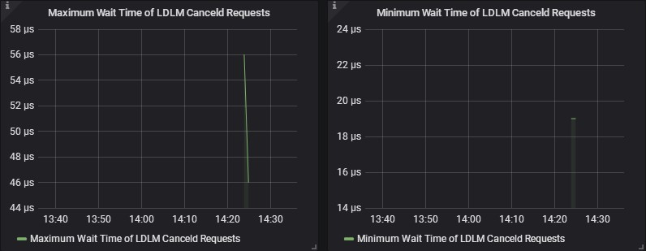
  
- The Adaptive Timeout Value of LDLM Canceld Service Panel ([Figure 100](#figure-100-adaptive-timeout-value-of-ldlm-canceld-service-panel)) shows the maximum and minimum adaptive timeout value of LDLM Canceld Service varying on time on OSS. When a client sends a request, it has a timeout deadline for the reply. The timeout value of a service is an adaptive value negotiated between server and client during run-time. The value shown in the left graph is the maximum timeout of the LDLM Canceld service during the last collect interval; The value shown in the right graph is the minimum timeout of the LDLM Canceld service during the last collect interval. 

  ###### Figure 100: Adaptive Timeout Value of LDLM Canceld Service Panel
  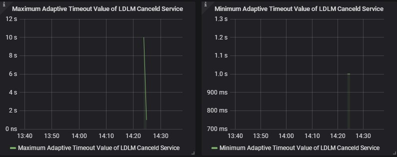
  
- The Number of Available LDLM Canceld Request buffers Panel ([Figure 101](#figure-101-number-of-available-ldlm-canceld-request-buffers-panel)) shows the maximum and minimum number of available LDLM Canceld request buffers varying on time on OSS. When a request arrives, one request buffer will be used. When number of available request buffers is under low water, more buffers are needed to avoid performance bottleneck. The value shown in the left graph blew is the maximum number during the last collect interval;  The value shown in the right graph blew is the minimum number during the last collect interval.

  ###### Figure 101: Number of Available LDLM Canceld Request Buffers Panel
  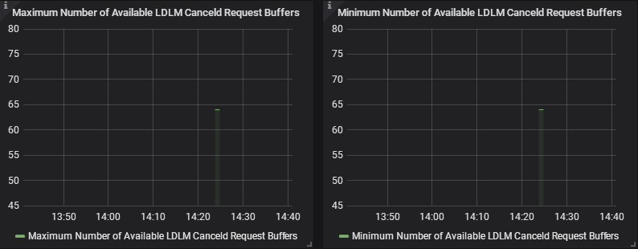
  
- The **Number of Active LDLM Callback** **Requests** Panel ([Figure 102](#figure-102-number-of-active-ldlm-callback-requests-panel)) shows the maximum and minimum number of active LDLM Callback requests varying on time on OSS. Active requests are the requests that is being actively handled by this OSS, not including the requests that are waiting in the queue. If the number of active requests is smaller than PTLRPC thread number minus two (one for incoming  request handling and the other for incoming high priority request handling), it generally means the thread number should be enough. The value shown in the left graph blew is the maximum number during the last collect interval. The value shown in the right graph blew is the minimum number during the last collect interval. 

  ###### Figure 102: Number of Active LDLM Callback Requests Panel
  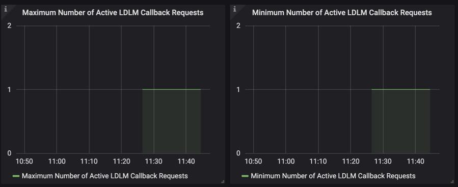
  
- The Number of Incoming LDLM Callback Requests Panel ([Figure 103](#figure-103-number-of-incoming-ldlm-callback-requests-panel)) shows the maximum and minimum number of incoming LDLM Callback requests varying on time on OSS.  Incoming requests are the requests that waiting on preprocessing. A request is not incoming request any more when its proprocessing begins. And after preprocessing, the requests will be put into processing queue.  The value shown in the left graph blew is the maximum number of incoming LDLM Callback requests during the last collect interval; The value shown in the right graph blew is the minimum number of incoming LDLM Callback requests during the last collect interval. 

  ###### Figure 103: Number of Incoming LDLM Callback Requests Panel
  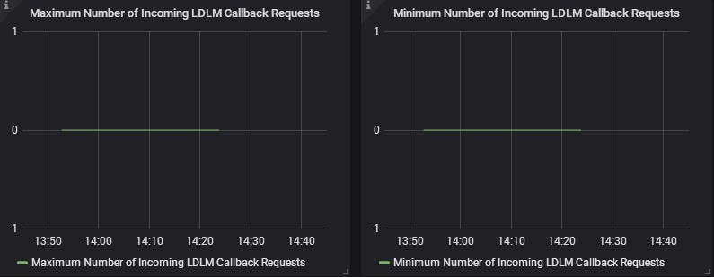
  
- The Wait time of LDLM Callback Requests Panel ([Figure 104](#figure-104-wait-time-of-ldlm-callback-requests-panel)) shows the maximum and minimum wait time of LDLM Callback requests varying on time on OSS. The wait time of a request is the time interval between its arrival time and the time when it starts to be handled. The value shown in the left graph blew is the maximum wait time of the LDLM Callback requests during the last collect interval; The value shown in the right graph blew is the minimum wait time of the LDLM Callback requests during the last collect interval. 

  ###### Figure 104: Wait Time of LDLM Callback Requests Panel
  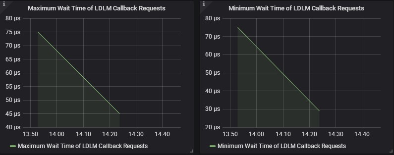
  
- The Adaptive Timeout Value of LDLM Callback Service Panel ([Figure 105](#figure-105-adaptive-timeout-value-of-ldlm-callback-service-panel)) shows the maximum and minimum adaptive timeout value of LDLM Callback Service varying on time on OSS. When a client sends a request, it has a timeout deadline for the reply. The timeout value of a service is an adaptive value negotiated between server and client during run-time. The value shown in the left graph is the maximum timeout of the Readpage service during the last collect interval; The value shown in the right graph is the minimum timeout of the Readpage service during the last collect interval. 

  ###### Figure 105: Adaptive Timeout Value of LDLM Callback Service Panel
  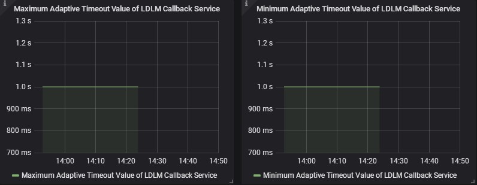

   

- The Number of Available LDLM Callback Request buffers Panel ([Figure 106](#figure-106-number-of-available-ldlm-callback-request-buffers)) shows the maximum and minimum number of available LDLM Callback request buffers varying on time on MDS. When a request arrives, one request buffer will be used. When number of available request buffers is under low water, more buffers are needed to avoid performance bottleneck. The value shown in the left graph blew is the maximum number during the last collect interval;  The value shown in the right graph blew is the minimum number during the last collect interval. 

  ###### Figure 106: Number of Available LDLM Callback Request Buffers
  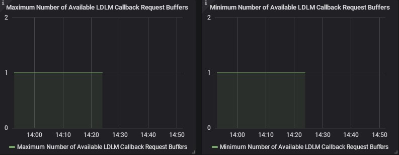
  

### Server Statistics

The Server Statistics dashboard ([Figure 107](#figure-107-server-statistics-dashboard)) shows detailed information about a server.

###### Figure 107: Server Statistics Dashboard
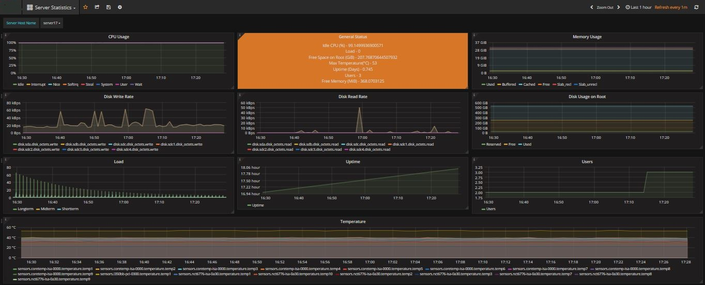


Below you will find description of some of the panels in the **Server Statistics** dashboard:

- The **CPU Usage** panel ([Figure 108](#figure-108-cpu-usage-panel)) shows the amount of time spent by the CPU in various states, most notably executing user code, executing system code, waiting for IO-operations and being idle.

###### Figure 108: CPU Usage Panel
  
  ###### 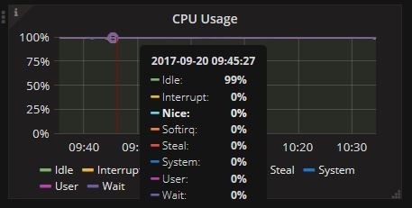
  
- The **Memory Usage** panel ([Figure 109](#figure-109-memory-usage-panel)) shows how much memory has been used. The values are reported by the operating system. The categories are: **Used**, **Buffered**, **Cached**, **Free**, **Slab_recl**, **Slab_unrecl**.

  ###### Figure 109: Memory Usage Panel
  
  ###### 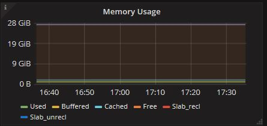
  
- The **Disk Write Rate** panel ([Figure 110](#figure-110-disk-write-rate-panel)) shows the disk write rate of the server.

  ###### Figure 110: Disk Write Rate Panel
  
  ###### 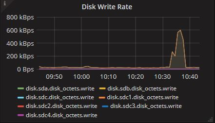
  
- The **Disk Read Rate** panel ([Figure 111](#figure-111-disk-read-rate-panel)) shows the disk read rate of the server.

  ###### Figure 111: Disk Read Rate Panel
  
  ###### 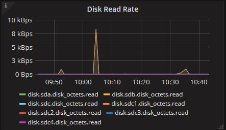
  
- The **Disk Usage on Root** panel ([Figure 112](#figure-112-disk-usage-on-root-panel)) shows free space, used space and reserved space on the disk that is mounted as Root.
 A warning message will be generated when there’s little free space left.

  ###### Figure 112: Disk Usage on Root Panel
  
  ###### 
  
- The **Load** panel ([Figure 113](#figure-113-load-panel)) shows the load on the server. The system load is defined as the number of runnable tasks in the run-queue and is provided by many operating systems as follows:

	- **Shortterm** — one minute average 

	- **Midterm** — five minutes average 

	- **Longterm** — fifteen minutes average

  ###### Figure 113: Load Panel
  
  ###### 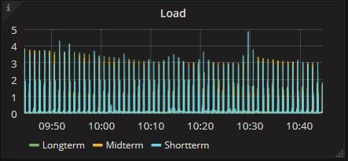
  
- The **Uptime** panel ([Figure 114](#figure-114-uptime-panel)) shows how long the server has been working. It keeps track of the system uptime, providing such information as the average running time or the maximum reached uptime over a certain period of time.

  ###### Figure 114: Uptime Panel
  
  ###### 
  
- The **User** panel ([Figure 115](#figure-115-user-panel)) shows the number of users currently logged into the system.

  ###### Figure 115: User Panel
  
  ###### 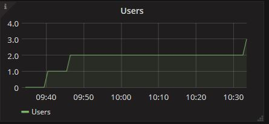
  
- The **Temperature** panel ([Figure 116](#figure-116-temperature-panel)) shows the temperature collected from sensors.

  ###### Figure 116: Temperature Panel
  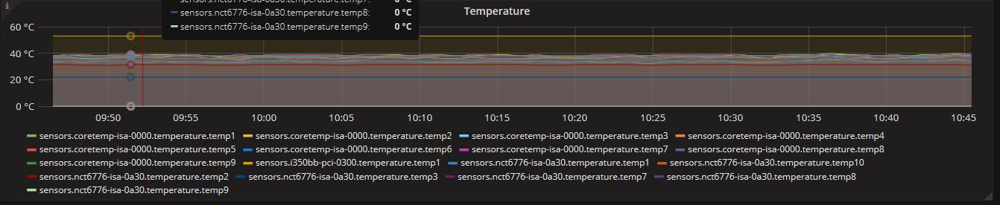
  

### SFA Physical Disk Dashboard

The **SFA Physical Disk** dashboard shown in [Figure 117](#figure-117-sfa-physical-disk-dashboard) displays information about DDN SFA physical disks.

###### Figure 117: SFA Physical Disk Dashboard
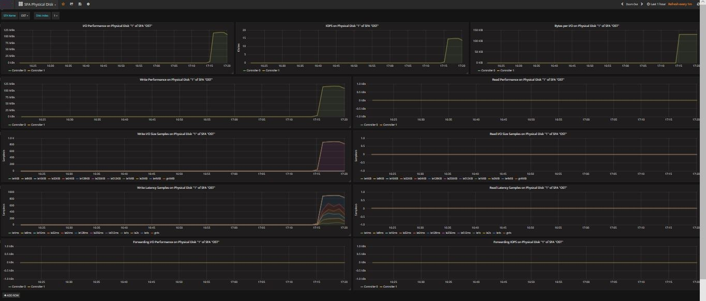

   

Below you will find description of some of the panels in the **SFA Physical Disk** dashboard:

- The **I/O Performance on Physical Disk** panel ([Figure 118](#figure-118-io-performance-on-physical-disk-panel) )shows I/O speed over time.

  ###### Figure 118: I/O Performance on Physical Disk Panel
  
  ###### 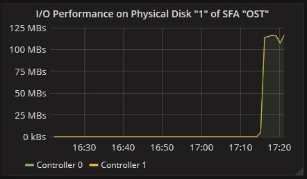
  
- The **IOPS on Physical Disk** panel ([Figure 119](#figure-119-iops-on-physical-disk-panel)) shows I/O operations per second on Physical Disk.

  ###### Figure 119: IOPS on Physical Disk Panel
  
  ###### 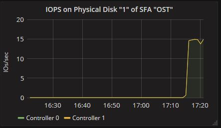
  
- The **Bytes per I/O** panel ([Figure 120](#figure-120-bytes-per-io-on-physical-disk-panel)) shows the I/O bytes per second on each controller.

  ###### Figure 120: Bytes per I/O on Physical Disk Panel
  
  ###### 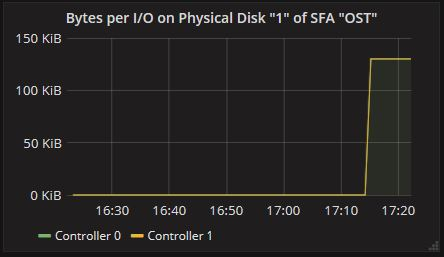
  
- The **Write Performance** panel ([Figure 121](#figure-121-write-performance-on-physical-disk-panel)) shows the write performance on each controller.

  ###### Figure 121: Write Performance on Physical Disk Panel
  
  ###### 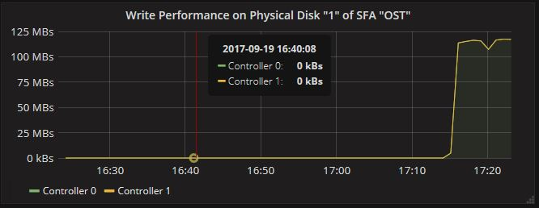
  
- The **Write I/O Size Samples** panel ([Figure 122](#figure-122-write-io-size-samples-on-physical-disk-panel)) shows the account of writting operation on each size.

  ###### Figure 122: Write I/O Size Samples on Physical Disk Panel
  
  ###### 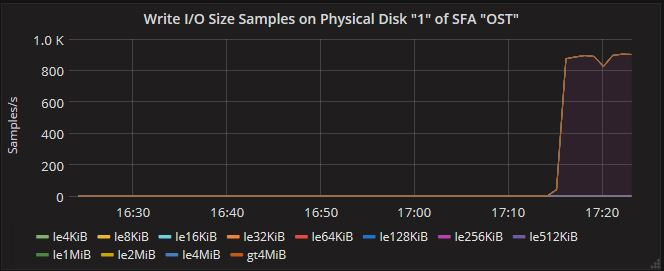
  
- The **Write Latency Samples** panel ([Figure 123](#figure-123-write-latency-samples-on-physical-disk-panel)) shows the account of writing operation on each latency.

  ###### Figure 123: Write Latency Samples on Physical Disk Panel
  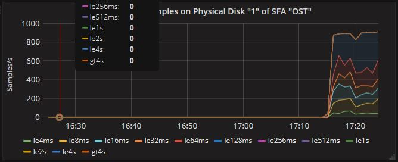  
  

### SFA Virtual Disk Dashboard

The **SFA Virtual Disk** dashboard ([Figure 124](#figure-124-sfa-virtual-disk-dashboard) ) shows information about DDN SFA virtual disks:

###### Figure 124: SFA Virtual Disk Dashboard
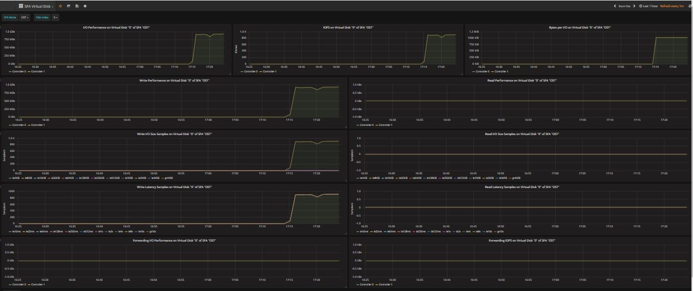

Below you will find description of some of the panels in the **SFA Virtual Disk** dashboard:

- The I/O Performance panel ([Figure 125](#figure-125-io-performance-on-virtual-disk-panel)) in shows the I/O speed at a specific time.

  ###### Figure 125: I/O Performance on Virtual Disk Panel
  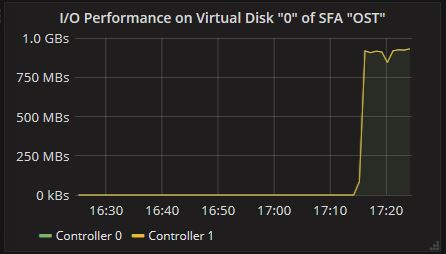
  
- The IOPS panel ([Figure 126](#figure-126-io-operations-per-second-on-virtual-disk-panel)) shows I/O operations per second on Virtual Disk.

  ###### Figure 126: I/O Operations per Second on Virtual Disk Panel
  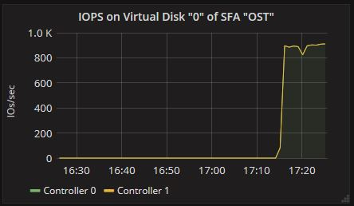
  
- The Bytes per I/O panel ([Figure 127](#figure-127-bytes-per-io-on-virtual-disk-panel)) shows I/O bytes per second on each controller.

  ###### Figure 127: Bytes per I/O on Virtual Disk Panel
  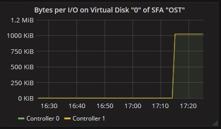
  
- The Write Performance panel ([Figure 128](#figure-128-write-performance-on-virtual-disk-panel)) shows write performance on each controller.

  ###### Figure 128: Write Performance on Virtual Disk Panel
  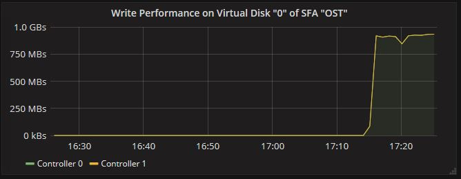

- The Write I/O Size Samples panel ([Figure 129](#figure-129-write-io-size-samples-on-virtual-disk-panel)) shows the size distributions of write I/Os.

  ###### Figure 129: Write I/O Size Samples on Virtual Disk Panel
  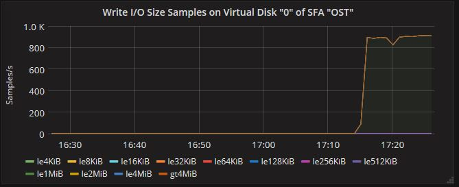
  
- The Write Latency Samples panel ([Figure 130](#figure-130-write-latency-samples-on-virtual-disk-panel)) shows the latency distributions of write I/Os.

  ###### Figure 130: Write Latency Samples on Virtual Disk Panel
  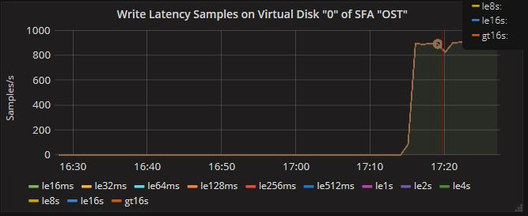

 

## Stress Testing

In order to check whether the monitoring system works well under high pressure, DDN designed the **collectd-stress2** plugin for stress testing. It is an upgraded version of the **Stress** plugin, which can use a couple of **collectd** clients to simulate tens of thousands of metrics collected from hundreds of servers.

### Installing stress2 RPM on collectd Client

Because the **stress2** plugin generates a large amount of simulated monitoring data and contaminates the database, the plugin *should not* be installed on all clients by default. After the monitoring system has been installed using esmon_install, select a couple of **collectd** clients as testing hosts and install the **stress2** plugins on each of the testing hosts. The RPM collectd-stress2 * .rpm should be located in the ISO directory. To install the RPM, run the following command:

```shell
rpm --ivh collectd-stress2*.rpm
```

### Updating Configuration File of Collectd Client

After **stress2** RPMs have been installed, update the configuration file /etc/collectd.conf and add the following configuration:

- **Thread** —Defines the number of test threads.

- **Metric** — Defines all the attributes of the monitoring target. It can be specified multiple times to simulate different monitoring targets at the same time. It contains the following attributes:

	- **Variable** — Defines the scope of the monitoring target changes and the speed of change, it can be specified multiple times.

		- **Name** — Defines the variable name.

		- **Number** — Defines the maximum range of variable changes.

		- **UpdateInterval** — Defines the time interval between variable changes.

	- **Host**—Defines the host name of the client, usually defined as "$ {key: hostname}", the program automatically sets the current host name. It describes the discriminator of the collection data object together with the following **Plugin**, **PluginInstance**, **Type**, **TypeInstance**. See [Naming Schema](https://collectd.org/wiki/index.php/Naming_schema) for details.

	- **Plugin**—Defines the plugin member in the collectd identifier.

	- **PluginInstance**—Defines the plugininstance member in the collectd identifier.

	- **Type**—The type member of the collectd identifier. For details, see https://collectd.org/wiki/index.php/Derive.

	- **TypeInstance**—Defines the type instance member in the collectd identifier.

	- **TsdbName**—Defines the name submitted to the database format.

    - **TsdbTags**—Defined the tags submitted to the database format to facilitate the late classification search.

Below is an example of /etc/collectd.conf.

```yaml
Example:

LoadPlugin stress2
<Plugin "stress2">
  Thread 32
  <Metric>
	<Variable>
	    Name "ost_index"
	    Number 10
	    UpdateIterval 0
	</Variable>
	<Variable>
	    Name "job_id"
	    Number 7000
	    UpdateIterval 10
	</Variable>
	  Host "${key:hostname}"
	  Plugin "stress-${variable:ost_index:OST%04x}"
	  PluginInstance "jobstat_${variable:job_id:job%d}"
	  Type "derive"
	  TypeInstance "sum_read_bytes"
	  TsdbName "ost_jobstats_samples"
	  TsdbTags "optype=sum_read_bytes fs_name=stress ost_index=${variable:ost_index:OST%04x} job_id=${variable:job_id:job%d}"
   </Metric>
  <Metric>
	<Variable>
	    Name "mdt_index"
	    Number 10
	    UpdateIterval 0
	</Variable>
	<Variable>
	    Name "md_stats"
	    Number 10
	    UpdateIterval 10
	</Variable>
	  Host "${key:hostname}"
	  Plugin "stress-${variable:mdt_index:MDT%04x}"
	  PluginInstance "md_stats"
	  Type "derive"
	  TypeInstance "open"
	  TsdbName "md_stats"
	  TsdbTags "optype=open fs_name=stress mdt_index=${variable:mdt_index:MDT%04x} mdt_stats_open=${variable:mdt_stats_open:%d}"
   </Metric>
</Plugin>
```

### Start Testing

After modifying the configuration file, restart collectd:

service collectd restart

A message like the following should appear in */var/log/messages*:

server11 collectd[20830]: stress2: time: 1.79244 for 70100 commits with 32 threads, 39108.70099 commits/second

The above information shows that stress2 plugin successfully loaded , and generated a lot of monitoring data. With the above configuration file and following specified hardware environment, the corresponding monitoring bottlenecks were checked.

- **OS: **CentOS7.

- **Memory**: 128GB.

- **CPU:** Intel(R) Xeon(R) CPU E5-2630 v3 @ 2.40GHz.

- **Disk:** Samsung SSD 850  2B6Q.

The monitoring client and database server are running on the same host, Influxdb data is stored on SSD with ext4 file system.

**Preconditions:**

- **Collectd Interval:** 60 seconds.

- **Grafana History:** 1 hour.

- **Grafana** **Refresh** **Interval:** 60 seconds.

- **Collectd** **Running** **Time:** more than 1 hour.

**Conclusion:**

- **Grafana keeps on refreshing:** monitor overload.

- **Grafana has idle time:** monitor running well.

In theory, Grafana's refresh time equals the database query time plus the web page load time.

We can query the database to measure the performance of the database query. For example the following is the default query command for LustrePerfMon Grafana **Read Throughput per Job**:
```sql
influx -database esmon_database –execute \

"SELECT "value" FROM "ost_jobstats_samples" WHERE ("optype" = 'sum_read_bytes' AND "fs_name" = 'stress') AND time >= now() - 1h GROUP BY "job_id"" 
```

With the monitoring software running, the above command on the database host can be executed to verify the query time. As shown in [Figure 71](#figure-71number-of-available-ldlm-canceld-request-buffers-panel), the query time of the Influxdb grew linearly during the first hour, because the data points kept on accumulating . But after an hour, the query time became steady, which is also expected behavior.

###### Figure 131：Influxdb Query Time
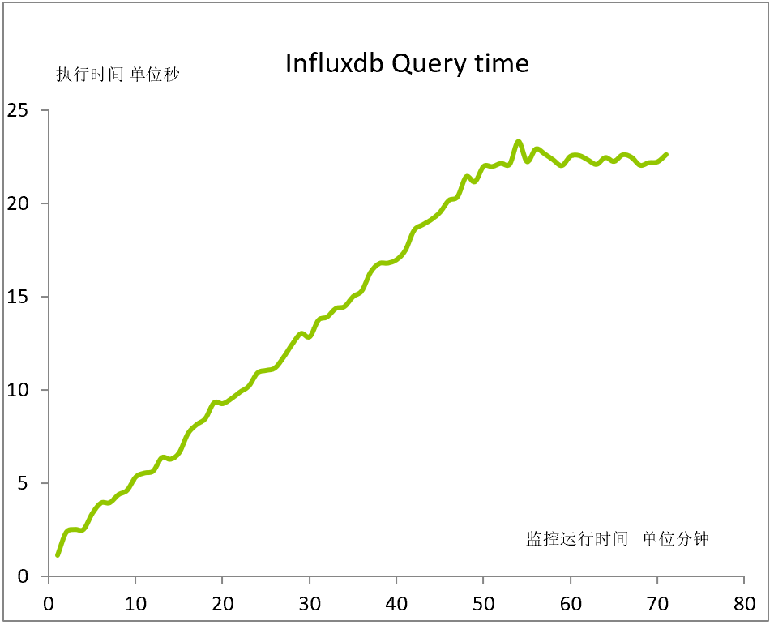

After verifying the load on the database side, we also need to verify the loading status of Grafana. Log in to Grafana to see **Read Throughput per Job** (see [Figure 72](#figure-72number-of-active-ldlm-callback-requests-panel))

###### Figure 132：Read throughput per Job stress testing
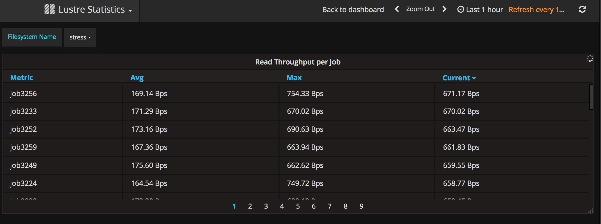


If the page is always refreshing and the page can be loaded within 60 seconds, that means, under the current configuration, the monitoring system can handle the current pressure. Otherwise, the monitoring system can be considered overloaded. In that case, either hardware need to be upgraded or the data collecting/refreshing intervals need to be increased. By continuously adjusting the number of **job_id** in */etc/collectd.conf* and checking the page refreshing latency, the maximum supported metrics can be known under the current hardware configuration. Tests show that if Lustre has 10 OSTs, with above hardware, the monitoring system can support up to 7000 running jobs at the same time without any problem.

## Troubleshooting

The directory */var/log/esmon_install/[installing_date]* on the Installation Server gathers all the logs that is useful for debugging. If a failure happens, some error messages will be written  to the file */var/log/esmon_install/[installing_date]/error.log*. The first error message usually contains the information about the cause of failure.
