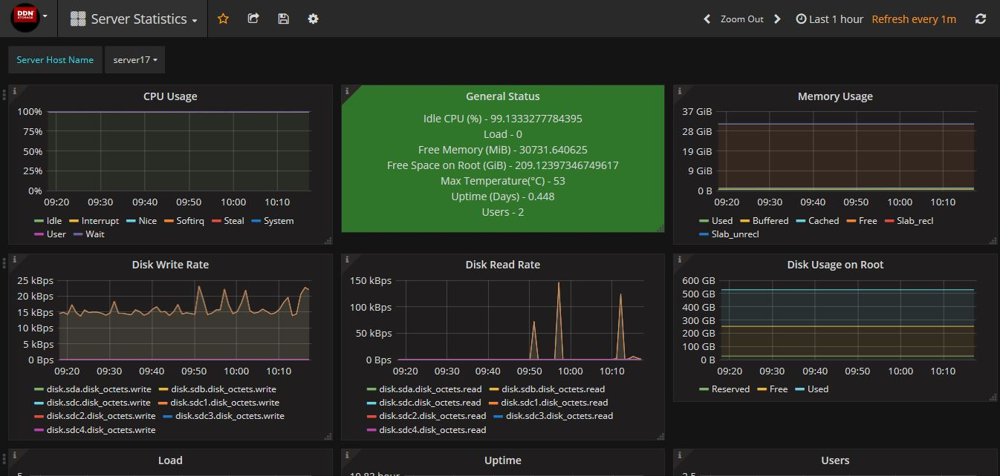
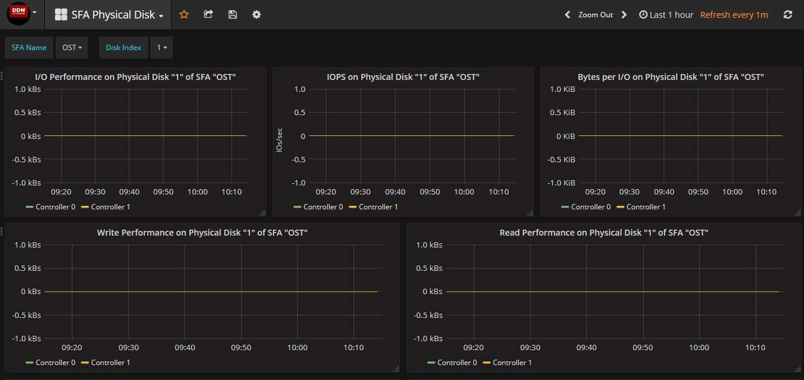
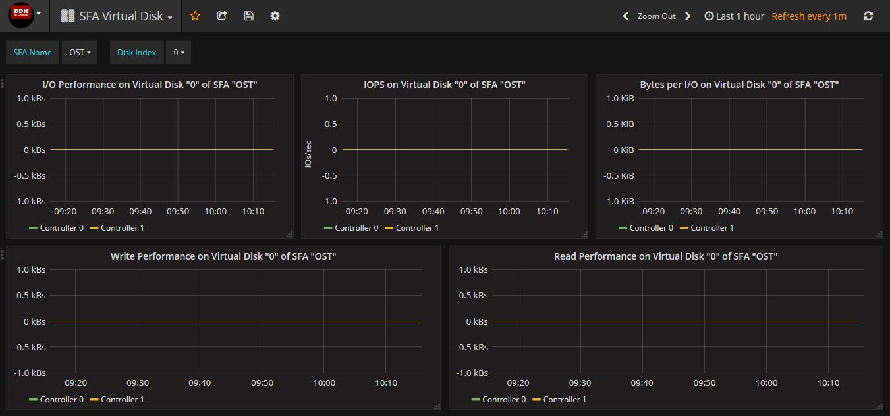

# DDN Exascaler Monitoring System Manual

## Definitions

- **ESMON**: Abbreviation for *DDN Exascaler Monitoring System*.
- **DDN Exascaler**: *DDN Exascaler* is software stack developed by *DDN* to overcome the toughest storage and data management challenges in extreme, data-intensive environments.
- **Installation Server**: The server on which the installation process is triggered.


- **Monitoring Server**: The server on which the database (*Influxdb*) and web server (*Grafana*) of the monitoring system will run.

- **Monitoring Client(s):**  The servers from which the monitor system will collect metrics from. The metrics includes information about CPU, memory, Lustre, SFA storage, etc. A *Collectd* daemon will run on each monitoring client.

- **DDN IME**: *DDN’s Infinite Memory Engine (IME)* is a flash-native, software-defined, storage cache that streamlines application IO, eliminating system bottlenecks.

- **Lustre**: The *Lustre* file system is an open-source, parallel file system that supports many requirements of leadership class HPC simulation environments.

##Introduction

*ESMON* is a monitoring system which can collect system statistics of DDN Exascaler for performance monitoring and analyzing. It is based on multiple widely used open-source software. Some extra plugins and are developed by DDN for enhancemen.

One of the main components of *ESMON* is *Collectd*. *Collectd* is a daemon which collects system performance statistics periodically and provides mechanisms to store the values in a variety of ways. *ESMON* is based on the open-source *Collectd*, yet includes more plugins, such as Lustre, GPFS, Ganglia, Nagios, Stress, Zabbix and so on.

###Collectd plugins of DDN

Several additional plugins are added to *Collectd* in *ESMON* to support various functions.

- **Filedata plugin:** The *Filedata* plugin is able to collect data by reading and parsing a set of files. And definition file with XML format is needed for the *Filedata* plugin to understand which files to read and how to parse these files. The most common usage of *Filedata* plugin is to collect metrics through /proc interfaces of a running *Lustre* system. 
- **Ganglia plugin:** The *Ganglia* plugin can send metrics collected by a *Collectd* client daemon to *Ganglia* server.
- **GPFS plugin:** The *GPFS* plugin can collect performance information through "mmpmon" commands provided by *GPFS*. The *GPFS* plugin shares the same definition file format with *Filedata* plugin. The  configuration format of *GPFS* in *collectd.conf* is also similar with *Filedata* plugin.
- **IME Plugin:** The *IME* plugin can collect performance information from *DDN IME*. Like *GPFS* plugin, the *IME* plugin shares the similar definition file format and configuration format with *Filedata* plugin.
- **SSH plugin:** The *SSH* plugin is able to collect metrics by running commands on remote hosts by using SSH connections. The *SSH* plugin is used to collectd metrics from *DDN SFA* Storage. Like *GPFS* plugin and *IME* plugin, the *IME* plugin shares the similar definition file format and configuration format with *Filedata* plugin.
- **Stress plugin:** The *Stress* plugin can push a large amount of metrics to server from *Collectd* client in order to benchmark the performance of the collecting system under high pressure.
- **Zabbix plugin:** The *Zabbix* plugin is able to send metrics from *Collectd* to *Zabbix* system.

##Installation Requirements

###Installation Server

- OS distribution: CenOS7/RHEL7
- Free disk space: > 500 MB. The *installation server* will save all installation logs to */var/log/esmon_install* directory, which requires some free disk space.
- Network:  The *installation server* be able to start SSH connections to the *monitoring server* and *monitoring clients* without  password prompt
- *ESMON* ISO image :  The *installation server* should posses the *ESMON* ISO image.

###Monitoring Server

- OS distribution: CenOS7/RHEL7
- Free disk space:  > 5G. *Influxdb* will be running on this server. More disk space is required to keep more data into *Influxdb* 
- Network: SSHD should be running on the *monitoring server* and it should be able to be connected by *installation server* without prompting for password.

###Monitoring Client

- OS distribution: CenOS7/RHEL7 or CentOS6/RHEL6
- Free disk space:  > 200M. The *installation server* will save necessary RPMs in directory */var/log/esmon_install*, which requires some free disk space.
- Network: SSHD should be running on the *monitoring client* and it should be able to be connected by *installation server* without prompting for password.

##Installation Process

###1. Prepare the *Installation Server*

1. Grab the *ESMON* ISO image file to the *installation server*, for example: /ISOs/esmon.iso.

2. Mount the *ESMON* ISO image:

      ```shell
      # mount -o loop /ISOs/esmon.iso /media
      ```

3. Start the install script:

      ```shell
      # cd /media && sh ./installesmon.sh
      ```

###2. Update the Configuration File

The configuration file */etc/esmon_install.conf* includes all the necessary information for installation. Following is an example:

```yaml
iso_path: /work/ISOs/esmon.iso             # ISO path to ESMON
ssh_hosts:                                 # Array of hosts
  - host_id: Monitoring-Server             # ID of this SSH host
    hostname: Monitoring-Server            # The host name
    ssh_identity_file: /root/.ssh/id_rsa   # The SSH key to connect to the host
  - host_id: Monitoring-Client1
    hostname: Monitoring-Client1
    ssh_identity_file: /root/.ssh/id_rsa
  - host_id: Monitoring-Client2
    hostname: Monitoring-Client2
    ssh_identity_file: /root/.ssh/id_rsa
client_hosts:                              # Array of client hosts of ESMON
  - host_id: Monitoring-Client1            # Host ID
    lustre_oss: true                       # Whether enable Lustre OSS monitoring
    lustre_mds: true                       # Whether enable Lustre MDS monitoring
    ime: false                             # Whether enable IME monitoring
  - host_id: Monitoring-Client2
    lustre_oss: false
    lustre_mds: true
    ime: false 
server_host:
    host_id: Monitoring-Server # Server host ID of ESMON
    drop_database: true        # Whether to drop existing ESMON database in Influxdb
    erase_influxdb: true       # Whether to erase all data/metadata of Influxdb
```

**iso_path** is the path where *ESMON* ISO image is saved

**ssh_hosts** includes the information of how to login to the hosts using SSH connections. **host_id** is the unique ID of the host. Two hosts shouldn't share a same **host_id**. **hostname** is the host name to use when connecting to the host using SSH. **host_id** and **hostname** could be different for a host, because there could multiple ways to connect to the same host. **ssh_identity_file** is the SSH key file used when connecting to the host. **ssh_identity_file** could be omitted if the default SSH identity file works. All the monitoring server* and *monitoring client*s should be included in the **ssh_hosts**.

**client_hosts** includes all of the hosts that *ESMON* client packages should be installed and configured. **lustre_oss ** defines whether to enable metric collection of Lustre OSS. **lustre_mds** defines whether to enable metric collection of Lustre MDS. **ime** defines whether to enable metric collection of *DDN IME*.

**host_id** in **server_host** is the host ID that *ESMON* server packages should be installed and configured. If **erase_influxdb** is true, all of the data and metadata of *Influxdb* will be erased completely. And if **drop_database** is true, the database of ESMON in *Influxdb* will be dropped. **erase_influxdb** and
**drop_database** should only be when the data in *Influxdb* is not needed any more. By enabling **erage_influxdb**, some corruption problems of *Influxdb* could be fixed.

###3. Start the Installation on the Cluster

After the */etc/esmon_install.conf* file has been updated correctly on the *installation server*, following command could be run to start the installation on the cluster:

```shell
# esmon_install
```

All the logs which are useful for debugging are saved under */var/log/esmon_install* directory of the *installation server*.

###4. Access the Monitoring Web Page

The *Grafana* service is started on the *monitoring server* automatically. The default HTTP port is 3000An login web page will been shown through that port.  The default user and password are both "admin". 


Different dashboards can be chosen to view different metrics collectd by *ESMON*.


The *Cluster Status* dashboard shows a summarized status of the servers in the cluster.


The *Lustre Statistics* dashboard show metrics of *Lustre* file systems.


The *Server Statistics* dashboard shows detailed information about a server.



The *SFA Physical Disk* dashboard shows the information about the *DDN SFA* physical disks.



The *SFA Virtual Disk* dashboard shows the information about the *DDN SFA* virtual disks.



## Troubleshooting

*/var/log/esmon_install/[installing_date]* directory on the *installation server* gathers all the logs that is useful for debugging. If a failure happens, some error messages will be printed to file */var/log/esmon_install/[installing_date]/error.log*. The first error message usually contains the information about the cause of failure.
