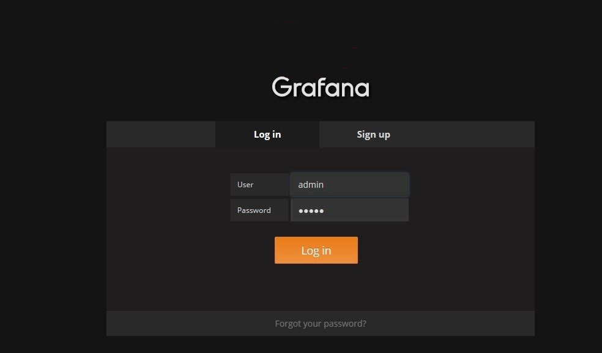
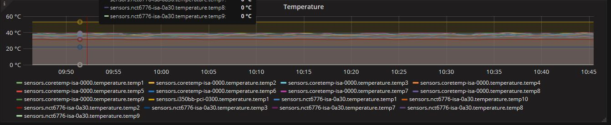
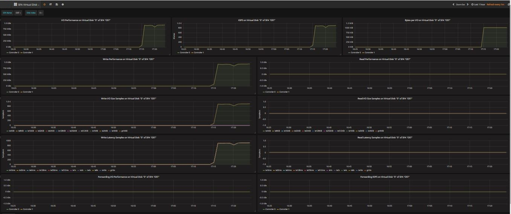

# DDN Exascaler Monitoring System Manual

## Definitions

- **ESMON**: Abbreviation for *DDN Exascaler Monitoring System*.
- **DDN Exascaler**: *DDN Exascaler* is software stack developed by *DDN* to overcome the toughest storage and data management challenges in extreme, data-intensive environments.
- **Installation Server**: The server on which the installation process is triggered.


- **Monitoring Server**: The server on which the database (*Influxdb*) and web server (*Grafana*) of the monitoring system will run.

- **Monitoring Client(s):**  The servers from which the monitor system will collect metrics from. The metrics includes information about CPU, memory, Lustre, SFA storage, etc. A *Collectd* daemon will run on each monitoring client.

- **DDN IME**: *DDN’s Infinite Memory Engine (IME)* is a flash-native, software-defined, storage cache that streamlines application IO, eliminating system bottlenecks.

- **Lustre**: The *Lustre* file system is an open-source, parallel file system that supports many requirements of leadership class HPC simulation environments.

##Introduction

*ESMON* is a monitoring system which can collect system statistics of DDN Exascaler for performance monitoring and analyzing. It is based on multiple widely used open-source software. Some extra plugins and are developed by DDN for enhancemen.

One of the main components of *ESMON* is *Collectd*. *Collectd* is a daemon which collects system performance statistics periodically and provides mechanisms to store the values in a variety of ways. *ESMON* is based on the open-source *Collectd*, yet includes more plugins, such as Lustre, GPFS, Ganglia, Nagios, Stress, Zabbix and so on.

###Collectd plugins of DDN

Several additional plugins are added to *Collectd* in *ESMON* to support various functions.

- **Filedata plugin:** The *Filedata* plugin is able to collect data by reading and parsing a set of files. And definition file with XML format is needed for the *Filedata* plugin to understand which files to read and how to parse these files. The most common usage of *Filedata* plugin is to collect metrics through /proc interfaces of a running *Lustre* system. 
- **Ganglia plugin:** The *Ganglia* plugin can send metrics collected by a *Collectd* client daemon to *Ganglia* server.
- **GPFS plugin:** The *GPFS* plugin can collect performance information through "mmpmon" commands provided by *GPFS*. The *GPFS* plugin shares the same definition file format with *Filedata* plugin. The  configuration format of *GPFS* in *collectd.conf* is also similar with *Filedata* plugin.
- **IME Plugin:** The *IME* plugin can collect performance information from *DDN IME*. Like *GPFS* plugin, the *IME* plugin shares the similar definition file format and configuration format with *Filedata* plugin.
- **SSH plugin:** The *SSH* plugin is able to collect metrics by running commands on remote hosts by using SSH connections. The *SSH* plugin is used to collectd metrics from *DDN SFA* Storage. Like *GPFS* plugin and *IME* plugin, the *IME* plugin shares the similar definition file format and configuration format with *Filedata* plugin.
- **Stress plugin:** The *Stress* plugin can push a large amount of metrics to server from *Collectd* client in order to benchmark the performance of the collecting system under high pressure.
- **Zabbix plugin:** The *Zabbix* plugin is able to send metrics from *Collectd* to *Zabbix* system.

##Installation Requirements

###Installation Server

- OS distribution: CenOS7/RHEL7
- Free disk space: > 500 MB. The *installation server* will save all installation logs to */var/log/esmon_install* directory, which requires some free disk space.
- Network:  The *installation server* be able to start SSH connections to the *monitoring server* and *monitoring clients* without  password prompt
- *ESMON* ISO image :  The *installation server* should posses the *ESMON* ISO image.

###Monitoring Server

- OS distribution: CenOS7/RHEL7
- Free disk space:  > 5G. *Influxdb* will be running on this server. More disk space is required to keep more data into *Influxdb* 
- Network: SSHD should be running on the *monitoring server* and it should be able to be connected by *installation server* without prompting for password.

###Monitoring Client

- OS distribution: CenOS7/RHEL7 or CentOS6/RHEL6
- Free disk space:  > 200M. The *installation server* will save necessary RPMs in directory */var/log/esmon_install*, which requires some free disk space.
- Network: SSHD should be running on the *monitoring client* and it should be able to be connected by *installation server* without prompting for password.

##Installation Process

###1. Install the *ESMON* RPM on *Installation Server*

1. Grab the *ESMON* ISO image file to the *installation server*, for example: /ISOs/esmon.iso.

2. Mount the *ESMON* ISO image:

      ```shell
      # mount -o loop /ISOs/esmon.iso /media
      ```

3. Install the *ESMON* RPM on *installation server*:

      ```shell
      # rpm -ivh /media/RPMS/rhel7/esmon*.rpm
      ```

###2. Update the Configuration File on *Installation Server*

The configuration file */etc/esmon_install.conf* includes all the necessary information for installation. Following is an example:

```yaml
iso_path: /work/ISOs/esmon.iso             # ISO path to ESMON
ssh_hosts:                                 # Array of hosts
  - host_id: Monitoring-Server             # ID of this SSH host
    hostname: Monitoring-Server            # The host name
    ssh_identity_file: /root/.ssh/id_rsa   # The SSH key to connect to the host
  - host_id: Monitoring-Client1
    hostname: Monitoring-Client1
    ssh_identity_file: /root/.ssh/id_rsa
  - host_id: Monitoring-Client2
    hostname: Monitoring-Client2
    ssh_identity_file: /root/.ssh/id_rsa
client_hosts:                              # Array of client hosts of ESMON
  - host_id: Monitoring-Client1            # Host ID
    lustre_oss: true                       # Whether enable Lustre OSS monitoring
    lustre_mds: true                       # Whether enable Lustre MDS monitoring
    ime: false                             # Whether enable IME monitoring
  - host_id: Monitoring-Client2
    lustre_oss: false
    lustre_mds: true
    ime: false 
server_host:
    host_id: Monitoring-Server # Server host ID of ESMON
    drop_database: true        # Whether to drop existing ESMON database in Influxdb
    erase_influxdb: true       # Whether to erase all data/metadata of Influxdb
```

**iso_path** is the path where *ESMON* ISO image is saved

**ssh_hosts** includes the information of how to login to the hosts using SSH connections. **host_id** is the unique ID of the host. Two hosts shouldn't share a same **host_id**. **hostname** is the host name to use when connecting to the host using SSH. **host_id** and **hostname** could be different for a host, because there could multiple ways to connect to the same host. **ssh_identity_file** is the SSH key file used when connecting to the host. **ssh_identity_file** could be omitted if the default SSH identity file works. All the monitoring server* and *monitoring client*s should be included in the **ssh_hosts**.

**client_hosts** includes all of the hosts that *ESMON* client packages should be installed and configured. **lustre_oss ** defines whether to enable metric collection of Lustre OSS. **lustre_mds** defines whether to enable metric collection of Lustre MDS. **ime** defines whether to enable metric collection of *DDN IME*.

**host_id** in **server_host** is the host ID that *ESMON* server packages should be installed and configured. If **erase_influxdb** is true, all of the data and metadata of *Influxdb* will be erased completely. And if **drop_database** is true, the database of ESMON in *Influxdb* will be dropped. **erase_influxdb** and
**drop_database** should only be when the data in *Influxdb* is not needed any more. By enabling **erage_influxdb**, some corruption problems of *Influxdb* could be fixed.

###3. Start the Installation on the Cluster

After the */etc/esmon_install.conf* file has been updated correctly on the *installation server*, following command could be run to start the installation on the cluster:

```shell
# esmon_install
```

All the logs which are useful for debugging are saved under */var/log/esmon_install* directory of the *installation server*.

###4. Access the Monitoring Web Page

The *Grafana* service is started on the *monitoring server* automatically. The default HTTP port is 3000. A login web page will been shown through that port.  The default user and password are both "admin". 

| 

##Dashboards

By selection dashboards, different metrics collectd by *ESMON* can be shown.

Different dashboards can be chosen to view different metrics collectd by *ESMON*.

| 

###Cluster Status Dashboard
The *Cluster Status* dashboard shows a summarized status of the servers in the cluster.
The back ground color of panels show the servers' working status.

- If the color of the panel is green, it means the server is under normal condition.
- If the color of the panel is yellow, it means the server is under warnning status. In this case, one or more of the following conditions happen.

|        Idle CPU is less than 20%
|        Load is higher than 5
|        Free memory is less than 1000 MiB
|        Free space of "/" is less than 10 GiB 

- If the color of the panel is red, it means the server is under critical status. In this case, one or more of the following conditions happen.

|        Idle CPU is less than 5%
|        Load is higher than 10
|        Free space of "/" is less than 1 GiB
|        Free memory is less than 100 MiB

| 

###Lustre Status Dashboard

The *Lustre Statistics* dashboard show metrics of *Lustre* file systems. TODO: copy the markdown introduction from Grafana dashboard discription.

| 

Following pictures are some of the panels in *Lustre Statistics* Dashboard

- *Free Inode Number Panel* shows how many inodes remained in the system.

| 

- *Lustre Aggregated CPU Usage Panel* shows the proportion of system and users usage of CPU

| 

- *Quota Accounting(Capacity) Panel* shows the capacity usages of users.

| 

- *Quota Accounting(Inode) Panel* shows the inode usages of users.

| 

###Server Statistics

The *Server Statistics* dashboard shows detailed information about a server.

| 

Following pictures are some of the panels in *Server Statistics Dashboard*

- *CPU Usage Panel* shows the proportion of CPU usage on each server.

| 
|   The amount of time spent by the CPU in various states, most notably executing user code, executing system code, waiting for IO-operations and being idle.

- *Memory Usage Panel* shows how much memory has been used.

| 
|  The values are reported by the operating system. The categories are: Used, Buffered, Cached, Free, Slab recl, Slab unrecl

- *Disk Write Panel* shows the disk write rate of the server.

| 
|  This panel shows the writting rate for each disk.

- *Disk Read Panel* shows the disk read rate of the server.

| 
|  This panel shows the reading rate for each disk.

- *Disk Usage Panel* shows free space, used space and reserved space on the disk.

| 
|  This value show the usage of the disk which is mounted as Root. There will be three categories: Free, Used, Reserved 
|  _Warning_ will be reported when there's a little free space left.

- *Load Panel* shows the load on the server. The system load is defined as the number of runnable tasks in the run-queue and is provided by many operating systems as a one minute average.

| 
|   The system load is defined as the number of runnable tasks in the run-queue and is provided by many operating systems as:
|      *Shortterm* --- one minute average
|      *Midterm* --- five minutes average
|      *Longterm* --- fifteen minutes average

- *Uptime Panel* shows how long the server is working.

| 
|  It keeps track of the system uptime, providing informations such as the average running time or the maximum reached uptime over a certain period of time.

- *User Panel* shows the number of users currently logged into the system.

| 
|  Counts the The number of users currently logged into the system.

- *Temperature Panel* shows the temperature collected from sensors.

| 
|   System Temperature is collected by sensors. This panel shows the temperture of these sensors.

### SFA Physical Disk Dashboard

The *SFA Physical Disk* dashboard shows the information about the *DDN SFA* physical disks.

| 

Following pictures are some of the panels in *SFA Physical Disk* dashboard

- *I/O Performance Panel* shows the I/O speed at the time.

| 

- *IOPS Panel* shows the I/O operations per second on Physical Disk.

| 

- *Bytes per I/O Panel* shows the I/O bytes per second on each controller.

| 

- *Write Performance Panel* shows the write performance on each controller.

| 

- *Write I/O size Panel* shows the account of writting operation on each size.

| 

- *Write Latency Samples Panel* shows the account of writting operation on each latency.

| 

### SFA Virtual Disk Dashboard

The *SFA Virtual Disk* dashboard shows the information about the *DDN SFA* virtual disks.

| 

Following pictures are some of the panels in *SFA Viatual Disk* dashboard

- *I/O Performance Panel* shows the I/O speed at the time.

| 

- *IOPS Panel* shows the I/O operations per second on Physical Disk.

| 

- *Bytes per I/O Panel* shows the I/O bytes per second on each controller.

| 

- *Write Performance Panel* shows the write performance on each controller.

| 

- *Write I/O Size Panel* shows the account of writting operation on each size.

| 

- *Write Latency Samples Panel* shows the account of writting operation on each latency.

| 

## Troubleshooting

*/var/log/esmon_install/[installing_date]* directory on the *installation server* gathers all the logs that is useful for debugging. If a failure happens, some error messages will be printed to file */var/log/esmon_install/[installing_date]/error.log*. The first error message usually contains the information about the cause of failure.
