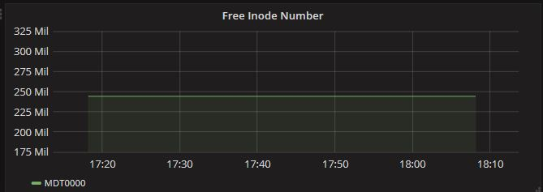

# DDN Exascaler 监控系统手册


##简介

*ESMON* 是一款基于多种开源软件的监控系统，它通过采集DDN Exascaler的系统状态信息以达到对其进行性能监控及分析的目的。 DDN同时还开发了一些外部插件以作功能扩展。

其中，*ESMON* 的主要组件是一个名叫 *Collectd*的守护进程。 它完成了系统性能的相关统计信息定期收集，并将这些数据以多种不同的机制进行存储。尽管*ESMON* 是基于开源的*Collectd*而研发的, 它同时也包含了许多其他插件，如Lustre, GPFS, Ganglia, Nagios, Stress, Zabbix等等.

### 名词解释

- **ESMON**: DDN Exascaler 监控系统的缩写。
- **DDN Exascaler**: *DDN Exascaler* 是由DDN研发的软件栈，它攻克了极端数据密集型环境中最严苛的存储及数据管理问题。
- **部署服务器**: 程序安装进程将在此服务器上被触发。


- **监控服务器**: 监控系统的数据库(*Influxdb*) 及网络服务 (*Grafana*) 将在此服务器上运行。
- **被监控客户端**  监控系统将从被监控客户端上收集各类指标数据，例如CPU, 内存, Lustre, SFA 存储等相关信息。守护进程*Collectd* 将在每个客户端后台运行。
- **DDN IME**: DDN 的无限内存引擎(*Infinite Memory Engine*) 是一款本地化闪存，由软件定义的存储缓存，它简化了应用程序读取路径，消除了系统瓶颈。
- **Lustre**: Lustre文件系统是一种开源的并行文件系统，它满足了许多高性能计算仿真环境的需求。

###DDN Collectd 插件

为支持更多不同功能，DDN添加了一些附加的Collectd插件。

- **Filedata 插件:** Filedata插件能够通过读取及解析一组文件进行数据收集。用户需要在一个xml格式文件中对读取哪些文件、如何解析这些文件等进行定义。Filedata插件最常见的用途是通过正在运行的Lustre系统的 /proc 接口收集指标。
- **Ganglia 插件:**  Ganglia插件将collectd进程收集的指标信息发送给Ganglia服务器。
- **GPFS 插件:**  GPFS插件通过GPFS提供的“mmpmon”命令来收集性能信息。GPFS插件的定义文件格式和Filedata插件相同。同时，其’*collectd.conf’*的配置格式也与Filedata 插件相似.
- **IME 插件:** IME插件通过DDN IME收集性能信息。像GPFS插件一样，IME插件和Filedata插件共享相似的定义文件格式和配置格式。
- **SSH 插件:** SSH插件能够通过使用SSH连接在远程主机上运行命令来收集来自DDN SFA存储的各项指标。像GPFS插件和IME插件一样，它的定义文件格式和配置格式和Filedata插件类似。
- **Stress 插件:** Stress插件可以从collectd向服务器推送大量指标数据，以便在高压下对收集系统的性能进行基准测试。
- **Zabbix 插件:** Zabbix插件将指标数据从collectd发送至Zabbix系统。

##安装要求

###部署服务器

- 操作系统版本: CenOS7/RHEL7
- 硬盘空闲空间: > 500 MB。所有安装日志将被保存于部署服务器的 */var/log/esmon_install* 目录下，须占用一定空间。
- 网络:  部署服务器须能对监控服务器和被监控客户端发起无密码提示的SSH连接。
- *ESMON* ISO 镜像 :  ESMON ISO 镜像须在部署服务器上可用。

###监控服务器

- 操作系统版本: CenOS7/RHEL7
- 硬盘空闲空间: \> 5GB。监控服务器运行有Influxdb，须预留更大空间以容纳更多数据写入Influxdb。
- 网络:  监控服务器须运行SSHD，以便通过无密码提示的SSH与监控服务器连接。

### 被监控客户端

- 操作系统版本: CentOS7/RHEL7 or CentOS6/RHEL6
- 硬盘空闲空间: > 200MB。必要的RPMs将被保存于 /var/log/esmon_install 目录下，须占用一定空间。
- 网络:  被监控客户端须运行SSHD，以便通过无密码提示的SSH与监控服务器连接。

##安装过程

###1. 在部署服务器上安装ESMON RPM

1. 将 *ESMON* ISO 镜像文件拷贝至部署服务器上，如 /ISOs/esmon.iso.

2. 载入 the *ESMON* ISO 镜像:

      ```shell
      # mount -o loop /ISOs/esmon.iso /media
      ```

3. 安装 *ESMON* RPM：

      ```shell
      # rpm -ivh /media/RPMS/rhel7/esmon*.rpm
      ```

###2. 在部署服务器上更新配置文件

配置文件 */etc/esmon_install.conf* 包含了所有安装的必要信息。例如：

```yaml
iso_path: /work/ISOs/esmon.iso             # ISO path to ESMON
ssh_hosts:                                 # Array of hosts
  - host_id: Monitoring-Server             # ID of this SSH host
    hostname: Monitoring-Server            # The host name
    ssh_identity_file: /root/.ssh/id_rsa   # The SSH key to connect to the host
  - host_id: Monitoring-Client1
    hostname: Monitoring-Client1
    ssh_identity_file: /root/.ssh/id_rsa
  - host_id: Monitoring-Client2
    hostname: Monitoring-Client2
    ssh_identity_file: /root/.ssh/id_rsa
client_hosts:                              # Array of client hosts of ESMON
  - host_id: Monitoring-Client1            # Host ID
    lustre_oss: true                       # Whether enable Lustre OSS monitoring
    lustre_mds: true                       # Whether enable Lustre MDS monitoring
    ime: false                             # Whether enable IME monitoring
  - host_id: Monitoring-Client2
    lustre_oss: false
    lustre_mds: true
    ime: false 
server_host:
    host_id: Monitoring-Server # Server host ID of ESMON
    drop_database: true        # Whether to drop existing ESMON database in Influxdb
    erase_influxdb: true       # Whether to erase all data/metadata of Influxdb
```

这些参数的具体含义如下：

**iso_path**：ESMON ISO镜像保存路径。

**ssh_hosts** 包含了用SSH连接登录主机（包括所有监控服务器及被监控客户端）的所有相关信息。**host_id**是主机的唯一id， 两个不同的主机不能拥有相同的**host_id**。**hostname**是用于SSH连接的主机名。一个主机可拥有不同的**host_id** 和 **hostname**。允许多种不同方式连接至同一主机。 **ssh_identity_file**是用于SSH连接时的SSH密钥文件。当配置有默认SSH密钥文件时，该参数可省略。

**client_hosts** 包含了所有主机中 ESMON client 包安装路径和配置详情。 其中，**lustre_oss ** 定义了是否启用 Lustre OSS中指标收集功能。 **lustre_mds** 定义了是否启用 Lustre MDS中指标收集功能。 **ime** 定义了是否启用 DDN IME中指标收集功能。

**server_hosts**, 包含了所有主机中ESMON server 包安装路径和配置详情。当**erase_influxdb** 为真时，所有 Influxdb 中的数据和原数据都将被完全擦除**。**通过启用**erase_influxdb**可解决 Influxdb 的数据损坏问题。当**drop_database**为真时**, Influxdb **中的 ESMON database将被丢弃，反之将被保留。注意，只有不再需要Influxdb中数据和原数据时才可启用 **erase_influxdb **和 **drop_database。**

###3. **在集群上运行安装程序**

在*/etc/esmon_install.conf*部署服务器上正确更新后, 运行以下命令在集群启动安装程序。

```shell
# esmon_install
```

所有可用于调试的相关日志将被保存在*/var/log/esmon_install*目录下。

###4. 访问监控网络页面

Grafana 服务将自动在监控服务器启动 。默认HTTP 端口为 3000。通过访问该端口可跳转至登录页面，默认用户名密码皆为 “admin”。

##页面概览

在主页上 (Home dashboard)，可通过选择不同的模块页面浏览由 ESMON 收集的不同数据指标。


###Cluster Status 
*Cluster Status* 页面显示了集群中服务器的状态信息概要。

其中，面板的背景颜色与服务器的运行状态相关 :

- 绿色：服务器正常运行。
- 黄色：警告信息，说明存在下列情况之一：

|        空闲 CPU 不足 20%
|        负载数量高于 5
|        空闲内存不足 1000 MiB
|        根目录下空闲空间不足10 GiB 

- 红色：严重警告信息，说明存在下列情况之一或多种情况同时存在：

|       空闲 CPU 不足 5%
|        负载数量高于 10
|        根目录下空闲空间不足 1 GiB
|        空闲内存不足100 MiB

| 

###Lustre Status 

*Lustre Statistics* 页面显示了 Lustre 文件系统指标数据。 | 


以下是一些主要指标的面板视图：

- *Free Inode Number*视图显示了系统剩余的空闲节点数。

| 


- *Lustre Aggregated CPU Usage* 视图分别显示了系统和用户的 CPU 使用比例。

| 


- *Quota Accounting(Capacity)* 视图显示了用户容量使用情况。

| 


- *Quota Accounting(Inode)* 视图显示了用户inode的使用情况。

| 


###Server Statistics

*Server Statistics* 页面显示了服务器详细信息。 


以下是一些主要指标的面板视图：

- *CPU Usage*视图显示了CPU在不同阶段的使用情况，如执行用户代码、执行系统代码、等待数据读写操作、空闲时所占用的时间。

| 


- *Memory Usage* 视图显示了内存的使用情况，包括： **Used, Buffered, Cached, Free, Slab_recl, Slab_unrecl**。

| 
|  

- *Disk Write*视图显示了服务器的硬盘写入率。

| 


- *Disk Read* 视图显示了服务器的硬盘读取率。

| 


- *Disk Usage* 视图显示了Root载入的硬盘空闲空间、使用空间、预留空间看。剩余空闲空间不足时，将弹出警告信息。

| 
| 

- *Load*  视图显示了服务器负载情况，即服务器运行队列中可运行的任务数量。相关信息由操作系统提供，分为三类：

  - - **Shortterm（短期）**— 平均一分钟 
    - **Midterm（中期）**— 平均五分钟 
    - **Longterm（长期）**— 平均十五分钟 

   


- *Uptime*视图显示了服务器持续的正常运行时间。通过追踪系统运行时间，图中还显示了一段时间内的平均运行时间及最长运行时间。

| 
| 

- *User* 视图显示了当前登录系统的用户数量。

| 


- *Temperature*视图显示了传感器收集的温度信息。


### SFA Physical Disk 页面

The *SFA Physical Disk* 页面显示了DDN SFA 物理硬盘相关信息。


以下是一些主要指标的面板视图：

- *I/O Performance*视图显示了物理硬盘上不同时间的I/O读写速率。

|


- *IOPS*视图显示了物理硬盘上每秒进行的I/O操作数。

| 


- *Bytes per I/O* 视图显示了在物理硬盘上不同时间每个控制器I/O操作的平均数据大小 。

| 


- *Write Performance*视图显示了在物理硬盘上每个控制器的数据写入速率。

| 


- *Write I/O size Samples* 视图显示了在物理硬盘上写操作的数据大小分布情况。

| 


- *Write Latency Samples* 视图显示了在物理硬盘上写操作的延迟分布情况。

| 


### SFA Virtual Disk 页面

The *SFA Virtual Disk* 页面显示了 DDN SFA虚拟硬盘的相关信息: 


以下是一些主要指标的版面视图:

- *I/O Performance* 视图显示了虚拟硬盘上不同时间的I/O读写速率。

|


- *IOPS* 视图显示了虚拟硬盘上每秒进行的I/O操作数。

| 


- *Bytes per I/O* 视图显示了在虚拟硬盘上每个控制器在不同时间点I/O操作的平均数据大小 。

| 


- *Write Performance* 视图显示了在虚拟硬盘上每个控制器的数据写入速率。

| 


- *Write I/O Size* 视图显示了在虚拟硬盘上写操作的数据大小分布情况。

| 


- *Write Latency Samples* 视图显示了在虚拟硬盘上写操作的延迟分布情况。

| 


## 故障排除

部署服务器收集了所有可用于调试的日志，并将其保存至的*/var/log/esmon_install/[installing_date]* 目录下。 一旦操作失败，相关错误信息将被输出至*/var/log/esmon_install/[installing_date]/error.log* 文件中。通常，第一条错误信息包含了导致该操作失败的原因。
